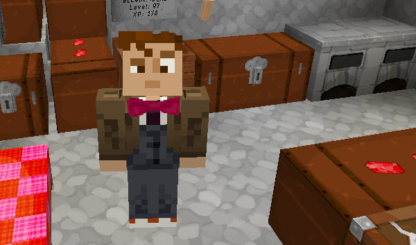
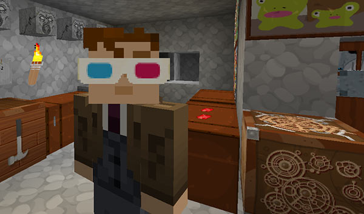

Whovian accessories
===================

You can craft two Whovian accessories items in-game so that you can be cool like the Doctor.

For best results (and custom textures) you should use the TARDIS-MCP resource pack, and an MCPatcher modded client.

### Bow ties

Because bow ties are cool. To see the recipe type:

    /tardisrecipe bow-tie

There are 16 different bow tie colours, just change wool colour in the recipe to craft them.

Because the durability of the crafted bow ties has been set quite low (to prevent the crafting of cheap armour), you can combine same coloured bow ties in an ANVIL to ‘repair’ them.

### 3-D glasses

The Tenth Doctor used a pair of 3-D glasses when observing the effects the Void had on people and objects. you can do the same! To see the recipe type:

    /tardisrecipe glasses

3-D glasses give you night vision when worn, but lose one durability point every minute and eventually will break and drop paper. If you time it right, you should get a good 6 minutes of night vision.

