# Biome Adaptive Chameleon Presets

When the Chameleon Circuit is set to Adaptive Biome mode, the TARDIS exterior preset is selected based on the biome that
the TARDIS travels to.

You can configure which preset is used for which biome by editing _adaptive.yml_.
The file uses YAML aliases - for example:

```yaml
# snowy biomes
SNOWY_TAIGA: &snowy COLD_TAIGA
SNOWY_SLOPES: *snowy
```

* `&snowy` defines an _alias_ to the `COLD_TAIGA` preset
* `*snowy` is an _instance_ of the alias

You can either change the alias `&snowy` to another Chameleon preset e.g. `&snowy PINE`, and the other instances will
use that as well, or set a preset for each individual biome.

You can use any Chameleon block preset as well as the biome presets shown below.

> __Note:__ You can only use an `&`alias if it has been defined in the file above where you want to use the `*`
> instance - so to change _every_ snowy biome you would need to set the alias up in the `# frozen biomes` section first.

## Biomes and presets

By default the plugin maps biomes to presets in the following way:

### Beach, frozen river, river, snowy beach, stony shore

BOAT

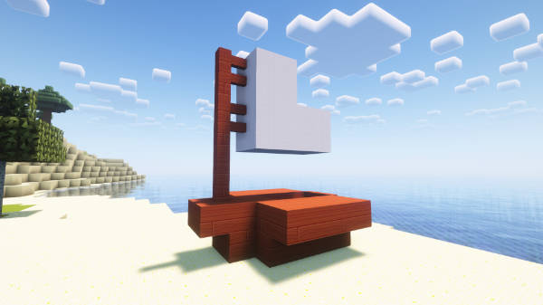

### Cold ocean, deep cold ocean, deep lukewarm ocean, deep ocean, lukewarm ocean, ocean, warm ocean

YELLOW

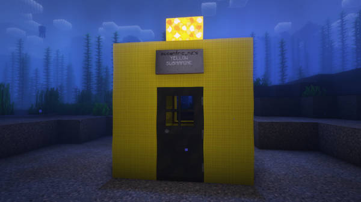

### Desert

DESERT

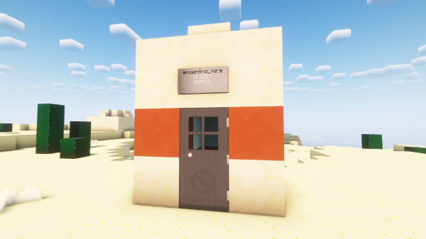

### Windswept gravelly hills, windswept hills, windswept forest

EXTREME_HILLS

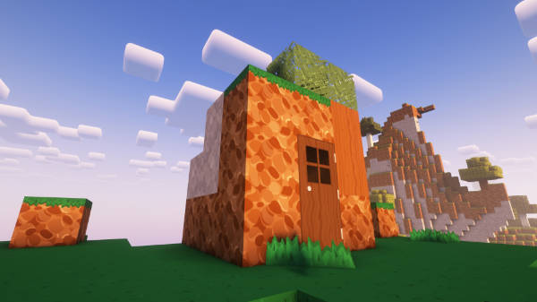

### Birch forest, forest, old growth birch forest

FOREST

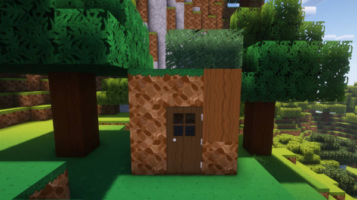

### Nether wastes, soul sand valley, crimson forest, warped forest, basalt deltas

NETHER

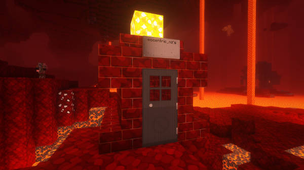

### Snowy plains, deep frozen ocean, frozen ocean, jagged peaks, snowy peaks

ICE_FLATS

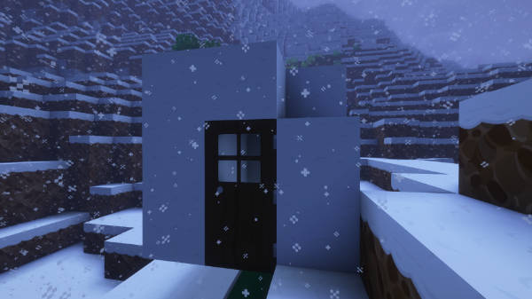

### Ice spikes

ICE_SPIKES

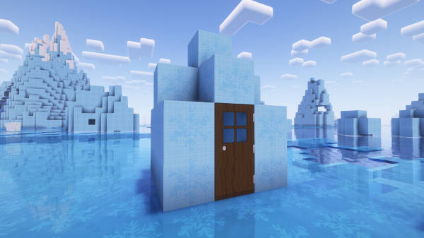

### Jungle, sparse jungle, bamboo jungle

JUNGLE

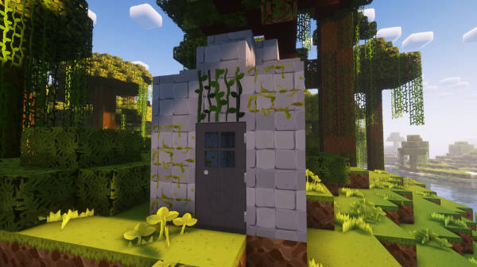

### Badlands, wooded badlands, eroded badlands

MESA

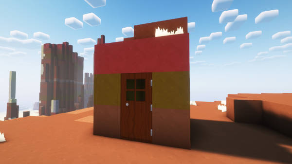

### Mushroom fields

SHROOM

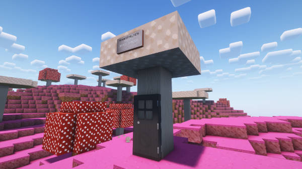

### Plains, sunflower plains, meadow

PLAINS

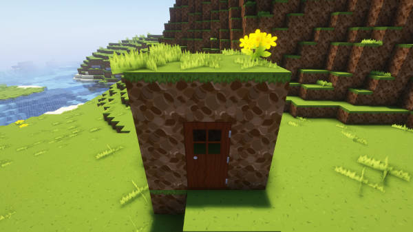

### Dark forest, flower forest

ROOFED_FOREST

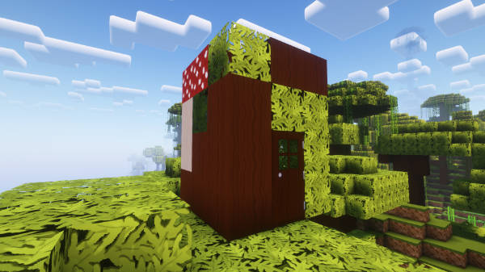

### Savanna, windswept savanna, savanna plateau

SAVANNA

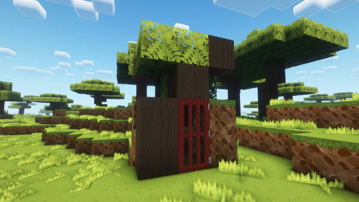

### Swamp, mangrove swamp

SWAMP

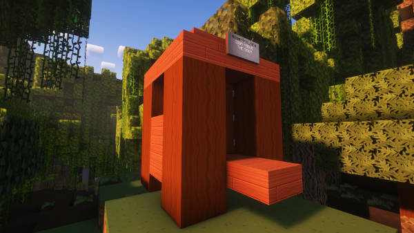

### End barrens, End highlands, End midlands, small End islands, The End

THEEND

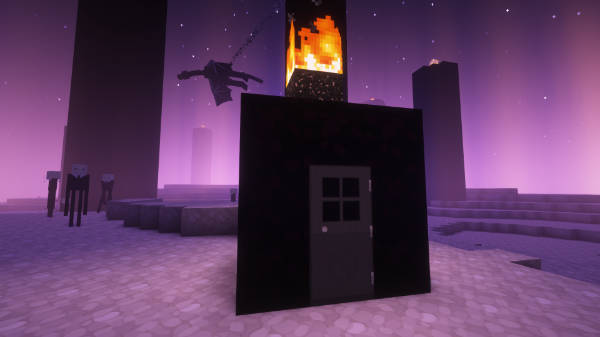

### Old growth spruce taiga, taiga, old growth pine taiga

TAIGA


### Snowy taiga, snowy slopes, grove

COLD_TAIGA

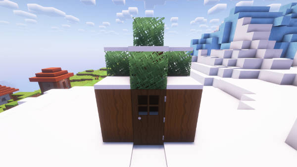

## Locking in a preset

You can use the Chameleon GUI to lock in an adaptive biome preset so that it is used regardless of the biome the TARDIS travels to.

To lock the preset:

1. Set the Chameleon circuit to BIOME Adaptive mode.
2. Travel to the biome that has the desired preset.
3. Open the Chameleon GUI again and click the "Lock: button above the Adaptive setting.
   
Clicking the button will switch the settings to _Shorted out_ and apply the biome preset on a permanent basis (it
   won't change when you go to a different biome).


