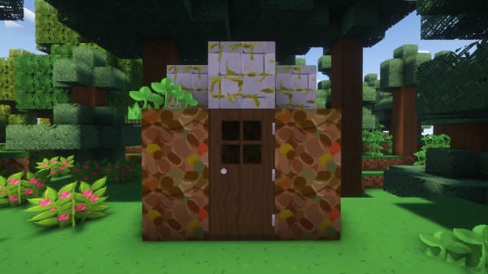

# Biome Adaptive Chameleon Presets

When the Chameleon Circuit is set to Adaptive Biome mode, the TARDIS exterior preset is selected based on the biome that the TARDIS travels to.
The biomes and presets are shown below:

### Beach, frozen river, river, snowy beach, stony shore
BOAT

### Cold ocean, deep cold ocean, deep lukewarm ocean, deep ocean, frozen ocean, lukewarm ocean, ocean, warm ocean
YELLOW

### DESERT
DESERT

### Windswept gravelly hills, windswept hills, windswept forest
EXTREME_HILLS

### Birch forest, forest, old growth birch forest.
FOREST

### Nether wastes, soul sand valley, crimson forest, warped forest, basalt deltas
NETHER

### Snowy plains, deep frozen ocean
ICE_FLATS

### Ice spikes
ICE_SPIKES

### Jungle, sparse jungle, bamboo jungle
JUNGLE

### Badlands, wooded badlands, eroded badlands
MESA

### Mushroom fields
SHROOM

### Plains, sunflower plains, meadow
PLAINS

### Dark forest, flower forest
ROOFED_FOREST

### Savanna, windswept savanna, savanna plateau
SAVANNA

### Swamp, mangrove swamp
SWAMP

### End barrens, End highlands, End midlands, small End islands, The End
THEEND

### OLd growth spruce taiga, taiga, old growth pine taiga
TAIGA

### Snowy taiga, snowy slopes, grove
COLD_TAIGA

