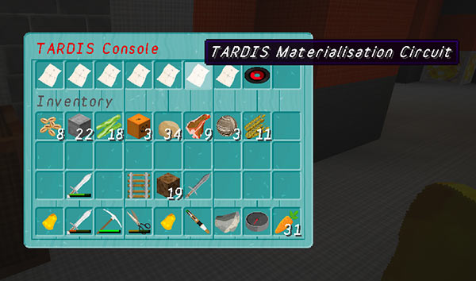
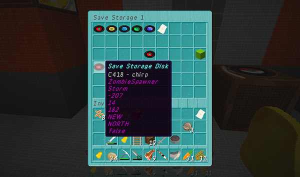

# TARDIS Advanced Console

For players who like a bit more complexity in their game play, the TARDIS has an Advanced Console feature. This in combination with the `medium` or `hard` difficulty mode, changes the way that all console features work. On `medium` or `hard` difficulty, you MUST use the Advanced Console, on `easy`, it is optional.

The Advanced Console consists of multiple TARDIS components — the Advanced Console itself, the Disk Storage Container, plus various Storage Disks and Circuits.

The Advanced Console is the central hub and controller of the TARDIS, you insert disks and circuits to enable travel and the different TARDIS functions. For example, in order for the TARDIS to travel, the Materialisation Circuit must be installed in the Advanced Console.

The Advanced Console and Disk Storage Container are both automatically added to new TARDISes. If your TARDIS was created prior to TARDIS v2.7, you can add these blocks with the `/tardis update [advanced|storage]` command. The block for the Advanced console is a JUKEBOX, and the Disk Storage Container is a NOTEBLOCK.

## Circuit types

The following is a list of circuits that enable different TARDIS functions:

- _TARDIS ARS Circuit_ — enables the Architectural Reconfiguration System
- _TARDIS Chameleon Circuit_ — enables the TARDIS to adapt to its surroundings and use TARDIS presets
- _TARDIS Input Circuit_ — enables the TARDIS keyboard and Destination Terminal
- _TARDIS Materialisation Circuit_ — enables the TARDIS to travel
- _TARDIS Memory Circuit_ — enables the TARDIS to remember saved locations and TARDIS areas
- _TARDIS Scanner Circuit_ — enables the TARDIS Scanner and Exterior Rendering Room
- _TARDIS Temporal Circuit_ — enables the Temporal Locator

To enable a TARDIS feature, you must craft the appropriate circuit, and install it in the Advanced Console. To do this, just right-click the Advanced Console to open its inventory, and then transfer the circuits as normal. Removing a circuit from the Advanced Console inventory disables that feature.

The associated TARDIS GUIs can be opened by shift-right-clicking a circuit when it is installed in the Advanced Console, for example shift-right-clicking the TARDIS ARS Circuit opens the ARS inventory GUI.

### Crafting circuits

Please refer to the [Recipe Commands](recipe-commands.html) page for how to view the crafting recipes

## Storage Disks

The following is a list of disks that let you store TARDIS related things:

- _Area Storage Disk_ — allows travel to TARDIS Areas
- _Biome Storage Disk_ — a craftable disk that allows travel to a specific biome
- _Player Storage Disk_ — a craftable disk that allows travel to a player
- _Preset Storage Disk_ — a craftable disk that sets the TARDIS exterior preset
- _Save Storage Disk_ — a craftable disk that allows travel to saved locations

### Using Storage Disks

To use storage disks you put them into the Advanced Console inventory. It doesn’t make sense to put some disks in the inventory together, for example you can’t travel to both a saved location AND a player at the same time! Generally you will put in a travel destination disk, and a preset disk.

**Note:** Save Storage Disks also save the preset that the TARDIS is currently using, so save disks will always override a preset disk if they are both present in the Advanced Console inventory.

Storage Disks are automatically read and processed when you close the Advanced Console inventory. If the destination has not changed, then nothing will happen.

### Crafting Storage Disks

Crafting storage disks is a three step process:

1. Craft a Blank Storage Disk (shaped recipe) — `/tardisrecipe blank`
2. Craft the desired type of storage disk (shapeless recipe) — combine a blank storage disk with the appropriate item, for example Blank Storage Disk + Redstone = Save Storage Disk
3. Craft or write information to the disk — for Save and Player disks you use a command to write information to the disk (see below), for the others you craft them with a specific item.

See [Crafting Biome and Preset Disks](crafting-disks.html), and [Writing Save and Player Disks](writing-disks.html) for more information.

## Storing Disks and Circuits

You can safely store TARDIS Disks and Circuits in the Disk Storage Container. One advantage to using the Disk Storage Container is that it will allow you to transfer saves and circuits between TARDISes. If you delete your TARDIS and then create a new one, the Disk Storage Container in the new TARDIS will automatically contain the disks and circuits from the old TARDIS.

You open the Disk Storage Container inventory by right-clicking the Storage block (NOTEBLOCK).

When the inventory opens, you will see a row of records and a map at the top. These are the storage section icons — clicking these will take you to the inventory screen for that type of storage disk. Only TARDIS storage disks and circuits can be stored in here, other items will be ejected when the inventory closes.

Some inventory screens (saves, biomes and presets) have 2 pages — use the coloured wool blocks to navigate between them.

#### Area Storage Disks

The Area Disk inventory is populated automatically with the areas that you have access to. New areas will be added as you gain access to them, but if you lose an Area Storage Disk, it will NOT be replaced. You cannot store an Area Storage Disk in any other place than in the Disk Storage Container, your player inventory or the Advanced Console.

You cannot craft Area Storage Disks.
