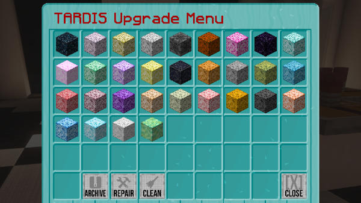
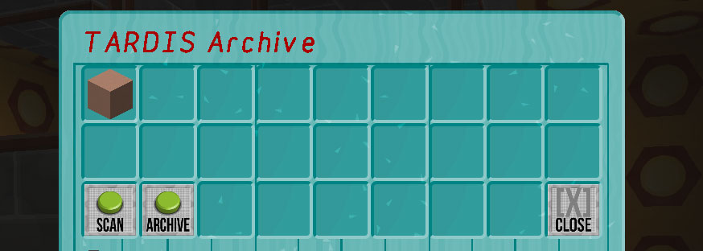

# Archiving TARDIS consoles

In TARDIS version 3.7 and higher you can archive a custom TARDIS console for use in the Desktop Theme GUI.

### Permission

Players will need the permission `tardis.archive`

### Config options

| Option | Type | Default Value |
| --- | --- | --- |
| archive: |
| --- |
| &nbsp;&nbsp;&nbsp;&nbsp;`enabled` | boolean | `true` |
| &nbsp; | Sets whether archiving of consoles is allowed on the server. |
| &nbsp;&nbsp;&nbsp;&nbsp;`limit` | integer | `3` |
| &nbsp; | Sets the number of archives that can be saved per player. |

### Commands

    /tardis archive [scan|add|remove|update|description] [name]

`/tardis archive scan` — scan the current console to check whether it can successfully be archived. You should run this command before using `/tardis archive add [name]`

`/tardis archive add [name]` — save an archived schematic with the given name.

`/tardis archive remove [name]` — delete an archived schematic with the given name. You cannot remove an archive that is currently in use.

`/tardis archive update [name]` — update an archived schematic with the given name if you have made new / extra changes to the console.

`/tardis archive description [name]` — set the descripton text of the archived console that shows in the TARDIS Archive GUI.

## The GUI

The GUI is accessed by clicking the Archive Consoles button in the Desktop Theme GUI.

The TARDIS Archive GUI opens, and shows any consoles that have already been saved along with three buttons. The button functions are explained below:

| Button | Icon | Action |
| --- | --- | --- |
| Console(s) | Stained clay | Clicking this changes the desktop theme to the selected archived console. |
| Size |  | Use this to set the size of the console to archive. Clicking the button multiple times will cycle through the three different sizes. |
| Scan |  | Use this to scan the current console to check whether it can successfully be archived. |
| Archive |  | Archives the current console. A random console name will be generated — if you want to name the console yourself, use the `/tardis archive add [name]` command. |
| Small |  | Changes the Desktop Theme to the small (16 x 16 x 16 block) cobblestone template. |
| Medium |  | Changes the Desktop Theme to the medium (32 x 16 x 32 block) cobblestone template. |
| Tall |  | Changes the Desktop Theme to the tall (32 x 32 x 32 block) cobblestone template. |
| Close |  | Close the TARDIS Archive GUI. |

