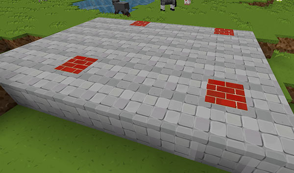

[Jump to video](#video)

# TARDIS area commands

`/tardisarea start [name]` - type this to define the starting corner of a preset admin area.

`/tardisarea end` - type this to define the ending corner of a preset admin area.

`/tardisarea parking [name] [distance]` - type this to set the parking distance between TARDISes for the specified area.

`/tardisarea show [name]` - type this to show the corners of the admin area.

`/tardisarea remove [name]` - type this to delete a preset admin area.

`/tardisarea yard [name] [material] [material]` - type this to visually mark the area with parking spots, where:

- `[name]` is the area name that you want to change
- the first `[material]` is the block you want to use as the floor of the area — defaults to COBBLESTONE if not specified
- the second `[material]` is the block you want to use to mark the parking spot — defaults to BRICK if not specified\<

### Video

**Note:** The command in the video has changed in since this video was made! Use the commands above.

<iframe src="https://player.vimeo.com/video/52724961" width="600" height="366" frameborder="0" webkitallowfullscreen mozallowfullscreen allowfullscreen></iframe>