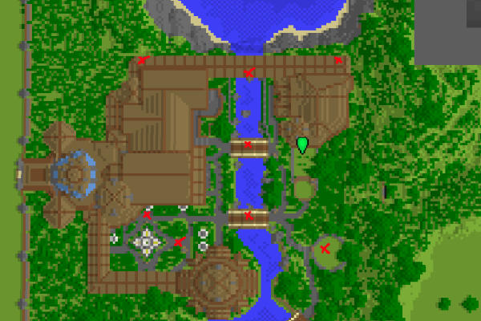

[Jump to video](#video)

# TARDIS area commands

`/tardisarea start [name]` - type this to define the starting corner of a preset
admin area.

`/tardisarea end` - type this to define the ending corner of a preset admin area.

`/tardisarea parking [name] [distance]` - type this to set the parking distance
between TARDISes for the specified area.

`/tardisarea show [name]` - type this to show the corners of the admin area.

`/tardisarea remove [name]` - type this to delete a preset admin area.

`/tardisarea yard [name] [material] [material]` - type this to visually mark the
area with parking spots, where:

- `[name]` is the area name that you want to change
- the first `[material]` is the block you want to use as the floor of the area
  — defaults to COBBLESTONE if not specified
- the second `[material]` is the block you want to use to mark the parking spot
  — defaults to BRICK if not specified

`/tardisarea invisibility [name] [ALLOW|DENY|preset]` - type this to set how TARDISes using invisibility will be treated
when landing in this area

- `[name]` is the area name that you want to change
- `ALLOW` will allow invisible TARDISes
- `DENY` will prevent invisible TARDISes from landing
- `preset` force a TARDIS to use the specified Chameleon preset when landing in this area

`/tardisarea direction [name] [NORTH|EAST|SOUTH|WEST]` - type this to set the direction that TARDISes will face when
landing in this area

## Semi-random parking areas

You can set up an area where parking spaces are assigned manually instead of in a grid-like fashion,
for example like in the image below, where each red cross is a parking spot.

To create a non-grid type area, type:

`tardisarea create [name]`

To assign parking spots to the area, stand at the location you want a TARDIS to park and use the command:

`tardisarea add [name]` - where `name` is the area the parking spot should belong to.

To edit parking spots in a non-grid area, use the command:

`tardisarea edit [name]` - where `name` is the area to edit.

A chest GUI will open, allowing you to remove existing parking spots, or add the location where you are currently
standing.

### Video

**Note:** The command in the video has changed in since this video was made!
Use the commands above.

<iframe src="https://player.vimeo.com/video/52724961" width="600" height="366" frameborder="0" webkitallowfullscreen mozallowfullscreen allowfullscreen></iframe>