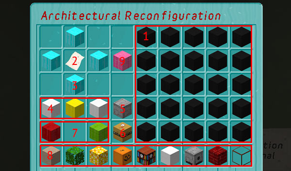

[Jump to videos](#video)

# Architectural Reconfiguration System

The TARDIS ARS is a system for managing the growing and jettisoning of rooms.

To use ARS, you must have an ARS compatible TARDIS. Currently all TARDIS types are compatible except for CUSTOM ones, however you may be need to make a new TARDIS to take advantage of the system if your current TARDIS was created before version 2.6 of the plugin.

The ARS system is based on a 3-dimensional 9 wide x 9 deep x 3 high cuboid grid. Each coordinate in the grid is a 16 x 16 x 16 block cube (or slot). All room schematics available for use in the Architectural Reconfiguration System fit inside this size (except the GRAVITY and ANTIGRAVITY wells which take up two slots).

- The system allows you to grow up to a maximum of 242 rooms.
- You cannot manually grow a room inside the ARS cuboid region with the `/tardis room` command.

### The Architectural Reconfiguration System GUI

To use the ARS, you must have an ARS GUI sign. TARDISes created with version 2.6 and greater have one added automatically. To manually add one (or update its location):

1. Place a sign
2. Use the `/tardis update ars` command to set its location

When you RIGHT-click the ARS sign the GUI opens. Hovering over the blocks will display lore that tells you the block’s function. Below is a breakdown of the GUI:

1. The black wool blocks are the scrollable map area — this represents one layer of the 3-dimensional grid.
2. Clicking the map item loads the current ARS configuration into the map area. If you haven’t used the ARS before, you will see a stone block for each empty slot in the grid and a precious material block that represents the main TARDIS console.
3. The cyan wool blocks allow you to scroll the map area to see other areas of the grid.
4. The white and yellow blocks a) indicate which level you are on in the grid, and b) set the level when clicked.
5. The cobblestone block resets a slot back to empty (if you change your mind).
6. The TNT block sets a slot (containing a room) to be jettisoned.
7. The red and lime green wool blocks allow you to scroll through the available rooms.
8. The bottom row of the GUI contains the room blocks. The block type is determined by the seed block for the room.
9. The pink wool block closes the ARS GUI and starts processing your settings.

### Using the Architectural Reconfiguration System

Folow these steps to use the ARS:

1. You always need to load the map first! Click the map item.
2. Use the scroll and level blocks to move the map to the area you want to configure.
3. Select a slot by clicking on it.
4. Click on a room block to set the currently seleted slot to that room.
5. If you want to set the slot back to empty again, click the cobblestone (reset) block.
6. If a slot already contains a room, click the TNT (jettison) block to indicate that the room should be jettisoned. **\***
7. Once you have configured the rooms you require, click the pink Reconfigure block.

### Notes and tips

- The map aligns to standard compass directions, so **up/top** is NORTH, **down/bottom** is SOUTH, **left** is WEST, and **right** is EAST
- You must have enough Artron energy to grow the configured rooms. If you don’t the map will be reset to its last saved configuration.
- You must have permission to grow the configured rooms.
- ARS respects the `rooms_require_blocks` config setting. If this is set to true, you will need to condense the required percentage of the room blocks before you can reconfigure.
- Gravity wells require empty slots on _two_ levels. GRAVITY wells go DOWN, ANTIGRAVITY wells go UP.
- **\*** To jettison gravity wells, you need to put TNT in both upper and lower slots.
- You can put a gravity well on the bottom level and it will extend out of the ARS grid. This will allow you to grow more rooms manually outside of the reserved ARS region if you so desire. Likewise you can put an antigravity well on the top level to manually grow rooms _above_ the reserved ARS region.

### Videos
<iframe src="https://player.vimeo.com/video/68938409" width="600" height="366" frameborder="0" webkitallowfullscreen mozallowfullscreen allowfullscreen></iframe>