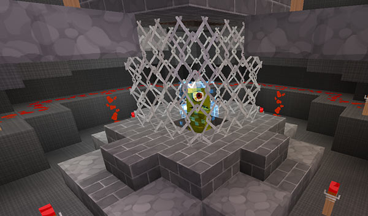

[Jump to video](#video)

# Artron Energy

Your TARDIS runs on Artron Energy, and has multiple ways of recharging. By default the wood button on the TARDIS console is how you charge and check your energy levels. Travelling and hiding your TARDIS uses up energy. The plugin uses a scoreboard to display how much Artron Energy you have used so you can easily keep track of the current levels ([`*`](#pfnote)).

### Getting started

The first thing you will want to do is jump start your TARDIS with energy.

To jumpstart your TARDIS to 50% energy, right-click the wood button with your “TARDIS key” in hand. When you do this, a charged creeper appears inside the Artron Energy Capacitor, indicating that you now have power.

### Full charge

To fully charge your TARDIS, right-click the wood button with a Nether Star to bring it to 100% (This item is configurable in the config file).

### Time lord energy

You, as a time traveller, build up energy over time as you travel. To transfer it to the TARDIS, right-click the wood button while sneaking (SHIFT by default).

### Checking how much energy you have

If you right-click the wood button with any item that is **NOT** the TARDIS key, then the current percentage of full charge is displayed.

### Turning the power off and on

If `allow.power_down` is `true` in the TARDIS config, then right-clicking the wood button with the TARDIS key toggles the power up or down. When powered _down_ the console lights and beacon are turned off, and access to any function that requires power is denied.

The TARDIS will automatically power down if the Artron Energy levels reach zero, and will not be able to power up again until more energy is transferred to the capacitor (either by Time Lord transfer or via the Artron Condenser).

If powered down, and the TARDIS is hidden, it will become visible again due to power loss.

You can remotely power up the TARDIS (if it has sufficient power) by right-clicking AIR with the Stattenheim Remote.

### Power standby mode

By default (as of TARDIS v2.9) the TARDIS uses a small amount of Artron Energy when powered on, but not actively doing anything (like travelling or recharging). To prevent power use in standby mode, you should power down the TARDIS.

You can configure how often and how much energy is used in _artron.yml_ — see the [Artron Configuration](configuration-energy.html) page.

### Power up/down/standby config options

- in _config.yml_ `allow.power_down: [true|false]` — let players power down the TARDIS
- in _artron.yml_ `standby: [amount]` — the amount of energy the TARDIS uses each cycle in standby mode
- in _artron.yml_ `standby_time: [ticks]` — the length of the repeating cycle in server ticks i.e. energy is removed every x ticks — if set to `0` then this feature is disabled

### The TARDIS energy condenser

You can also convert most blocks and items to energy. The energy condenser is added automatically to new TARDISes, if you have a TARDIS from a previous version of the plugin, you can place a chest and run the `/tardis update condenser` command, then follow the instructions to create one.

For a list of items that can be condensed visit the [condensables page](condensables.html).

### Artron Storage Cells

You can use an [Artron Storage Cell](artron-cells.html) to charge your TARDIS. Right-click the wood button with the storage cell to transfer the energy into your TARDIS.

### Charged creepers & natural lightning

Players can gain extra Artron Energy by killing charged creepers. The TARDIS can also gain an energy bonus if it is near the location of a natural lightning strike.

### Server recharge points

Finally, the last way to charge your TARDIS is to use a server admin created recharging station. These can be created by using a beacon‡ and the `/tardisadmin recharger [name]` command.

It is also recommended that server admins create a [TARDIS area](area-commands.html) for Police Boxes to “park” in, so they can recharge easily.

<strong>‡</strong> For pre-beacon versions of CraftBukkit (\< 1.4.2), use a REDSTONE LAMP (powered on).

## Overcharging the TARDIS

Some functions of the TARDIS, for example using the Desktop Theme GUI require that the Artron Energy Capacitor be charged more than the maximum amount. To do this you will need to condense extra blocks and items, or use Artron Storage Cells.

### Video
<iframe src="https://player.vimeo.com/video/57842293" width="600" height="366" frameborder="0" webkitallowfullscreen mozallowfullscreen allowfullscreen></iframe>

**\*** Note — the Artron Energy readout will not display if you are wearing the [Perception Filter](perception-filter.html).

`Next:` [Time Travel](time-travel.html)

