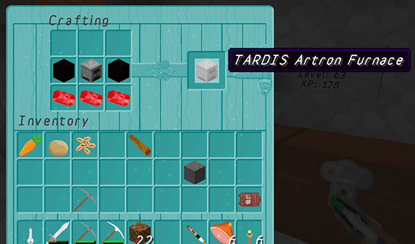
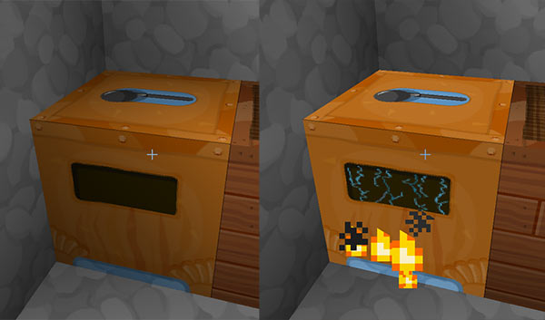

# Artron Furnace

TARDIS Artron Furnaces are special furnaces that can use Artron Storage Cells for fuel (as well as coal and other fuels).

Anyone can craft an Artron Furnace, but only players with the `tardis.furnace` permission can place them. In order to function TARDISHelper v1.2 or higher must be installed.

To view the recipe use the `/tardisrecipe furnace` command.

There is a custom texture and a custom sound for the Artron Furnace if you have the [TARDIS-MCP](https://github.com/eccentricdevotion/TARDIS-MCP) and [TARDISSound](https://github.com/eccentricdevotion/TARDIS-SoundResourcePack) resource packs installed in the client.

## Configuration

You set configuration options in _artron.yml_, the default settings are shown below:

    artron_furnace:
        burn_limit: 100000
        burn_time: 0.5
        cook_time: 0.5
        set_biome: true

- `set_biome [true|false]` — whether to set the biome so that custom textures work on the furnace block
- `cook_time: [time ratio]` — sets the cook time for items smelted with Artron Storage Cells — `0.5` is half the normal time, `2.0` would be twice normal speed (longer), 1 = normal cook time (same as coal) 
- `burn_time: [time ratio]` — sets the length of time an Artron Storage Cell will burn for — as above fractions (`0.5`) will give shorter life to the cells, \> 1 will extend the burn time, 1 = normal burn time (same as coal)
- `burn_limit: [amount]` — the maximum amount of burn time a fully charged Artron Storage Cell can have.

The actual burn time is calculated like so:

    burn_limit * burn_time * (cell_charge_level / full_charge)

The default settings mean that the Artron Furnace cooks quickly but doesn't burn as long.

