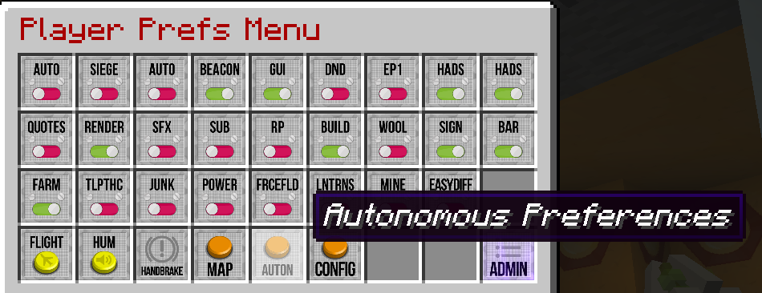
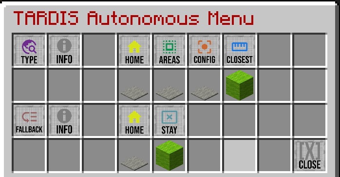

# Autonomous homing function

Should you, as a Time Lord, die in game, you can set a preference to have the 
TARDIS automatically fly to a recharge point or the TARDIS home location 
(whichever is closest to where you die).

To enable/disable the autonomous homing function, use the command:

    /tardisprefs auto [on|off]

The following applies to the use of the autonomous homing function:

- The `auto` player preference must `on`
- You must have the permission: `tardis.autonomous`
- The function must be enabled in the TARDIS config: `allow_autonomous: true`
- The TARDIS must have sufficient Artron Energy (set by the config option `autonomous`)
- The TARDIS must not be in Siege Mode
- If their is insufficient Artron Energy to return home, and Siege Mode is 
  enabled on the server, then the TARDIS will
  enter Siege Mode

### Autonomous Preferences

Since version 4.10.1 there is another player preference you can use - autonomous 
type. You can access the settings via the player preferences GUI.

The GUI lets you choose the location you want the TARDIS to automatically return 
to when you die.

The options are:

- `HOME` - Always go to the TARDIS's home location.
- `AREAS` - Go to the an area in the death world. If a parking spot cannot be found, 
  use the fallback location.
- `CONFIGURED AREAS` - Go to the server's default area(s). If a parking spot 
  cannot be found, use the fallback location.
- `CLOSEST` - Go to the TARDIS's home location or an area whichever is closest.

You can also choose what the TARDIS should do if a parking spot cannot be found 
(the fallback location), the options are:

- `HOME` - Go to the TARDIS's home location.
- `STAY` - Stay at the current location, don't go anywhere.

