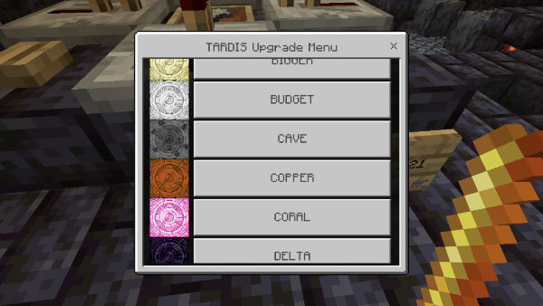
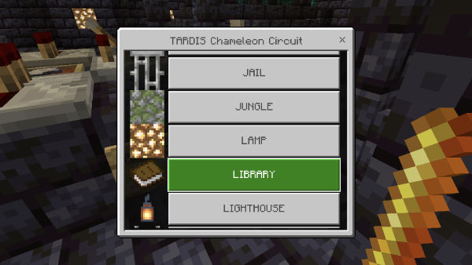
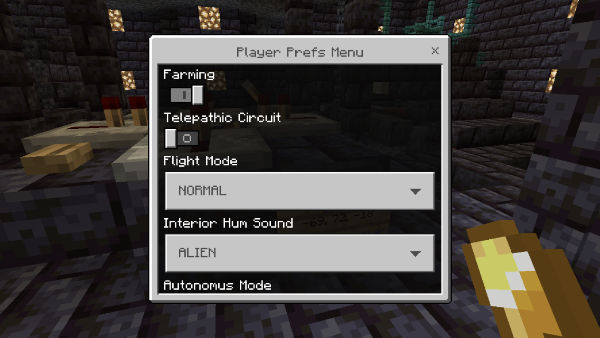

# Bedrock edition

If you are running the [Geyser](https://geysermc.org/) and [Floodgate](https://github.com/GeyserMC/Floodgate) plugins to allow Bedrock players to connect to your server, 
the TARDIS plugin will show Bedrock forms where possible instead of chest GUIs. This allows players using 
tablets and other mobile devices to navigate the many TARDIS options much more easily.

The various forms are shown below:

## Control menu

Access to most of the TARDIS functions.

## Saves

Click a button to load a save, or the TARDIS home location.

## Areas

Click a button to load an area to travel to.

## Destination terminal

Use the form controls to find a unique location.

## Desktop theme

Click a button to change to a new desktop theme.

Select a block to use for the floor /walls of the new interior.

## Map

Click a button to transmat to a room in your TARDIS.

## Chameleon circuit

Click a button to set Chameleon Circuit options.

## Direction

Click a button to change the exterior direction.

## Temporal circuit

Click a button to change the relative time when exiting the TARDIS.

## Transmat

Click a button to transmat to a saved interior location.

## Player Preferences

Click a button to toggle player preferences on or off.

## Companions

Click a button to add / remove a player as a TARDIS companion.

## Genetic Manipulator

Click a button to genetic modify your appearance.

