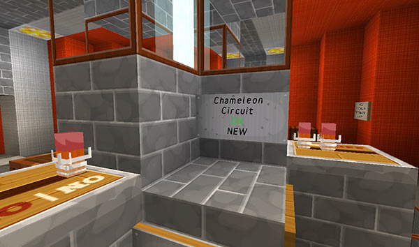
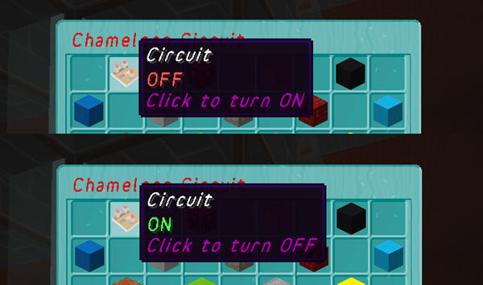
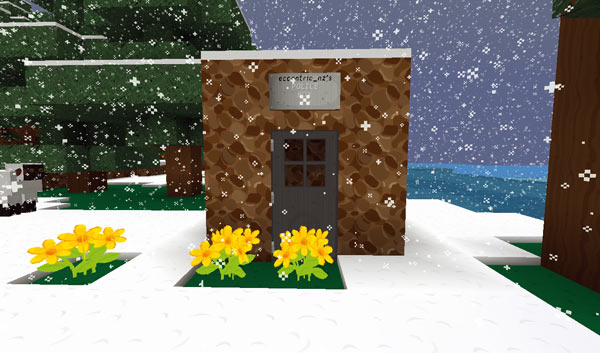
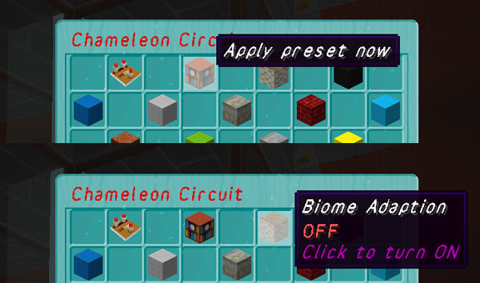
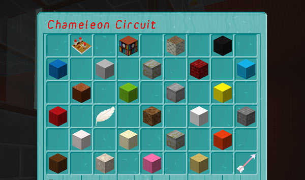
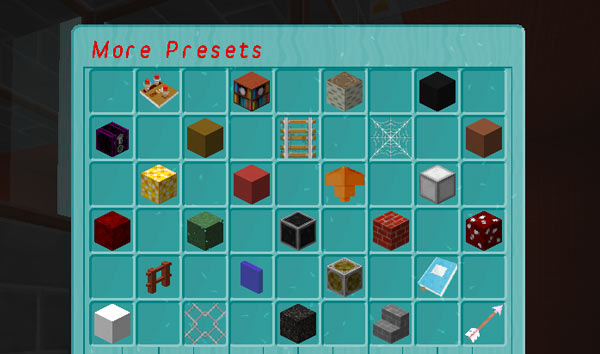

[Jump to video](#video)

# The Chameleon Circuit

To make your TARDIS Police Box blend in with its surroundings you can use the Chameleon Circuit. The Chameleon Circuit will be created automatically when you make a new TARDIS, and is located on a wall sign on the TARDIS console.

If you have an existing TARDIS, you can add the Chameleon Circuit by placing a sign where you want the Chameleon Circuit to be, and running the command:

    /tardis update chameleon

Click on the sign and its position will be added to the TARDIS database.

## Using the circuit

To use the Chameleon Circuit, right-click on the sign.

The Chameleon GUI opens, giving you a range of options. Hover each button to see what it does. The top row of buttons have special functions as explained below:

**Circuit button** — use this to toggle the Chameleon Circuit on and off.

If the Chameleon circuit is **ON** and the current preset is a Police Box or submerged, the next time you time travel the TARDIS will blend in.

**Apply button** — use this to rebuild the TARDIS exterior with the currently selected Chameleon preset.

**Biome adaption button** — use this to toggle biome adaption on and off. If ON, the TARDIS will choose a Chameleon preset suited to the biome that the TARDIS lands in (for example the swamp hut preset for the SWAMP biome).

## Chameleon presets

The rest of the Chameleon GUI buttons are for Chameleon presets. You can see a what all the presets look like on the [Preset page](presets.html). Selecting one of the presets will change the appearance of the TARDIS exterior next time you time travel. To change the appearance immediately, use the Apply button.

There are two pages of presets, use the arrow button in the bottom right-hand corner to navigate between pages.

You can also create your own custom preset using the [Chameleon construction GUI](chameleon-construction.html).

## Shorting out the circuit

If you want your Police Box to keep a certain chameleon appearance, you can run the following command while targeting the type of block you want to use:

    /tardis chameleon short

Now each time the TARDIS travels, it will use the targeted block for the Police Box walls.

To repair the ‘shorted’ Chameleon Circuit and reset the wall block back to BLUE WOOL, type:

    /tardis chameleon reset

### Video
<iframe src="https://player.vimeo.com/video/59827874" width="600" height="366" frameborder="0" webkitallowfullscreen mozallowfullscreen allowfullscreen></iframe>