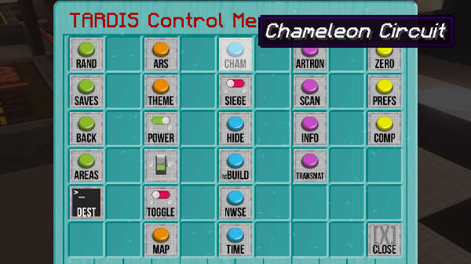

# The Chameleon Circuit

The Chameleon Circuit has changed in TARDIS version 3.7 and higher. The old Chameleon Circuit documentation can be found [here](chameleon-circuit-legacy.html).

To make your TARDIS Police Box blend in with its surroundings you can use the Chameleon Circuit. The Chameleon Circuit will be created automatically when you make a new TARDIS, and can be accessed from the [TARDIS Control Menu](control-menu.html) sign.

## Using the circuit

To use the Chameleon Circuit, right-click on the Control Menu sign, then click the Chameleon Circuit button.

The Chameleon GUI opens, giving you a range of options. Hover over each button to see what it does. The button functions are explained below:

| Button | Icon | Action |
| --- | --- | --- |
| Apply |  | Use this to rebuild the TARDIS exterior with the current Chameleon settings. |
| Chameleon Circuit |  | Toggle the Chameleon Circuit on or off. When OFF, the TARDIS exterior will revert to the FACTORY preset. |
| Adaptive |  | Use this to make the Chameleon Circuit blend in with its environment. There are two modes you can choose from: BIOME and BLOCK. If set to BIOME the TARDIS will choose a Chameleon preset suited to the biome that the TARDIS lands in (for example the swamp hut preset for the SWAMP biome). If set to BLOCK, the TARDIS will scan the block at the next landing location and then change the wall block of the TARDIS to the same kind of block. BLOCK mode will only run if the previous Chameleon preset was set to NEW, OLD or SUBMERGED. |
| Invisible |  | Make the TARDIS [invisible](invisibility.html). |
| Shorted out |  | Make the Chameleon Circuit malfunction and always choose the same appearance, for example: a Police Box. Clicking this button will open the Chameleon [Presets](presets.html) GUI. Selecting one of the presets will change the appearance of the TARDIS exterior next time you time travel. To change the appearance immediately, use the Apply button. |
| Construct |  | Create your own custom preset using the [Chameleon construction GUI](chameleon-construction.html). |
| Close |  | Close the Chameleon Circuit GUI. |

Underneath the buttons are indicators for the current Chameleon settings, hover the mouse over the items to view details. A lime green wool block indicates the currently selected setting.

