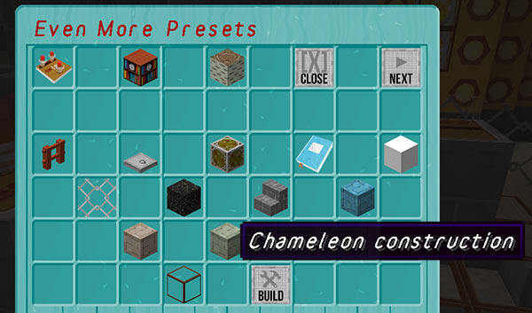
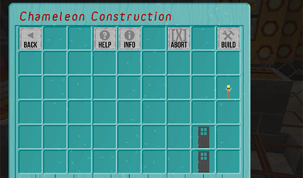
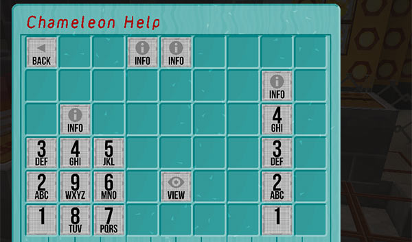
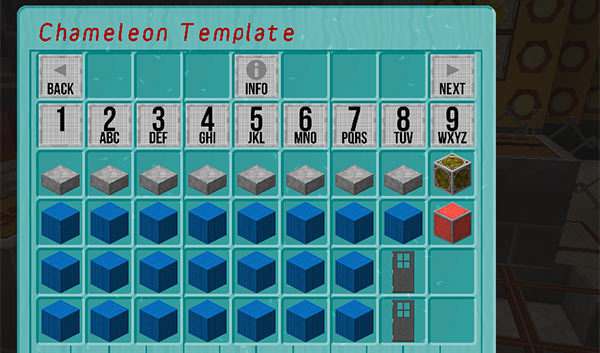
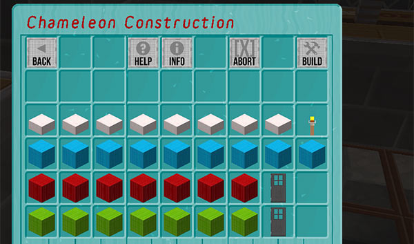

[Jump to video](#video)

# The Chameleon Construction GUI

Since version 3.4-beta-1, the TARDIS plugin includes a GUI where players can construct their own Chameleon preset.

The GUI is accessed from the third page of the Chameleon Preset GUI, which in turn is accessed by clicking the Chameleon Circuit sign on the TARDIS console.

When opening the GUI for the first time, you are presented with the construction screen — however if you need help or information regarding the construction process, 2 other screens are available.

Click the ‘Help’ button to open the help screen.

Click the ‘View’ button to open the template example screen.

Blocks can be placed into the GUI to design the preset — these same blocks are consumed when applying the customised design to the TARDIS exterior.

Click the ‘Build’ button to accept the design and rebuild the TARDIS.

### Notes

- If `allow.all_blocks` is `false`, precious blocks (GOLD, DIAMOND etc.) cannot be used in the GUI.
- All text in the GUI can be translated using the _plugins/TARDIS/language/chameleon\_guis.yml_ file.

### Video
<iframe src="https://player.vimeo.com/video/139820997" width="600" height="366" frameborder="0" webkitallowfullscreen mozallowfullscreen allowfullscreen></iframe>