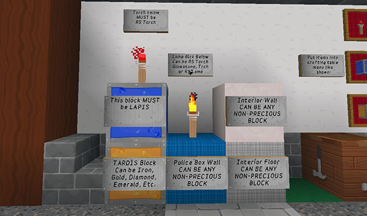
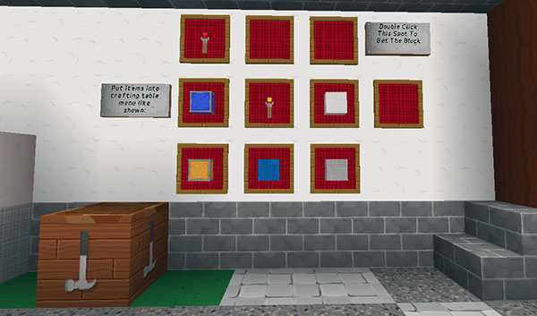

# Change log (for older versions)

[Most recent changes](change-log.html)

## What’s been changed?

### v2.9.2

#### Additions

- `/tardis update zero` allows stone/wood plates
- Added the War Doctor’s TARDIS to ARS
- Added fence gates to emerald sonic interactable blocks

#### Bug fixes

- Fixed isomorphic preference message
- Fixed ClassCastException trying to message ops when map files are not in the correct location
- Fixed the biome database field not being updated on underpowered servers
- Fixed the `/tardistravel` command giving wrong message
- Fixed a NPE when an invalid argument is given to the `/tardisrecipe tardis` command

### v2.9.1

#### Additions

- Added snowy biomes to `set_biome` umbrella
- Added an `allow.power_down_on_quit` option 
  - Both `allow.power_down_on_quit` AND `allow.power_down` must be `true`

#### Bug fixes

- Fixed an ARS bug with a missing message
- Fix `/tardistravel biome list` command
- Fixed the recipes updater, and correct wrongly set painter circuit recipes
- Fixed TARDIS occupation not being set, and other **"must be in TARDIS world"** errors if the `default_world_name` does not contain **"TARDIS"**
- Fixed the standby power mode allowing the TARDIS to go into negative Artron levels

### v2.9

Please view the change logs for TARDIS v2.9-beta-1 and v2.9-beta-2 below as well!

#### Additions

- Added a war doctor’s TARDIS (MCPatcher and TARDIS-MCP resource pack recommended) — seed block is STAINED\_CLAY — permission: `tardis.war`
- Added Whovian food: 
  - Jelly babies — `/tardisrecipe jelly-baby`
  - Fish fingers — `/tardisrecipe fish-finger`
  - Bowl of custard — `/tardisrecipe custard`
  - Jammy Dodgers — `/tardisrecipe jammy-dodger`
  - http://eccentricdevotion.github.io/TARDIS/food.html
- Added `/tardisrecipe tardis [type]` command to view TARDIS seed block recipes
- Right-cliking AIR with the Stattenheim Remote powers on TARDIS (if it is powered down) from anywhere in the world
- Added a Sonic Screwdriver Painter Upgrade to change block colours inside the TARDIS 
  - permission: `tardis.sonic.paint`
  - Move new TARDIS map file (map_1979.dat) to correct location (_server/main world/data\_ folder)
  - Craft Painter Circuit — `/tardisrecipe painter`
  - Upgrade your sonic
  - Place dye in last (right-most) hotbar slot
  - SHIFT-LEFT-click wool, carpet, stained glass, stained glass panes and stained clay to change block colour to colour of dye in the slot
  - Must be in TARDIS!

#### Resource packs

The TARDIS-MCP resource pack has been updated, get it here: [TARDIS-MCP resource pack](https://github.com/eccentricdevotion/TARDIS-MCP) — read the installation instructions!

- New Whovian food textures
- New TARDIS roundel texture for war doctor’s TARDIS
- New ‘The Moment’ texture — use (red) HUGE\_MUSHROOM\_2 with cap texture on all sides (`/give [player] 100:14 1`)
- Updated storage disk textures with easier to read labels (thanks to WonkoTheSane)
- Added CIT Weeping Angel, Cyberman and Ice Warrior textures
- New fob watch texture — rename a clock to ‘Fob Watch’
- New ‘slimmer’ Police Box textures — see: [TARDIS ticket #688](http://dev.bukkit.org/bukkit-plugins/tardis/tickets/688-tardis-optifine-texture-support/?comment=394)
  - must be in a DEEP\_OCEAN biome with doors facing South
  - door closed — blue stained clay
  - door open — change right column to light blue stained clay

#### Changes

- The TARDIS now automatically powers down if it runs out of energy
- To power up or down the TARDIS players must must have the TARDIS key in hand
- Reverted back to the old behaviour of clicking Artron button with NO key in hand to show the current power level
- Added snowy biomes to `set_biome` umbrella

#### Bug fixes

- Fixed chest contents being spat out, and the chest replaced when the TARDIS lands directly on a chest
- Fixed door lock message
- Fixed broken TARDIS deletion
- Fixed the Genetic Manipulator not working even though the power was on
- Power is not removed in standby mode if the TARDIS is at a recharge point
- Fixed the Artron creeper not being able to spawn — you may need to edit your TARDIS world’s WorldGuard region and remove the `mob_spawning: deny` flag…

### v2.9-beta-2

The TARDIS resource packs have also been updated, get them here:

- [TARDIS-MCP resource pack](https://github.com/eccentricdevotion/TARDIS-MCP)
- [TARDIS-Sounds resource pack](https://github.com/eccentricdevotion/TARDIS-SoundResourcePack)

#### Additions

- Added an ‘umbrella’ to the police box when `set_biome` is true and the TARDIS lands in a dry biome.
- All in-game messages can now be localised to the server’s preferred language 
  - the default language is English, and all the messages are contained in the `plugins/TARDIS/language/en.yml` file
  - config option: `preferences.language: [language code]` — set the language with the command: `/tardisadmin language [code]` — use tab completion to see a list of codes
  - language translations require their own file. Make a copy of `en.yml` and translate it. For example; if the language is set to Spanish (code: **es** ), then a file called `es.yml` needs to placed in the `plugins/TARDIS/language/` folder
  - Vistaero (a helpful TARDIS plugin user) has written a useful tool for editing language files, you can get it here: [TARDIS Language File Translator](https://www.dropbox.com/s/35rx51ly8994vux/Language%20File%20Translator.zip) and a tutorial video is here: [Language File Translator Demo](https://www.dropbox.com/s/xxuamw6s2733g8e/Demo.mp4)
  - as messages are added for new TARDIS features, the preferred language file will be updated (in English) for you to translate
  - See it in action on [Youtube](https://www.youtube.com/watch?v=Zx_i66YKIgQ)
- You can now completely power down the TARDIS 
  - after the Artron Capacitor has been initialised, right-clicking the Artron button turns the power on and off
  - when powered down access is denied to any TARDIS features that require power
  - if the TARDIS is hidden it will become visible again due to power loss
  - if the TARDIS is left in standby mode (i.e. powered on but not doing anything), a small (configurable) amount of Artron energy is used every (configurable) cycle
  - **config options:**
    - in _config.yml_ `allow.power_down: [true|false]` — let players power down the TARDIS
    - in _artron.yml_ `standby: [amount]` — the amount of energy the TARDIS uses each cycle in standby mode
    - in _artron.yml_ `standby_time: [ticks]` — the length of the repeating cycle in server ticks i.e. energy is removed every x ticks — if set to `0` then this feature is disabled
  - you cannot power down while travelling
  - there are new power up and power down sound effects ([resource pack](https://github.com/eccentricdevotion/TARDIS-SoundResourcePack) required)
  - the exterior (redstone) lamp will turn off as well (if there is one)
  - the TARDIS will not power up if it has no power
  - the TARDIS will automatically power down on the next cycle after Artron levels reach zero
  - [Video](https://www.youtube.com/watch?v=L3TNANYxoEQ)
- Added a Key Prefs Menu to change to different TARDIS key types 
  - **requires** the [TARDIS-MCP resource pack](https://github.com/eccentricdevotion/TARDIS-MCP) (and MCPatcher)
  - works the same as the Sonic Prefs Menu
  - access the menu with the command `/tardisprefs key_menu`
- Added a travel time progress bar 
  - **requires** the [BarAPI](http://dev.bukkit.org/bukkit-plugins/bar-api/) plugin
  - is a player preference — set it with `/tardisprefs travelbar [on|off]`, or use the Player Prefs Menu

#### Changes

- TARDIS now prevents unwanted mobs spawning in TARDIS worlds itself, instead of relying on other plugins (WorldGuard, Multiverse etc)
- The plugin now only gives Artron energy to players if they have actually travelled (not every time they go through the door)

#### Bug fixes

- Fixed the Sonic Prefs Menu not returning the player’s sonic if they left it in the GUI and then closed it
- Fixed the Sonic Prefs Menu allowing items to be placed in bad slots
- Fixed a bug in Manual Flight mode where if the player did nothing, TARDIS spammed the console with 1000s of errors
- The hinge is set properly for the interior TARDIS door when it is created (fixes missing texture file when using the TARDIS-MCP resource pack)
- Fixed a NullPointerException when trying to reset the biome after the Police Box has left, and added a biome database field updater so that it shouldn’t ever happen again
- Fixed Genetic Manipulator room not showing in ARS GUI until the rooms had been scrolled

### v2.9-beta-1

As always, some big changes to TARDIS entry mechanics — please read carefully.

#### Additions

- Added a `/tardisremote` command 
  - permission `tardis.remote` default: op
  - actions currently supported: travel, comehere, chameleon, hide, rebuild, back
  - arguments: `/tardisremote [player] [action] [travel options]`
  - if action = travel, `travel options` are: `home`, `area [area name]`, and coords e.g. `world x y z`
  - can be run from command blocks, but the specified player must be online
  - if the player who is running the command does **NOT** have `tardis.admin` permission, then the normal checks are performed (energy/permissions/circuits/plugin respect etc for the specified player)
  - use via Command Block will fail silently if above checks fail, as we can’t message a command block…
  - if player has `tardis.admin` permission then no energy is used / only basic checks performed (so we’re not griefing anything)
  - `comehere` comes to the currently targeted block (only available to TARDIS admin players)
  - [https://www.youtube.com/watch?v=VypqSYls1QM](https://www.youtube.com/watch?v=VypqSYls1QM)
- Added the ability to walk in and out of the TARDIS if the door is open (instead of clicking the door) [https://www.youtube.com/watch?v=xyrJyzxmtz8](https://www.youtube.com/watch?v=xyrJyzxmtz8)
  - to use the new method, enable it with `/tardisadmin walk_in_tardis true` and restart the server
  - when enabled, RIGHT-clicking the door opens it, SHIFT\_RIGHT-clicking teleports (the old behaviour)
  - Not all TARDIS presets support walking in!
  - The exterior door can be opened and entered by the Time lord of the TARDIS and any companion, but only the Time Lord can deadlock the door. The exterior door must be opened with the TARDIS key
  - Both doors can be closed using any item or empty hand
  - If you leave the door open (and the Police Box is visible), any monsters within a 16 block radius can enter the TARDIS (unless a player is also within range). If there are no monsters nearby outside there will be a 25% percent chance that a random monster will spawn inside the TARDIS. A check is made every 2 minutes the door is left open
  - Due to the fact that Endermen can enter the TARDIS, you may want to set `enderman-grief: deny` in your WorldGuard region config
  - Added a `/tardisadmin purge_portals` command to clear all data associated with walking into the TARDIS (they’ll still work, just toggle open the door again)
- Added a ‘black wool behind door’ toggle switch 
  - This allows access to the outside of the TARDIS (useful if you have built a nice view)
  - `/tardis update toggle_wool`
- Added MCPatcher texture support and made a new [TARDIS Resource Pack](https://github.com/eccentricdevotion/TARDIS-MCP) — **Note:** things may look a little odd until you rebuild the TARDIS 
  - [http://dev.bukkit.org/bukkit-plugins/tardis/tickets/688-tardis-optifine-texture-support/](http://dev.bukkit.org/bukkit-plugins/tardis/tickets/688-tardis-optifine-texture-support/)
  - If using an MCPatcher modded client with the Connected Textures and Custom Item Textures mods installed the TARDIS uses biome specific textures for the Police Box and TARDIS interior, and custom textures for all TARDIS items
  - to make the Police Box use the custom textures you need to enable it in the config (it is on by default) — `/tardisadmin set_biome true`
  - to make the TARDIS interior use the custom textures you need to enable it in the config (it is on by default) — `/tardisadmin sky_biome true`
  - the Police Box 3x3 block area is set to DEEP\_OCEAN biome, the TARDIS interior is set to SKY biome
  - only new interiors and rooms are set, to change existing consoles and rooms, you will need to use the WorldEdit `//setbiome` command
  - you can now choose from 15 different Sonic Screwdriver textures (see more info below)
  - Added a `/tardisprefs ctm [on|off]` command — if `on` the plugin replaces the left front wool block in the Police box with a quartz pillar textured on ends with the TARDIS door sign
- Addeed a Sonic Screwdriver preferences menu — `/tardisprefs sonic`
  - Requires MCPatcher to see the new textures!
  - In the GUI, place your sonic in the lower left slot and then select the screwdriver of your choice
  - You can set the default screwdriver type — `/tardisadmin default_sonic [type]` — use tab completion to see a list of types
- Added rudimentary GriefProtection claim compatibility
- Added a TARDIS (ARS) Map 
  - accessed via the Sonic player preferences menu (SHIFT-RIGHT-click air with a sonic) — click the map item to open the GUI
  - click ‘Where am I?’ to locate yourself on the ARS map
- Added a `keys` list to the blocks.yml config 
  - if `all_blocks` is set to `false` in the main config, the key can only be set to the items in the keys list
- Added a `/tardisprefs sign [on|off]` command / preference to determine if the Police Box has the ‘name’ sign on front
- Added TARDIS flight modes 
  - use the `/tardisprefs flight [mode]` command to set the flight mode
  - modes are: 
    - `normal` — the default, what we’re all currently used to
    - `regulator` — use the Helmic Regulator to correct the TARDIS’ flight path, a GUI will open automatically — use the direction blocks to keep the regulator in the centre
    - `manual` — run round like crazy clicking the correct console repeater when told to do so
  - In manual flight mode the repeaters are called: 
    - `world`: Helmic Regulator
    - `x`: Astrosextant Rectifier
    - `z`: Gravitic Anomaliser
    - `y`: Absolute Tesseractulator
    - A visual effect has been added to help show which one to click :)
  - in manual flight mode you can set the delay between having to click the repeaters in the config: `/tardisadmin manual_flight_delay [ticks]` — default is 60 (3 seconds)
  - in regulator flight mode, the further away from the centre the regulator block is, the further from your desired location you will land
  - in manual flight mode, the more repeaters you miss hitting, the further from your desired location you will land
  - currently if the destination is inside a building, the adjusted location will most probably end up on the roof (even if there is room inside the building)

#### Changes

- Improvements to anti-flower pot placement when `/tardisprefs build off`
- A message is now sent when switching the Chameleon Circuit on/off by command
- TARDIS now controls both breeding, spawn eggs, eggs and mob building in TARDIS worlds (previously used WorldGuard)
- The TARDIS safety platform has been retired — open the door before exiting
- The companion list now uses UUIDs 
  - no changes to the commands
  - the companion lists are cleared of old data the first time you run this version — players will need to re-add their friends
- `/tardis comehere`, `/tardis home` and the Stattenheim Remote now use the player’s yaw to set the direction the TARDIS is facing
- You can no longer toggle TARDIS doors with the Sonic Screwdriver
- Iron doors opened from a distance with the Sonic Screwdriver will close again after three seconds
- The redstone sonic upgrade now allows you to open iron doors up close — they also will close again after three seconds
- The `enderman-grief: deny` flag is now set by default in TARDIS WorldGuard regions
- Setting the TARDIS key preference is now restricted to using items only (no blocks)
- The sonic Admin menu GUI is now opened from the Player Prefs menu
- Updated to latest UUIDFetcher code

#### Bug fixes

- Fixed gravity well jettisoning — you must now put TNT in both upper and lower slots
- Added `BURNING_FURNACE` and `JUKEBOX` to the emerald sonic interactable blocks
- Horse health is now set correctly
- Fixed save-sign item duplication when closing GUI with item on cursor, or shift-clicking
- Fixed an error loading the plugin if WorldGuard was not on the server (WorldGuard is _NOT_ required for the plugin to run)
- Fixed the platform and under-door block being left behind
- Fixed an `ArrayIndexOutOfBoundsException` when shift-right-clicking in the advanced console
- Added `GLOWSTONE` to underdoor blocks
- Fixed incorrect seed block IDs
- Fixed UUID conversion failing if a blank name was found in the database
- Fixed some problems with commands not getting the UUID for offline players
- Fixed an incorrect table name in the MySQL updater class

### v2.8

For CraftBukkit 1.7.9 or higher only!

Please also read the change log for v2.8-beta-1, v2.8-beta-2 and v2.8-beta-3 below. There are some big changes that you need to be aware of!

#### Additions

- Added bed blocks to those the Emerald Sonic should ignore

#### Changes

- Scoreboards no longer need OfflinePlayers (a Bukkit API change) — this means the plugin requires CraftBukkit 1.7.8 build #3049 or higher!
- Increased TARDIS mob farming range so that players will always teleport inside the TARDIS when riding a horse and clicking the door
- The plugin no longer sets `keepSpawnInMemory: false` in the Multiverse config for TARDIS worlds, as it sometimes prevents redstone doors from working — you will need to manually update your Multiverse settings if you have this problem

#### Bug fixes

- Fixed dematerialisation sound playing when it shouldn’t
- Fixed the plugin outputting the player’s UUID instead of name in the rescue message
- Fixed an isomorphic control message appearing when it shouldn’t
- Fixed the wrong amount being checked for sufficient Artron Energy when using the Destination Terminal
- Fixed rails in front of door (for the RAIL room) disappearing at the end of dematerialisation

### v2.8-beta-3

For CraftBukkit 1.7.8/9 only!

Please also read the change logs for v2.8-beta-1 and v2.8-beta-2 below.

#### Additions

- Added UUID support for Minecraft/CraftBukkit 1.7.8 changes due to the upcoming in-game name changing feature, more info here: [http://dev.bukkit.org/bukkit-plugins/tardis/tickets/678-uuid-migration/](http://dev.bukkit.org/bukkit-plugins/tardis/tickets/678-uuid-migration/)
  - Server must be `online-mode=true` in server.properties as player UUIDs are different when the server is in offline mode
  - When you first install a UUID compatible version, the plugin will automatically backup and update the TARDIS database with the new UUID fields
  - After the database update, the current records will be queried for a list of player names
  - From this list, the plugin will connect to the Mojang Accounts database and retrieve UUIDs for all the players in the list — because this requires a connection to the web it may hold up the server startup process for a few seconds (it depends how many Time Lords there are — in a recent test on a database of 118 players, it took 18 seconds and updated 1343 records)
- Added a message to the player if the TARDIS _Zero_Room world has not been created and they try to grow a Zero room
- Added the `wg_flag_set` and `external_gravity` options to the `/tardisadmin` command
- Added compatibility with the Project Rassilon plugin when using the Sonic Screwdriver’s bio-scanning feature
- Added a black `wool_lights` preference — `/tardisprefs wool_lights [on|off]` to use wool instead of sponge when turning off the TARDIS lights and during malfunctions
- Added ‘Flag’ support to TARDIS WorldGuard compatibility 
  - The `respect_worldguard` setting is no longer true or false
  - Valid values are `none` (same as what was previously false) and any [WorldGuard State flag](http://wiki.sk89q.com/wiki/WorldGuard/Regions/Flags#Flag_List)
  - The default value is `build`, another common value will probably be `entry`
- Added a config option to allow T.I.P.S to expand to a possible 1600 slots 
  - The default is still 400, but can be changed in the config by setting `creation.tips_limit` to a multiple of 400 i.e. 800, 1200, 1600 — `/tardisadmin tips_limit [limit]`

#### Changes

- TARDISHorseSpeed has been updated for CraftBukkit 1.7.8
- The Artron Indicator only shows used, percent and remaining when travelling. To see the full charge and time lord levels, use the Artron Button on the console
- When using Multiverse new TARDIS worlds are set to `animalrate: 0` and `monstersrate: 0` instead of `animals: false`, `monsters: false`. This prevents farmed mobs from despawning 
  - To update existing TARDIS worlds, use the command `/tardisadmin modify mv`
- In conjunction with the above, we now add WorldGuard regions with a higher priority to the farm, stable and village rooms to allow mob spawning in them (except for nasty monsters of course)
- Now properly getting and setting TARDIS mob names, and saddled pigs if necessary when farming
- The horse’s direction is now set correctly when exiting the TARDIS from the stable room
- We are now using our own anti-build methods, as WorldGuard’s do not achieve the desired result (this is relevant to the player ‘build’ preference — `/tardisprefs build [on|off]`) 
  - To update existing TARDIS worlds, use the command `/tardisadmin modify wg`
- Added ‘Companion Build’ preference to the Sonic Screwdriver Player Preferences GUI
- Changed the messages when Advanced Console use is required
- You no longer have to click the output slot to generate a biome or preset disk
- Prevented the Emerald Sonic from scanning when clicking an interactable block (such as a door, button, chest etc)

#### Bug fixes

- Fixed a bug where one of the TARDIS map files (`map_1966.dat`) was not copied to the TARDIS folder and consequently may be missing from the _server’s main world/data_ folder 
  - if `map_1966.dat` is missing, remove all the map files from the _server’s main world/data_ folder so that TARDIS will regenerate the map files
  - copy the new map files back to the _server’s main world/data_ folder
- Fixed a bug where click-dragging in the Storage inventory upper slots allowed items to be stored there (that also became un-retrieveable)
- Fixed the Save Sign GUI opening when the player was in the TARDIS, but didn’t enter via the door
- Fixed the custom TARDIS schematic not working
- Fixed mis-named player disks in the lists generated by the `/tardisrecipe` and `/tardisgive` commands

### v2.8-beta-2

#### Additions

- Added double plants for use in custom presets
- 

Added ‘Nations’ support to TARDIS Towny compatibility — the config will be updated automatically, and there are now 4 values for `respect_towny`

  1. `none` — no Towny checking will take place at all, players can land in any town
  2. `wilderness` — players can only land in wilderness
  3. `town` — players can land in wilderness and in any town they are a resident of
  4. `nation` — players can land in wilderness and in any town they are a resident of, and any town which is in the same nation as the player’s town

#### Changes

- When using the `full_charge_item`, if the current Artron levels exceed a full charge, TARDIS no longer _reduces_ an overcharged capacitor to a full charge and does’t remove the `full_charge_item` from the player.
- TARDIS sounds are now played to nearby players who are outside the TARDIS (and the range has been increased as well)
- TARDIS now sends nice multiline messages to players when line length is longer than the `GUARANTEED_NO_WRAP_CHAT_PAGE_WIDTH`
- Changed the TARDIS door “locked” messaging to read “deadlocked” instead.
- TARDIS now toggles both TARDIS doors with standard sonic if the door is not deadlocked
- Removed the deprecated `/tardisprefs sign` command
- Emergency Program One will now remove itself after a reload/restart

#### Bug fixes

- Fixed broken TARDISHorseSpeed hook-in
- Fixed a ClassCastException when trying to toggle both doors and the outside door is a TRAP\_DOOR
- Fixed a NPE when trying to store Artron in an enchanted item that has no display name
- Fixed double / misleading messages when rescuing a player
- Fixed save sign re-arrangement persisting if you clicked the re-arrange button multiple times
- Custom preset sign text is now actually written on the sign (if there is one)
- Fixed an IllegalArgumentException trying to set health to more than 20.0 in the Zero room
- Fix TARDIS sounds playing twice to some players
- Fixed quite a few TARDIS Information System bugs

### v2.8-beta-1

#### Additions

- Added a TARDIS Genetic Manipulator and the Immortality Gate [http://eccentricdevotion.github.io/TARDIS/lazarus.html](http://eccentricdevotion.github.io/TARDIS/lazarus.html)
  - requires [LibsDisguises](http://www.spigotmc.org/resources/libs-disguises.81/) and [ProtocolLib](http://dev.bukkit.org/bukkit-plugins/protocollib/)
  - permissions: `tardis.room.lazarus` to grow the room, and `tardis.lazarus` to use the device
  - the [TARDIS Resource Pack](http://minecraft.curseforge.com/texture-packs/tardis-tp/files/) has been updated with a new sound
  - contains an Easter Egg!
- Added a Zero room, the feature is disabled by default, use the `/tadmin zero_room true` command to enable it and create the TARDIS_Zero_Room world if it doesn’t exist. [http://eccentricdevotion.github.io/TARDIS/zero-room.html](http://eccentricdevotion.github.io/TARDIS/zero-room.html)
  - a restart is required to enable chat isolation and healing
  - use `/tardis room zero` to add the room (it’s not compatible with ARS, as it is located in its own universe)
  - players can use `/tardis update zero` to add transmat button to move between the TARDIS and the Zero room
  - you can’t break blocks or use chat / commands in the zero room
- Added custom rooms to ARS if they are 16 x 16, we make no guarantees that they will work like the default rooms though! 
  - Use the template.schematic (in the _plugins/TARDIS/schematics_ folder) when building custom rooms to ensure compatibility
- Added a TARDIS Universal Translator — `/tardissay [language] [message]`, the `[message]` defaults to AUTO\_DETECT unless `/tardisprefs language [language]` is used 
  - use tab-completion to see the available languages
  - limited to 2,000,000 characters per month, who knows what happens after that!
- If the TARDIS is hidden, but blocks have been placed in its location, you can unhide the TARDIS if the blocks are hit with the admin sonic
- Added configurable Police Box sign colour — in the config: `police_box: sign_colour: WHITE` or by command: `/tardisadmin sign_colour [ChatColor]`
- Added clearer lists for incorrect command arguments, added missing items to `/tardisgive` command, and made arguments consistent across commands (e.g. `/tardisrecipe`)
- Added better preference messaging when a feature has been disabled server wide
- Added the ability to rearrange saves in the Save-Sign GUI 
  - Click the ‘Rearrange saves’ button to enable arranging
- Added a TARDIS Direction Frame — place an Item Frame and run the `/tardis update direction` command, then place a TRIPWIRE\_HOOK in the frame 
  - Right-click the Direction Frame to change the TARDIS direction
  - SHIFT-right-click the Direction Frame to rebuild the TARDIS in the new direction
  - the tripwire hook in the Direction frame is protected from stealing
- Added a configuration option to allow gravity wells outside of the TARDIS — `allow: external_gravity [true|false]`
- Added a new ability to the Emerald Environment Sonic — you can now re-sow plants if the appropriate seed item is in the player’s inventory. Permission: `tardis.sonic.plant`
- Added support for [Dynmap-TARDIS plugin](http://dev.bukkit.org/bukkit-plugins/dynmap-tardis/) — one day the Bukkit team will get around to approving it… it’s been 5 days now and counting!
- Added a message to players who don’t log out of the TARDIS Information System

#### Changes

- Implemented hard difficulty level to the `/tardistravel` and `/tardis save` commands 
  - players need to use the Advanced Console and disks instead of the travel command
  - players need to be holding a blank save disk in hand when using the save command
- Both doors are toggled open when shift-clicking either door (most of the time, it can be a bit buggy). When exiting — if the preset has a door and the door is open — the player is teleported to the door location (instead of right outside the Police Box).
- The door must be closed to time travel
- Now using the correct Artron Energy values for the type of travel, instead of the ‘random’ value everytime
- If a world is disabled in config, TARDIS creation is no longer allowed in that world
- We’re now respecting the `tardis.save` permission in the Advanced Console and for `/tardistravel dest [save]` command
- We’re now respecting the `tardis.sonic.standard` permission for standard sonic functions
- To list TARDISes to prune you now need to use the `/tardisadmin prunelist` command
- If the current TARDIS location can’t be found in the database (maybe because a world has been deleted), then the plugin performs an Emergency Relocation
- The plugin now checks there is sufficient energy to use the Exterior Rendering Room
- The plugin now checks the player has sufficient Artron Energy when using the save sign
- If ProtocolLib is enabled on the server, you can now just click the keyboard sign to edit it (rather than having to click it with another sign)
- The plugin is now stricter with the use of the `/tardis occupy` command — it only sets occupied if the player is IN the TARDIS or UNoccupied if outside
- Altered the Bukkit version checker so that the plugin will enable on MCPC+ servers
- The plugin now checks the player has permission to break the block with the Diamond Sonic Screwdriver
- The plugin now only equips the perception filter if the chest plate slot is empty

#### Bug fixes

- Fixed the `/tardis update` and `/tardis secondary` commands not updating the correct repeater control — many thanks to WonkoTheSane for finding this one (and a few others)
- Dropped items are removed from the Renderer Room before transmat
- Fixed stained glass colour in Police Box materialisation
- Player scoreboards should be restored properly after the TARDIS Artron display is shown. Also fixed Artron scoreboard persistence
- Fixed players not being able to use the `/tardisroom required [room]` command
- The `/tardisroom required [room]` command now correctly reports the amount of required blocks needed to grow a room
- Fixed condenser blocks and values when adding to database
- Fixed ARS not updating the condenser blocks after growing the room
- Fixed glitch with Admin sonic not opening player inventory
- Removed potential for Police Box duplication after changing direction while TARDIS is hidden
- Fixed `/tardisgive [player] artron [amount]` command, and don’t allow negative Artron amounts when storing energy
- Fixed broken `/tardis update backdoor`
- Fixe a couple of NPEs in the Advanced Console
- Fixed some minor Information System errors
- Fixed pistons not retracting when using the Redstone Sonic on pistons facing up or down

### v2.7

#### Additions

- Added some aliases to the `/tardistexture` command — `/tardisresource` — `/tresource` — `/trp`
- Added the Artron Storage Cell, Memory and Scanner circuit to the `/tardisgive` command
- Added missing room permissions to ARS
- Added Exterior Rendering Room preference — `/tardisprefs renderer [on|off]`
- Added relative coordinates travel — same permission as normal coordinates travel — similar to normal coordinates travel, but you don’t need to specify a world, and the relative values MUST be proceeded by a tilde (`~`) e.g. `/tardistravel ~50 ~ ~90` moves you 50 blocks in the X direction, 0 blocks in the Y direction and 90 blocks in the Z direction
- Added the ability for the Sonic Screwdriver to sort chests — permission `tardis.sonic.sort`
- Added an emergency relocation feature to move the TARDIS, and handle errors, if the world the TARDIS was in was deleted
- If the TARDIS is hidden, but blocks have been placed in its location, you can unhide the TARDIS by hitting the blocks with the Admin Sonic Screwdriver

#### Changes

- You can now break any sign to delete TARDIS, not just Police Box ones
- Made the seed block appear without having to click the output slot, and also check player has permission to craft the TARDIS type
- Reduced the amount of Artron Energy a Time Lord gets when travelling
- The Redstone Activator Sonic Screwdriver upgrade can now move single blocks in front of pistons
- Allow the player’s preferred TARDIS key (even if preference is AIR) to open the Advanced Console, and add better messaging if console won’t open
- Disk Storage only opens if it is the Time Lord’s own TARDIS
- To list TARDISes for pruning, you now need to use the `/tardisadmin prunelist [days]` command

#### Bug fixes

- Prevented Anvil renaming of materials to any TARDIS item
- Fixed broken Advanced Console due to the `tardis_id` database field not being updated when player creates a new TARDIS, or had opened someone else’s storage
- Don’t remove the enchantment from item in hand if it is not the Sonic Screwdriver
- You can only charge 1 Artron Storage Cell at a time
- Fixed Circuit missing message showing when there are no disks in the console
- Fixed Sonic Screwdriver Bio-scanner upgrade stopping standard sonic functions
- Fixed IllegalArgumentException when an invalid material is specified for the TARDIS Key or when adding a new room
- Fixed an IndexOutOfBoundsException if a player puts a blank save disk in the console
- Add admin as a region member when using the `/tardisadmin enter` command
- Numerous fixes to TARDIS presets
- Fixed Admin Menu showing extra items
- Fixed the MySQL database updater
- Fixed NPEs when doing a `/tardis save` to `/tardis save_player` and there was no item in hand
- Added sensible defaults when parsing all numbers from strings
- Removed double `materialise` config option
- Fixed the Terminal GUI opening when SHIFT-RIGHT clicking the Scanner circuit in the Advanced Console
- Fixed the `/tardisadmin prune` command removing TARDISes it shouldn’t

### v2.7-beta-2

#### Changes

- Updated the TARDIS Information System

#### Bug fixes

- Fixed missing circuit recipes for the `/tardisrecipe` command
- Fix broken recipe command for biome and preset disks
- Fixed the Advanced Console not tracking the destination change

### v2.7-beta-1

#### Additions

- Added a TARDIS Advanced Console, and a Disk Storage Container — [http://eccentricdevotion.github.io/TARDIS/advanced-console.html](http://eccentricdevotion.github.io/TARDIS/advanced-console.html)
- Added blank, save, player, area, biome and preset Storage Disks to work with Advanced Console
- Added new circuits to work with the Advanced Console
- Implemented the TARDIS Interior Positioning System — [http://eccentricdevotion.github.io/TARDIS/tips.html](http://eccentricdevotion.github.io/TARDIS/tips.html)
- Added TARDIS Item Kits — [http://eccentricdevotion.github.io/TARDIS/kits.html](http://eccentricdevotion.github.io/TARDIS/kits.html)
- Added `/tardisgive [player] [item] [amount]` command for TARDIS items, kits and Artron Energy — [http://eccentricdevotion.github.io/TARDIS/give-commands.html](http://eccentricdevotion.github.io/TARDIS/give-commands.html)
- Added the TARDIS Perception Filter — [http://eccentricdevotion.github.io/TARDIS/perception-filter.html](http://eccentricdevotion.github.io/TARDIS/perception-filter.html)
- Added underground cave travel `/tardistravel cave` — and added cave to the `/tardisbind cmd` command
- Added an upgradable Sonic Screwdriver — [http://eccentricdevotion.github.io/TARDIS/sonic-screwdriver.html](http://eccentricdevotion.github.io/TARDIS/sonic-screwdriver.html)
- Added a command to make Emergency Program One appear — `/tardis ep1`
- Added an Exterior Rendering Room — [http://eccentricdevotion.github.io/TARDIS/scanner.html](http://eccentricdevotion.github.io/TARDIS/scanner.html)
- Added a `/tardisroom required <room>` command to list what needs to be condensed to grow a room
- Added 1.7 blocks to the condensables list
- Added new 1.7 biomes to the TARDIS scanner
- The plugin now uses a scoreboard to display current Artron Energy levels
- Added Artron Storage Cells and the `/tardisartron [tardis|timelord] [amount]` command — [http://eccentricdevotion.github.io/TARDIS/artron-cells.html](http://eccentricdevotion.github.io/TARDIS/artron-cells.html)
- Added `/tardisprefs minecart [on|off]` command to use the Minecraft door and minecart sounds instead of the resource pack sounds for entering/exiting the TARDIS and materialisation
- Added a command to purge the database of TARDIS records when someone totally messes up their TARDIS (eg deletes the world the TARDIS is in) — `tardisadmin purge [player]`
- Added an option to allow the setting of the TARDIS WorldGuard regions build flag — `/tardisprefs build [on|off]` — set `allow: wg_flag_set: true` in the TARDIS config

#### Changes

- Updated all console schematics to include the Advanced Console and Disk Storage container
- Now that the plugin has Sonic Screwdrivers, the default key item has changed to a `GOLD_NUGGET`
- The config.yml file has been reorganised — previous settings should be retained, but you might want to check — [http://eccentricdevotion.github.io/TARDIS/configuration.html](http://eccentricdevotion.github.io/TARDIS/configuration.html)
- The condensables list is now configurable — set `use_default_condensables: false` in the config and edit condensables.yml
- TARDIS item recipes are now configurable — [http://eccentricdevotion.github.io/TARDIS/recipes.html](http://eccentricdevotion.github.io/TARDIS/recipes.html)
- The ARS GUI is now keyed to the TARDIS rather than the player clicking the sign, though it will only allow the player whose TARDIS it is to reconfigure — this allows admins to view a player’s ARS setup
- There are new map files for the new TARDIS recipes and updated map files for existing TARDIS recipes. They will be copied to the _plugins/TARDIS_ folder — please update the files in the _main world/data_ folder.
- Updated the code for texture pack switching to use resource packs — not sure that it actually works though… but I think that maybe it’s not TARDIS’s fault
- If using the TARDIS Resource Pack sounds the server can now configure how loud they play
- When a player creates a TARDIS, the plugin now uses the configured key item, instead of the default database value
- The plugin now allows the use of `tardis.area.*` to give access to all areas
- The plugin now cancels any scheduled tasks on reload
- You can now download a sounds only or textures only version of the TARDIS Resource Pack — [http://minecraft.curseforge.com/texture-packs/tardis-tp/files/](http://minecraft.curseforge.com/texture-packs/tardis-tp/files/)

#### Bug fixes

- Fixed using a redstone lamp on OLD preset
- Fix RAILS being removed in front of door (when you have a RAIL room)
- Fixed player yaw when entering by the back door
- Fixed submarine mode again
- Fixed custom TARDIS creation
- Doorways should be cleared better when using ARS / growing rooms
- Fixed the ARS GUI showing multiple Stable rooms and throwing nasty NPE
- Fixed the broken custom preset
- Fixed TARDIS world creation with MultiWorld 5.0
- Fixed the handbrake being toggled while TARDIS is materialising
- Fixed the door being allowed to be opened while the TARDIS is materialising
- Fixed the ARS use permissions
- Fixed some of the item dropping when presets materialise

### v2.6.4

- Fixed TARDIS deletion

### v2.6.3

- Fixed ARS GUI throwing NPEs when scrolling the rooms — thanks to darthnsupreme for picking this one up
- Further work on MySQL servers not persisting the database connection
- Fix MySQL not returning generated keys

### v2.6.2

- Fixed startup error trying to copy a non-existent config file
- Fixed a problem with some MySQL servers not persisting the database connection
- Fixed the default key item not being set properly if using MySQL database
- Fixed player key preference not being updated if using MySQL database

### v2.6.1

#### Additions

- Added support for using a MySQL database, those familiar with setting up plugins to use MySQL should have no problem doing the same for TARDIS — check config.yml for the required settings
- Added new ocean biomes to the TARDIS submarine mode
- Added a Do Not Disturb player preference — `/tardisprefs dnd [on|off]` — to prevent the use of `/ttravel [player]` command should the specified player not want to be travelled to

#### Changes

- If `default_world` is `true` and the world specified by `default_world_name` doesn’t exist, then the plugin tries to create it
- TARDIS seed blocks now properly recognise all types of wood and logs

#### Bug fixes

- Fixed CUSTOM TARDIS creation
- Fixed submarine mode
- Fixed player direction when using the TARDIS back door
- Fixed missing blocks in the REDSTONE TARDIS — delete the old schematic to update to the new one

### v2.6

There are lots of changes in v2.6 — some of which are not compatible with previous TARDISes… please read this and the [TARDIS v2.6-beta-1](#v26b1) and [TARDIS v2.6-beta-3](#v26b3) change logs carefully!

#### Additions

- A room template schematic is copied to the _plugins/TARDIS/schematics_ folder
- Added a `/tardisadmin make_preset [name] [asymmetric:true|false]` command to automatically generate the custom\_preset.txt file
- Added a second page of TARDIS presets — there are now 44 different presets plus one custom preset
- Added TARDIS sounds via the TARDIS Resource Pack — no more minecart sounds :) — Pack is available for download here: [TARDIS-SoundResourcePack](https://github.com/eccentricdevotion/TARDIS-SoundResourcePack)
- Added new Minecraft 1.7.2 blocks

#### Changes

- The plugin is no longer compatible with CraftBukkit versions below 1.7, and it will disable itself if a lower version is used!
- The TARDIS malfunction location should now be more random
- All console and room schematics have been updated with a newer door design that stays open longer
- ARS is now compatible with (NEW) large console sizes — TARDISes made with any previous version will need to be deleted and a new one created
- Updated the instructions in the TARDIS book to reflect the new method (seed blocks) of creating TARDISes
- Moved the CUSTOM schematic to _plugins/TARDIS/user_schematics so server owners don’t need to worry about saving it when updating the built in schematics
- The TARDIS de/materialisation animation now uses stained glass instead of ice
- A TARDIS seed block no longer drops when broken if the player is in CREATIVE gamemode
- The WorldBorder default radius has been increased to 256 to accommodate ARS
- TARDISHorseSpeed has been updated for CraftBukkit 1.7.2

#### Bug fixes

- Fixed message in `/tardisadmin enter` when the specified player has no TARDIS
- Fixed a bug where if the preferred floor block is LIME GREEN WOOL and a Gravity Well room is grown the whole floor becomes one massive antigravity pad
- Fixed a bug where jettisoning a farm, stable or village room didn’t remove the associated database entry
- Fixed the `/tardis lamps` command not finding any lamps at all

### v2.6-beta-3

What happened to _TARDIS v2.6-beta-2_, you might ask? It was rejected by Bukkit for having a non-compliant update checker. Perhaps an email advising developers of the change in policy would have been nice… but never mind here’s beta 3 :)

There are lots of changes in v2.6 — some of which are not compatible with previous TARDISes… please read this and the [previous change log](#v26b1) carefully

#### Additions

- Added a Doctor Who 50th anniversary easter egg
- There are some new presets — TELEPHONE, SUBMERGED, FLOWER, CHALICE, WINDMILL, WELL, ANGEL, GRAVESTONE, CAKE, TOPSYTURVEY, SHROOM, CUSTOM and one other secret one
- Added the ability to add a custom preset — edit the _plugins/TARDIS/custom\_preset.txt_ file and restart the server. The file contains data for the new taller Police Box preset — you should be able to work it out from there (the sign _if used_, will need to be in the default location).
- Added a new setting to the Chameleon Circuit GUI — Biome Adaption — if this is turned on, a biome related preset will be selected automatically (if there is one)
- Added a command to remove the ARS sign to allow manual room growing in the ARS grid area `/tardis arsremove` — useful if your TARDIS was created before v2.6 and is not compatible with ARS (Note: adding it back after removal will potentially overwrite any manually grown rooms)
- Added tab auto-completion for player names added to the `/tardisadmin enter` and `/tardisadmin delete` commands

#### Changes

- New (larger sized console) schematics for better room growing and future ARS compatibility — many thanks to Lord\_Rahl and **killeratnight** at mcnovus.net for the new designs
- All schematics updated with new piston doors — they now only open if there is a room on the other side — once again thanks to Lord\_Rahl and killeratnight
- Some presets now have random attributes — for example the Party Tent and Flower change to a random colour, the Angel has different wing and head positions
- The Chameleon Circuit GUI no longer closes when you select a preset — you need to use the ‘Close’ or ‘Apply’ button (or just hit ESC on the keyboard)
- The SWAMP preset has changed to be more like a witches hut
- The TARDIS ‘last use’ field is set upon TARDIS creation, and updated more often (not just when a Time Lord travels)
- The random destination button now selects a random location relative to the current location of the TARDIS preset (when travelling in the _same_ world)
- The `/tardistravel biome [biome]` command now finds the closest biome relative to the current location of the TARDIS preset (and not the player’s location)
- Removed bonus\_chest from config, admin commands and builder
- Removed the update checker — plugin enabling should be quicker now anyway
- Light grey wool blocks (usually the floor blocks) in TARDIS consoles (except the EMERALD type) are now replaced with the player’s preferred floor block (like rooms already do)

#### Bug fixes

- Fixed TARDIS consoles not being removed in shared worlds
- Fixed room jettisoning being off by 1 in both x and z directions, and the grammar in the jettison message
- Fixed a problem with controls not being set correctly with the new piston door schematics
- Fixed TARDIS seed blocks returning a non-valid block after being broken
- Fixed incorrect amount of blocks being added to the condenser table
- Fixed TARDIS seed blocks returning a non-valid block after being broken
- Fixed doors, trapdoors and various other blocks popping off presets when they de/materialise
- Fixed under door and platform blocks not being removed when the TARDIS leaves a location
- Fixed DROPPERS getting the wrong data value when being grown in a room
- Fixed a conflict with the JSONArray class
- Fixed pets disappearing when the player tries to exit the TARDIS with them
- In the ARS GUI, both (anti)gravity well slots are reset when jettisoning said rooms
- Fixed a parse number error trying to update _lastuse_ for players with `tardis.prune.bybass` perms
- Fixed the platform and underdoor blocks being left behind if they just replaced AIR

### v2.6-beta-1

There are lots of changes — some of which are not compatible with previous TARDISes… please read carefully — videos and full documentation are coming ASAP

#### Additions

- Added 3 new TARDIS consoles — ARS (see below), TOM and PLANK 
  - TOM and PLANK are similar to the BAKER and WOOD rooms, but are fully fledged primary consoles
- Added submarine mode 
  - a new button in the destination terminal GUI toggles submarine mode on and off
  - when **on** , the TARDIS can land underwater
  - the area surrounding the Police Box is cleared of water (requires the WorldGuard plugin to be installed on the server)
- Added a TARDIS Architectural Reconfiguration System 
  - the ARS, BUDGET, STEAMPUNK, TOM, and PLANK console types now have an ARS sign, which when clicked displays the ARS GUI
  - allows players to program multiple rooms to grow (and be jettisoned)
  - all room schematics have been changed to fit this new system, and include new automatic piston doors
- Added TARDIS seed blocks 
  - Seed blocks are crafted

    123
    456
    789 

- If the above is a 3x3 crafting grid, then:  
 1 = Redstone torch  
 2 = AIR  
 3 = AIR  
 4 = Lapis Block  
 5 = Any valid Police Box Lamp block/item  
 6 = Any valid TARDIS wall block  
 7 = Any of the current TARDIS ‘type’ blocks e.g. IRON, GOLD, DIAMOND, EMERALD etc  
 8 = Any valid Police Box wall block  
 9 = Any valid TARDIS floor block
- 

You then need to click the crafting output slot to generate the seed.

- Right-click a placed seed block with the TARDIS key to start growing a TARDIS 
- There are 19,450,850 different possible seed block combinations
- Seed blocks can be placed, broken and dropped and still remain as a valid seed block
- This is now the default way to create a TARDIS
- You can revert to using the old block stack method by setting `use_block_stack` in config.yml
- Added Chameleon Presets 
- Presets are selected using the new Chameleon sign GUI
- There are currently 11 presets: a NEW (taller) Police Box design, the OLD Police Box, a PARTY tent, a SWAMP hut, a JUNGLE temple, a DESERT temple, a STONE column, a VILLAGE house, a NETHER shape, a FACTORY fresh Type 40, and a YELLOW submarine
- Added custom console slot 
- add your custom schematic to the _plugins/TARDIS/schematics_ folder — it must be named **custom.schematic**
- to enable a custom console, set `custom_schematic: true` in the config
- to set the custom schematic seed block type, set `custom_schematic_seed: [material]` in the config — the default is OBSIDIAN
- Added the TARDIS Information System 
- You can add this to existing TARDISes by placing a sign and using the `/tardis update info` command
- Click the TIS sign to enter the chat based info system
- type the underlined letter in the menus into chat to see more options and info
- Added a VILLAGE room to transport Villagers into the TARDIS
- Added the TRENZALORE room to the default rooms
- Added compatibility with Multiverse-Adventure world resetting
- Added a command to abort room growing `/tardis abort [task ID]`
- Allow players with `tardis.create_world` permission to have a TARDIS in their own world when `default_world` is true 
1. set `create_worlds: false`
2. set `create_worlds_with_perms: true`
3. set up default world as usual
4. give players permission `tardis.create_world`
- Added a config option to set the speed that rooms are grown at — `room_speed: [a number between 1 & 20]` — the bigeer the number the faster the room grows
- Added a button in the save sign GUI to switch to TARDIS areas
- Added a check to make sure the right versions of the Factions plugin is installed if `respect_factions` is true
- Added a configuration section `under_door_blocks` to _blocks.yml_ to set which blocks are replaced under the Police Box door. Also added carpet to the default list
- Added a configuration section `no_artron_value` to _blocks.yml_ for zero value condensables
- Added a new config option for `custom_creeper_id` to set the id of the block under the Artron Energy Creeper in the new ‘custom’ console schematic
- Added basic MCPC+/Forge support
- You can now delete all companions with the command `/tardis remove all`

#### Changes

- All console and room schematics have been updated 
  - **You need to delete the _plugins/TARDIS/schematics_ folder!**
- 

Room and jettison seed position has changed

  - unfortunately this is **not backwards compatible with old rooms** (as this change was needed to implement and be compatible with ARS and full room jettisoning)
  - 

seed blocks are now placed in front of the stone pressure plate that activates the new piston doors positions(new schematics required) — players with older TARDISes should be able to work out where to place the seed block using the diagram below (grey squares are stone pressure plates, red squares are seed blocks, green blocks are piston doors, purple blocks are room walls)

- 

The `/tardis jettison` command now removes the whole room

- TARDIS creation now defaults to using seed blocks — see ‘Additions’ above
- The TARDIS Temporal circuit now makes the player invisible
- If the Police Box lamp is set to a REDSTON\_LAMP, then it flashes on and off during re- and de-materialisation
- Leashes are retained in the player’s inventory when transferring horses
- The Police Box platform block id and data value can now be set in the config — `platform_id: [id]` and `platform_data: [data]`
- If the Police Box door is locked, entities cannot be transported
- Leashes and beacons can now be condensed
- The save sign can now only display a maximum of 45 saves
- Malfunctions are now allowed to travel to disabled nether/the end worlds
- The compass target is reset to the bed spawn / world spawn location when a regular compass is selected after using the TARDIS locator
- All wool in a room is replaced with stained clay if `use_clay` is true
- TARDIS control signs (except Keyboard) can now be COMPARATORS
- Mobs are not farmed at all if there is no FARM room && `spawn_eggs` is false
- The TARDIS home, current, next and back location saving has been completely reworked
- Almost all non-SELECT SQL queries are now run asynchronously
- The player must still be in a TARDIS world when updating blocks
- The player must grow a (farm, rail, stable or village) room first before being able to update the relevant block locations
- The plugin now prevents the TARDIS from landing at y = 0
- When LEFT-clicking the door, it now locks / unlocks both sides
- Plugin metrics has been removed due to unreliability
- Random location finding attempts can now be limited with a config option — `random_attempts: [number]` — default is 30
- The `tardis.skeletonkey` permission now overrides locked isomorphic controls
- The destiantion terminal, ARS, TIS, temporal circuit, and keyboard sign GUIs are now added automatically to new TARDISes

#### Bug fixes

- The plugin now checks the player has permission to use the back door to The End or the Nether
- Police Box block protection is removed correctly when travelling after the Police Box has been hidden
- Fixed RAIL room offset
- Fixed a typo in the Materialsation Circuit recipe which prevented the circuit from being crafted in hard difficulty mode
- Fixed a number of `ArrayIndexOutOfBoundsException` in the sign GUIs
- Fixed some servers not being able to find the TARDIS item recipe map files
- Fixed an exploit involving Multiverse-inventories with TARDIS mob farming and minecart transfers
- Stopped room block positions from being updated if the room hadn’t been grown yet
- Fixed the farm room using wool in the floor even if `use_clay` is true
- Fix players being able to go the protected or disabled locations under certain circumstances
- If a TARDIS default world uses TARDISChunkGenerator, then SPONGE is converted to AIR in the console schematics
- A handbrake control record is inserted even if a custom schematic does not have CAKE block (the placeholder for the handbrake)
- The plugin now checks for unique save names
- Fixed the condenser chest throwing an IllegalArgumentException if it was turned into a double chest
- Fixed the fix `/tardistravel area [area]` command landing TARDIS is the same spot
- Fixed a bug where, if the TARDIS was created in same world, it wasn’t created underground
- Bedrock and pistion extensions in room schematics are now ignored when `rooms_require_blocks` is true
- Players are rescued even if `materialise` is false
- The plugin only loops for the size of the TARDIS area, that way if it is full, it doesn’t go into an endless loop and crash the server
- Fixed an ArrayIndexOutOfBounds error if no EPS messgae is supplied to the `/tardisprefs eps_message` command
- The plugin now checks a player has permission for a world before using it in the random world list
- Fixed a NullPointerException in the Chat listener when a player is muted by another plugin

### v2.5.8

- Fixed a potential server crashing error when trying to travel to a TARDIS area
- Removed the use of the _plugins/TARDIS/chunks.txt_ file

### v2.5.7

- Updated Factions support to 2.0.5 — _Disable Factions support or do not use this version if you are running Factions 1.8.x and lower_
- Fixed a NPE when using the ARS GUI and the map was not loaded
- Fixed a TARDIS deletion bug, where if you had the admin permission `tardis.delete` it would not find the TARDIS location properly
- After using the TARDIS Locator, if a regular compass is selected in the hot bar, the player’s compass target is reset back to the spawn/bed spawn location instead of always pointing at the TARDIS location
- Fixed an ArrayIndexOutOfBoundsException when a malfunction occurred and the destination was set to the Nether or The End (and travel there was disabled). **Travel will now be allowed to the destination** — as this was the original specification for the malfunction feature when it was suggested
- Fixed an error when the condenser chest was made into a double chest
- Fixed an error with the save sign when a player has more than 53 saves
- Fixed an error when not specifying a message in the `/tardisprefs eps_message` command

### v2.5.6

- Fixed a bug where when using the save sign the TARDIS direction could be incorrectly set
- Fixed other miscellaneous issues with the save sign

### v2.5.5

- Added a config option, and permission node to allow servers to set up TARDIS to both use a default world and have players with TARDIS worlds 
  1. set `create_worlds: false`
  2. set `default_world: true` (and other relevant default world config options)
  3. set `create_worlds_with_perms: true`
  4. give players who will get TARDIS worlds the permission: `tardis.create_world` — default is OP
- Fixed farm room using wool in the floor even if `use_clay` is `true`
- Fixed an m-circuit recipe typo, the circuit can now be crafted when `difficulty` is set to `hard`
- Added `/tardis abort [task ID number]` command to stop a room growing 
  - When starting to grow the room, players are messaged the task ID number to use with the command
- If a player’s TARDIS lamp preference is a redstone lamp, then the plugin sets the block under it to a redstone block, so that it is lit. 
  - There is an added benefit to this — the lamp will now flash on and off when the TARDIS de/re-materialises :)

### v2.5.4

**CAUTION:** if running CraftBukkit 1.6.2, you must have the CraftBukkit **Beta** Build or greater!

- Fixed further incompatibilities with CraftBukkit versions prior to 1.6.2
- Added HUGE\_MUSHROOM\_STEM to wall and floor blocks
- Fixed NPE in Temporal Locator GUI when clicking outside the inventory screen
- When transferring horses into the TARDIS, if the horse is leashed, then the leash hitch is removed and the player has a leash added to their inventory
- Better check to see if the recipe map files are in the appropriate place

### v2.5.3

- Fixed compatibility with CraftBukkit versions prior to 1.6.2

### v2.5.2

- Fixed a critical bug preventing new TARDISes from being created properly
- Horses now have their armour and saddles set correctly when entering and exiting the TARDIS
- Horse health is set properly when exiting the TARDIS
- Player’s are ejected from horses and pigs when TARDIS mob farming
- Horse speed can now be set when entering and exiting the TARDIS — this is a temporary fix until an Attributes API is added Bukkit — _ **REQUIRES** _ the **TARDISHorseSpeed.jar** plugin to be installed on the server (included in the ZIP download) — if you don’t care about setting horse speed, you don’t need to install it
- Better messaging when attempting to rescue a player
- The `/tardis occupy` command now sets the player UNOCCUPIED from any TARDIS (not just their own)
- Added some missing arguments to the `/tardisprefs` command

### v2.5.1

- Has been deleted as it was broken :(

### v2.5

- The map files required for the TARDIS item recipes are now copied to the _plugins/TARDIS_ folder — these **MUST** be put in the main server world’s _data_ folder in order for the recipes to work.
- You can no longer make a TARDIS Locator by renaming a regular Compass in an Anvil
- The plugin now tries to automatically set TARDIS occupation to false when a player leaves the TARDIS by means other than the door
- The ‘creeper’ block no longer needs to be a command block when using the `/tardis update creeper` command
- Fixed Horses teleporting to the Police Box when ridden over a wood pressure plate in a non-TARDIS world
- Fixed various potential NPEs, including one when clicking an empty slot in the Admin Menu inventory GUI, and another in the Texture Pack changer if the player disconnected while switching
- Fixed the RAIL room offset (again)

### v2.5-beta-2

#### Additions

- Added a recipe to craft the Sonic Screwdriver (a stick) — view the recipe with `/tardisrecipe sonic`
- Horses can now be moved out of the TARDIS if they are ridden over a wood pressure plate
- Updated the STABLE schematic and moved the horse spawn point — delete the old schematic!
- Added a config option to turn of lightning strikes when the TARDIS is recharging 
  - `strike_lightning: [true|false]`
- Added the farm, stable and rail spawn locations to the`/tardis update` command 
  - The four individual farm mob spawn locations are calculated from the one farm location, so your farm layout needs to pretty similar to the farm room — each spawn point is 3 x 3 blocks away — see [images/docs/farmspawns.jpg](http://)
  - You need to click a fence post to set the RAIL room spawn point

#### Changes

- The Police Box orientation is now preserved when saving the location
- The TARDIS scanner now scans for horses

#### Fixes

- Fixed hoppers not working with the Artron Energy Condenser
- Fixed the TARDIS Locator recipe requiring the Stattenheim circuit instead of the Locator Circuit
- Fixed double ups of mobs appearing after TARDIS mob farming
- Horse health is now set properly
- Fixed horses being ignored when trying to transfer them into the TARDIS

### v2.5-beta-1

First off a huge thank you to everyone who contributed ideas and caught bugs for this release — without your input the plugin wouldn ’t be where it is today. Special mention goes to [bootthanoo](http://dev.bukkit.org/profiles/bootthanoo/) whose ideas seem to strike the right chord with me and the plugin, but to everyone equally — keep the ideas rolling in :)

#### Additions

- Added a ‘fast return ’ button to quickly set the destination to the last visited location 
  - Use the command `/tardis update back` or `/tardis secondary back` to add it
  - You can also use the `/tardistravel back` command to set the destination
- Added biomes to the `/tardisbind` command — `/tardisbind biome [biome type]`
- Added a TARDIS Destination Terminal 
  - An inventory based GUI for choosing a random destination accessed by clicking a sign
  - Use the `/tardis update terminal` command to add it
  - See: [https://vimeo.com/68899459](https://vimeo.com/68899459)
- Added an inventory based GUI for boolean (true|false) config values 
  - To open the menu right-click air with a diamond in hand
  - Menu is only available to players with `tardis.admin` permission
  - Click an option to toggle its value
- Added all the new 1.6.\* blocks and items
- Added a new ‘steampunk ’ TARDIS 
  - Players require `tardis.steampunk` permission to create it
  - Uses the new COAL BLOCK as the base block
- Added horses to the TARDIS mob farming feature 
  - All colours, styles and variants are supported
  - Saddles, barding (armour), chests and chest inventories are retained
  - You need to grow a stable room to house the horses (otherwise spawn eggs are given)
  - **Still TODO** a way to get the horses out of the TARDIS
- Added a new STABLE room for horses — `tardis room STABLE` — seed block is a HAY\_BLOCK
- Added a Temporal Locator sign 
  - Uses an inventory based GUI to set player time, no travel needed
  - Time is set when exiting the TARDIS and reset back to server time when entering the TARDIS
  - Player time can be reset at any time by right-clicking air with a clock
  - Use the `/tardis update temporal` command to add it
  - Players need `tardis.temporal` permission to use it
- The default Police Box wall block and lamp are now configurable items and the sign and lamp can be turned off. 
  - The default TARDIS exterior //wall// block can now be set in config.yml — change `wall_id` and `wall_data` e.g. for blue wool it would be `wall_id: 35` and `wall_data: 11` — for iron block it would be `wall_id: 42` and `wall_data: 0`
  - The default TARDIS exterior //lamp// block can now be set in config.yml — change `tardis_lamp` to the ID of your choice — e.g. for a torch use `50` and for a redstone torch use `76`
  - Whether the default TARDIS exterior has a sign and lamp can now be set in config.yml — change `plain_on: [true|false]` — true means there will be NO sign or lamp
  - The TARDIS exterior //wall// block can be overridden by players by using the Chameleon Circuit i.e. using the `/tardis chameleon short` command while targeting the desired block
  - The TARDIS exterior //lamp// block can be overridden by players by using the `/tardisprefs` command e.g. `/tardisprefs lamp [id]` — you can limit the blocks that are allowed to be used by editing the `lamp_blocks` list of id numbers in blocks.yml
  - Whether the TARDIS exterior has a sign and lamp can be overridden by players by using the `tardisprefs` command e.g. `/tardisprefs plain [on|off]`
  - This should allow servers to set a plain TARDIS as default (as seen in DW Series 7 finale)
  - If you don ’t care, just leave the settings at the defaults to have the plugin behave as it usually does
- Added a RAIL room 
  - After growing the room, run rails up to the Police Box door to have minecarts transported into the TARDIS
  - Only one minecart is allowed through at a time
  - Storage minecarts will deposit their contents into a chest via a hopper
  - What else you do with them once they ’re there is up to you
- Added a switch to turn the lights in the main console room on and off 
  - Use the `/tardis update light` command to add it
  - If you have moved any lamp blocks, use the `/tardis lamps` command to rescan the TARDIS for their new locations
- Added a new command — `tardisrecipe [item]` to show custom recipes for the new TARDIS items (see below)
- Added a new config option — `difficulty: [easy|normal|hard]` — default is `normal`, for why see below
- Added a craftable Stattenheim Remote Control 
  - To see the recipe type `/tardisrecipe remote`
  - This item replaces the `/tardis comehere` command when `difficulty` is set to normal or hard
  - The item is harder to craft when `difficulty` is set to hard
  - Right-click the block you want the TARDIS to come to
- Added a craftable TARDIS Locator 
  - To see the recipe type `/tardisrecipe locator`
  - This item replaces the `/tardis find` command when `difficulty`is set to normal or hard
  - The item is crafted with another custom item the TARDIS Locator Circuit, see below
- Added 3 craftable TARDIS circuits — Locator Circuit, Materialisation Circuit and Stattenheim Circuit 
  - The items are custom maps — three maps are supplied with in the ZIP download — put them in the main server world ’s //data// folder to use them (maps will probably change for final 2.5 release)
  - To see the recipes type `/tardisrecipe [l-circuit|m-circuit|s-circuit]`
  - The Locator Circuit and Materialisation Circuit are required to craft the Stattenheim Circuit when `difficulty` is set to hard
  - The Stattenheim Circuit is required to craft the Stattenheim Remote when `difficulty` is set to hard
- Added a config option `use_clay: [true|false]` — if true it will switch the WOOL blocks in TARDIS and room schematics to the equivalent coloured STAINED \_CLAY blocks (for new TARDIS and rooms only)
- Added the start of an Architectural Reconfiguration System, another sign with an inventory based GUI 
  - Use the `/tardis update ars` command to add it
  - See: [https://vimeo.com/68938409](https://vimeo.com/68938409)

#### Changes

- The Emergency Program One NPC should now face the centre of the TARDIS and look at players
- Comparator blocks can now be TARDIS console buttons
- TARDIS now tells MultiWorld to delete the TARDIS world after the TARDIS has been deleted
- The save-sign has been updated to a new inventory based GUI, all your saves are listed in one place 
  - Just click a save to set it as the destination
  - To update the old save sign, just run the `/tardis update save-sign` command again
- You can now condense pistons, redstone torches and trapdoors
- Rooms are now jettisoned from the top down

#### Fixes

- The texture pack switch no longer switches when entering by the backdoor and texture pack switching is off
- The pet teleport location has been fixed when pets exit the TARDIS
- Fixed the rescue accept message saying you had 30 seconds, when really you had 60
- Rooms are only processed if they are enabled and square (fixes a NPE)
- The data values for directional blocks are set correctly for rooms grown in a NORTH or WEST direction
- The NPC Listener is only registered if the Citizens plugin is enabled
- Players are now always removed from the time traveller list before being added, this prevents the player being added more than once (if they exit the TARDIS by some other means than by the door) and receiving multiple messages when the handbrake is released
- Fixed a NPE when trying to remove the last (or only) companion
- You can no longer travel to yourself with the `/tardistravel [player]` command
- This version is now compatible with Tekkit Classic (or any CraftBukkit 1.2.5 server) again

### v2.4

#### Additions

- Added `/tardis update eps` command to change the location where the Emergency Program One hologram appears
- Added `/tardis update creeper` command to change the location where the Artron Creeper spawns
- 

#### Changes

- The Artron Condenser Chest now has its own title — ‘Artron Condenser ’
- HADS is only enabled for damage to Police Box blocks
- 

#### Fixes

- Fixed a critical Police Box duplication bug that occurred after using the `/tardis hide` command
- Fixed `/tardisroom blocks [room]` command failing to show the correct number of blocks required to be condensed
- Some missing commands were added to plugin.yml

### v2.4-pre

#### Additions

- Added Tab completion to almost all commands
- Added `/tardistravel biome [biome|list]` command to set the TARDIS destination to the nearest biome that is specified (within the current Police Box world). To see a valid biome list type: `/tardistravel biome list`
  - Requires the permission `tardis.timetravel.biome`
  - Added biomes to the TARDIS keyboard

#### Changes

- You can now breed mobs inside the TARDIS (even if WorldGuard is set to deny spawning)
- HADS is only enabled for TARDIS owners who are currently online

#### Fixes

- Fixed the `/tardistravel [world] [x y z]` command failing when there are spaces in the world name — to use worlds with spaces in their names, surround the name in single quotes e.g. `/tardistravel ‘space in name’ 239 66 -372`
- Fixed a TARDIS rescue message spamming the chat
- Fixed a NPE in HADS when the TARDIS owner is offline
- Various other minor fixes

### v2.4-beta-2

#### Changes

- The texture pack switcher now switches the TP when logging in and the player is inside the TARDIS
- The ‘out ’ texture pack can be reset back to default with `/tardistexture out default`
- The HADS damage count is reset when the TARDIS is moved (by any means)
- The TARDIS materialising sound effect should now play after the dematerialising one
- The TARDIS only travels home autonomously if it is not already at the ‘home ’ location
- Emergency Program One should now message ALL the players in the TARDIS
- Players are now informed if there is no response to their rescue attempt request within 60 seconds
- Added a config option to enable/disable achievements — `allow_achievements: [true|false]`

#### Fixes

- Fixed HADS not working in the Nether
- Fixed the TARDIS being encased in stone if a TARDIS\_TimeVortex world was not a FLAT world
- Fixed being able to click the handbrake before the TARDIS has finished materialising
- Fixed wrong permission node for the `/tardistexture` command
- Fixed Emergency Program One not working when `create_worlds` was true
- Fixed `hide` Artron Energy amount being added to the wrong config file

### v2.4-beta-1

#### Additions

- Added a config option to enable/disable the giving of spawn eggs when TARDIS mob farming
- Added ‘Emergency Program One’ — see: [https://vimeo.com/66056277](https://vimeo.com/66056277)
  - Emergency Program One appears after a malfunction, or when a Time Lord dies, and the autonomous function is enabled
  - can be enabled/disabled in the config file — `emergency_npc: [true|false]`
  - can be turned off and on by the player — `/tardisprefs eps [on|off]`
  - players can set a custom NPC message — `/tardisprefs eps_message [message]`
  - **Requires** the Citizens plugin!
- Added a permission for the `/tardisgravity` command — `tardis.gravity`
- Added two configurable gravity options: `gravity_max_distance` and `gravity_max_velocity`
- Added a TARDIS ‘keyboard’ — see: [https://vimeo.com/66056277](https://vimeo.com/66056277)
  1. Place a sign in the TARDIS control room
  2. Use the command `/tardis update keyboard`, then click the sign
  3. Right-click the ‘keyboard’ with another sign
  4. Enter a save/area/player on the first line or coordinates (world,x,y,z) on four lines
  5. Click done and the destination will be set
- Added the ability to switch Texture Packs when entering/exiting the TARDIS — see: [https://vimeo.com/66056277](https://vimeo.com/66056277)
  - **Requires** Server Textures be turned ON in Minecraft Options
  - can be enabled/disabled in the config file — `allow_tp_switch: [true|false]`
  - change the texture pack preference: `/tardistexture [on|off]`
  - set the texture pack with: `/tardistexture [in|out] [url]` — where `in` is _inside_ the TARDIS. `url` must be a valid internet link to the texture pack file e.g. _http://www.something.com/tp.zip_
- Chameleon blocks are now configurable — edit the allowed block ID list (`chameleon_blocks`) in blocks.yml
- Added Police Box de-materialisation :)
- Added `/tardis secondary door` command to add an exit door to secondary control rooms
- Added `/tardis rescue [player]` command — see: [https://vimeo.com/66633682](https://vimeo.com/66633682)
  - the player must accept the rescue attempt by typing _tardis rescue accept_ in chat, and then stay in one spot
  - the Police Box will materialise around the player and transport them inside the TARDIS
- Added basic support for PermissionsEx to the `add_perms` feature — TARDIS worlds will inherit the permissions from the main server world
- Added ‘Hostile Action Displacement System’ (HADS) — the Police Box will move itself if it takes damage — see: [https://vimeo.com/66992762](https://vimeo.com/66992762)
  - can be enabled/disabled in the config file — `allow_hads: [true|false]`
  - the displacement distance is configurable — `hads_distance: [amount]`
  - the damage count is configurable — `hads_damage: [amount]`
  - can be turned off and on by the player — `/tardisprefs hads [on|off]`

#### Changes

- There are now separate config files for rooms, artron and blocks 
  - _rooms.yml_ has all the room settings
  - _artron.yml_ has all the costs and items for travelling and energy
  - _blocks.yml_ contains the lists of allowable blocks for the ‘middle’ block and the chameleon circuit
  - The old config is converted automatically
- The `/tardisgravity` command can only be used in a TARDIS world
- The TARDIS console ‘world-repeater’ now always travels within the **current** world when on the 1-tick setting — see this ticket: [http://dev.bukkit.org/bukkit-mods/tardis/tickets/171-world-repeater/](http://dev.bukkit.org/bukkit-mods/tardis/tickets/171-world-repeater/)

#### Fixes

- Added jukebox and note block to the condensables list so the _bedroom_ can be grown when `rooms_require_blocks` is true
- Added wooden button to the condensables list so _secondary consoles_ can be grown when `rooms_require_blocks` is true
- Added vine to the condensables list so custom rooms requiring them can be grown when `rooms_require_blocks` is true
- If a custom room uses WEB then the player needs to condense STRING when `rooms_require_blocks` is true
- Fixed the `/tardis update repeater` command
- Non-admins can no longer add TARDIS areas with the `/tardisarea` command
- The default offset for the antigravity room is set properly when the plugin is started for the first time — the offset should be `0` — update you config if it is not!
- TARDIS mob farming now remembers the animals age and colour
- Saves made before config changes now respect those changes
- Custom rooms can be grown if the player has `tardis.room` permission

### v2.3

- If `rooms_require_blocks` was true and the `rooms_condenser_percentage` was low, there was a chance that you would be required to condense a zero amount of a block. The minimum will now always be at least 1.
- Added SPIDER\_EYE to the condensable items list
- Fixed the ‘baker’ and ‘wood’ rooms requiring players to condense a CAKE\_BLOCK if `rooms_require_blocks` was true
- The middle blocks in the TARDIS creation stack can now be set in the config — add [Bukkit Material enum](https://hub.spigotmc.org/javadocs/spigot/org/bukkit/Material.html) names to add extra blocks for use

### v2.3-pre

- Updated to Bukkit 1.5.2-R0.1
- Added support for My Worlds plugin (as an alternative world manager to Multiverse-Core or Multi-world)
- Fixed a NPE when using the `/tardisbook` command with no arguments
- Fixed a NPE exception if the TARDIS schematics aren’t updated
- The config option `default_world` is disabled automatically if `create_worlds` is also true
- Added a check that the TARDIS has enough Artron Energy to use the backdoor
- Added a check that the other backdoor has been added successfully before allowing use of the backdoor feature
- Added a check when updating the inner backdoor, that the player has entered the TARDIS properly by the regular door
- Added a config option: `return_room_seed: [true|false]` — whether the player gets back the room seed block when jettisoning a room
- Custom room schematics now have their own folder _user\_schematics_ — please move any custom schematics to here, custom rooms will be disabled in the config until you do…
- Removed the TRIPWIRE and TRIPWIRE\_HOOK items from the valid materials that can be used for the TARDIS key — they don’t work anyway
- Fixed pet name tags showing when transported into the TARDIS when the pet never had a custom name
- Made the controls converter far more robust, if any of the control locations are missing then the plugin determines their position automagically
- Fixed an ArrayOutOfBounds exception when controls had been converted more than once and there were duplicate records

### v2.3-beta-1

- The default for the config option `rooms_require_blocks` is now `false`
- Fixed the update checker giving the wrong message if a release version is available and the current version is a beta
- Players can now add a **back door** to the tardis — and no funny jokes please… 
  - Requires the permission `tardis.backdoor`
  - Place a pair of IRON doors — one inside and one outside!
  - Use the command `/tardis update backdoor` to tell the TARDIS where they are located
  - Using the back door requires Artron Energy — set the cost with the config option `backdoor`
- Companions can now enter the TARDIS at any time (The Time Lord of the TARDIS does not have to be inside)
- Added **isomorphic controls** so that Time Lords can lock the controls and prevent companions from stealing the TARDIS 
  - use the command `/tardisprefs isomorphic [on|off]`
- Added the permission `tardis.exterminate` — players must have it to delete their TARDIS
- Fixed some levers falling into the void (causing inactive lamps) in deluxe & eleventh TARDIS schematics — _delete the old schematics_
- Fixed the handbrake not being added in the deluxe TARDIS schematic — _delete the old schematic_
- Added missing condensable `*_ITEM` items for cauldrons, brewing stands and nether\_bricks to the condensables list. This should fix some rooms not being able to be grown when `rooms_require_blocks` is `true`
- Added the ability for functional secondary control consoles 
  - Old primary controls are automatically updated to the new format
  - Old secondary controls can be updated with the command `tardis secondary [control]` — the command functions exactly the same way as `/tardis update`
  - Growing a _baker_ or _wood_ secondary console room automatically adds functional secondary controls — _delete the old room schematics_
- Added a player preference to only have the TARDIS beacon on while travelling — `/tardisprefs beacon [on|off]`
  - In new TARDISes the beacon is off until the Artron Energy Capacitor is initialised by clicking the Artron button with the TARDIS key — _delete the old schematics_
- Removed all reliance on NMS and OCB methods 
  - this means that offline players no longer have their location set to the server’s default world spawn point (probably a non-issue as spawn is usually controlled by another plugin anyway e.g. Essentials Spawn)
  - this also means that the plugin will not break with every CraftBukkit update :)
- Fixed a NPE when trying the rename the TARDIS key when it is AIR

### v2.2

- Updated for Bukkit 1.5.1-R0.3
- Fixes levers popping off in the Budget and Bigger TARDIS schematics — delete the old schematics to update
- Fixed typo in malfunction message
- Fixed book titles also displaying the achievement reward
- Fixed not being able to condense certain items when growing rooms and `rooms_require_blocks` is true
- Fixed a farm room floor block not being replaced with the player’s preferred floor block
- The platform is destroyed properly when deleting the TARDIS
- Adjusted the malfunction timing and changed the way that the lamps are made to flicker on and off
- Added `/tardis lamps` command to allow TARDISes created prior to v2.2 to have malfunctioning lamps
- Added Redstone blocks in the TARDIS to the protected block list
- Added a config option `count: [amount]` — limit the number of times a player can create and destroy TARDISes
- Added a command `/tardisadmin count [player]` — check a player’s TARDIS build count
- Added a command `/tardisadmin count [player] [count]` — set a player’s TARDIS build count
- Players will not be given the TARDIS book if the CraftBukkit server version does not support ItemMeta
- Removed the ‘no permission’ message when clicking on Iron doors
- Split up the `/tardisadmin config` command — the base command just shows the general options — `/tardisadmin config [worlds|rooms|rechargers]` can be used to see the other configuration sections

### v2.2-beta-2

#### Bug fixes

- Travel to a previously saved destination in The End or the Nether is denied if they are disabled in the config or the player doesn’t have permission.
- Travel to a world that is disabled in the config is now denied for all travel commands (not just for random time travel)
- The plugin no longer tries to load anything else if support for the CraftBukkit version is not found
- The plugin now correctly finds the default world spawn location (sometimes used when admin deleting a TARDIS)
- Fixed the `/tardisadmin delete [player]` command sometimes failing 
- Fixed the `/tardisadmin gamemode` command
- The plugin no longer spams the console at startup so much — to revert to the old behaviour, set `debug: true` in the TARDIS config
- Fixed a Police Box duplication bug
- You can now only use your own TARDIS saves (even if you know the name of another player’s)
- If a ‘TARDIS\_TimeVortex’ world has a NORMAL environment, then it is now kept night like a regular TARDIS world
- Fixed an error at startup related to loading Police Box chunks
- Fixed a persistent error in the Creeper checker if a world was present in the TARDIS database, but not on the server
- Added missing `room.enabled` and `room.offset` to `/tardisadmin config` command
- Fixed grammar in the `/tardisprefs` command
- The Police Box is no longer destroyed if it is already hidden

#### Additions

- Added a config option `rooms_require_blocks: [true|false]` — if `true` it forces players to have condensed the blocks needed to grow a room.
- Added a config option `rooms_condenser_percent: [amount]` — use this to set the percentage of the blocks required for a room, a player needs to condense
- Added a command `/tardisroom blocks [room name]` — lists the blocks required to grow a room
- Added a command `/tardisroom blocks save` — saves a list of rooms and their required blocks to file
- Added some new 1.5 items to the TARDIS ‘condensables’ list
- Added a command `/tardis inside` — lists the occupants of the TARDIS
- If `create_worlds` is true, then the TARDIS chest is automatically designated and the condenser
- Added TARDIS books — give the player Timelore books to read and instruct them on: how to get TARDIS acheivements, do stuff with the plugin etc — Books are created from text files so are customisable — see [books.html](books.html)
- Added command `/tardisbook list` — shows what books are available
- Added command `/tardisbook get [book]` — gets the specified book
- Added TARDIS achievements — in conjunction with TARDIS books, you can achieve goals and gain rewards — goal amounts and rewards are customisable — see [achievements.html](achievements.html)
- Added command `/tardisbook start [book]` — to start the specified achievement
- Added Mooshrooms to TARDIS mob farming
- Player’s pets will now enter/exit the TARDIS with the player if they are close to the TARDIS doors (the same distance as for mob farming)
- Added config options: `malfunction`, `malfunction_nether` and `malfunction_end` — if not set to `0` gives a chance of TARDIS malfunction when time travelling, deposting the player in a different location than expected — a small (configurable) chance it may be the Nether or The End, even if they are disabled in the config or the player doesn’t have permission. There is an emergency landing SFX (Spout required). Lights will flicker and there will be smoke and nausea effects (only if the TARDIS is created after updating to this version…) — see [malfunction.html](malfunction.html)
- Added config option `exile: [true|false]` — sets whether the TARDIS exile feature is enabled
- Added config option `per_world_perms: [true|false]` — sets whether to use permissions per world for time travel — if `true`, then the player requires the permission `tardis.travel.[world name]`
- Added command `/tardisadmin prune [days]` — automatically delete TARDISes that have not been used for the specified number of days (last use is set by the player using the TARDIS handbrake)
- Added command `/tardisadmin prune list [days]` — check which TARDISes will be deleted — outputs to screen/console and also writes to file. There is also a `tardis.prune.bypass` permission — see [prune.html](prune.html)
- Added command aliases for all commands, see table below:

| Command | Aliases |
| --- | --- |
| `/tardis` | `/tt
                    /ttardis
                    //tardis
                    /timelord` |
| `/tardistravel` | `/ttravel` |
| `/tardisadmin` | `/tadmin` |
| `/tardisroom` | `/troom` |
| `/tardisprefs` | `/tprefs` |
| `/tardisarea` | `/tarea` |
| `/tardisbind` | `/tbind` |
| `/tardisgravity` | `/tgravity` |
| `/tardisbook` | `/tbook` |

### v2.2-beta-1

- Updated for CraftBukkit 1.5.1-R0.1
- You can now save a list of TARDIS Police Box locations on your server to a text file with the command `/tardisadmin list save`
- Interior sounds used by the Spout plugin have been updated to newer more ‘atmospheric’ ones
- Added a Minecraft 1.5 redstone block TARDIS interior
- Fixed a bug if the TARDISChunkGenerator plugin was not installed
- Fixed the database sometimes not updating itself properly when updating from a previous version
- TARDIS walls and room walls and floors can now be CLAY and QUARTZ blocks
- Added `/tardisroom` command to add your own room schematics — see [custom-rooms.html](custom-rooms.html)
- The plugin now properly respects the config options for the NETHER and THE END when using the travel commands
- Changed the add\_perms functionality so that multiple permission groups can be added to TARDIS worlds upon creation — see [add-permissions.html](add-permissions.html) — if you are using this function on your server you will need to update your _plugins/TARDIS/permissions.txt_ file
- The ‘save-sign’ and ‘scanner’ are now automatically added to newly created TARDISes — delete your _plugins/TARDIS/schematics_ folder so you get the updated files

### v2.1

- Added `/tardisadmin list save` command to save TARDIS locations to a text file
- Fixed a NPE in the save-sign listener
- Changed the message for handbrake release so that it says to “LEFT-click” the handbrake
- Interior TARDIS sounds have been changed (only applies to Spout enabled servers/clients)

### v2.1-pre

- Updated for CraftBukkit 1.5-R0.1
- Added support for new blocks/items

### v2.1-beta-2

- The TARDIS door can now be locked from both the inside and outside
- The scanner now works correctly for players
- The scanner uses the correct location if the TARDIS has time travelled but the Time Lord has not yet exited the door
- The TARDIS mob farming feature now allows animals to be within 2 blocks of the Police Box (instead of having to be inside the door)
- Keeping TARDIS worlds always night is now configurable — set `keep_night: false` if you wish a normal day to run its course
- Fixed a bug stopping the Chameleon Circuit from being able to short out with wool blocks
- Fixed the grammar in the message shown when growing gravity wells
- Added a player preference for room ‘floor’ blocks — use `/tardisprefs floor [material]` to change all LIGHT GREY WOOL blocks to the block of your choice
- Added a config option to allow precious blocks, ores and TNT for the Chameleon Circuit and room walls and floors — set `all_blocks: true` in the config to enable this
- Added the ability to create gravity wells in any direction with the `/tardisgravity [direction] [distance] [velocity]` command — see gravity-wells.html for more info
- The TARDIS beacon block is now indestructible (only applies to new TARDISes)
- The farm room schematic was updated, please delete the old farm.schematic file in the _plugins/TARDIS/schematics_ folder

### v2.1-beta-1

- Players with the `tardis.skeletonkey` permissions can now enter any TARDIS whether hidden or otherwise with the command: `/tardis enter [player]`
- There is now a proper help message when using the `/tardis room help` and `/tardisprefs wall help` commands
- Admin deleting a TARDIS with `/tardisadmin delete [player]` now properly removes the TARDIS world if `create_worlds` is true
- TARDIS worlds are properly deleted even if `create_worlds` has been set to false after the TARDIS was created
- Adjusted the update checker message so that servers are informed if a final release with the same base version number as a beta or pre-release has been uploaded
- The TARDIS key is now a player preference, to set it use: `/tardisprefs key [material]` — if not set then the config default is used
- Added an autonomous homing preference — if the player dies they can have the TARDIS fly home or to a recharge point (whichever is the closest). There is are config settings `allow_autonomous: [true|false]` and for Artron energy `autonomous: [cost]`, a permission node `tardis.autonomous` and the command to toggle it on and off `/tardisprefs auto [on ` `off]` — [autonomous.html](autonomous.html)- You can now open the TARDIS door by RIGHT-clicking it while SNEAKING (use left SHIFT key)
- Time Lords can now lock their Police Box doors by LEFT-clicking them. No one will be able to enter (including the Time Lord) until it is unlocked. Use another LEFT-click to unlock it
- Added the command `/tardisadmin decharge [name]` to remove recharge points from the config
- Fixed bugs stopping the plugin from loading on Tekkit Classic servers
- The room jettison seed block is now a configurable item — `jettison_seed: [material]` — the default is still TNT
- The TARDIS\’s Chameleon Circuit can now be shorted out. This means you can always have a leaves or stone brick TARDIS if you really want. To short out the circuit use: `/tardis chameleon short` while targeting the block of your choice. To repair the circuit and use the regular Chameleon block type: `/tardis chameleon reset` — the circuit of course needs to be ON — [chameleon-circuit.html](chameleon-circuit.html)
- The bind command has been changed to `/tardisbind [bind type] [name]` — this means you can now bind buttons to players and TARDIS areas as well as saved locations and the hide, rebuild and home commands — [bind-commands.html](bind-commands.html)
- You can no longer run the `/tardis room` command leave the TARDIS world and grow a room in another location
- Added simple support for the Factions plugin — location finding / checking now allows players to only land in their own faction space or wilderness. Has the config option: `respect\_factions [true|false]
- Added a way to set permissions for TARDIS worlds if using a permissions plugin that has a config file per world. Support is only for Essentials GroupManager and bPermissions at the moment. Set `add_perms: [true|false]` in the config, and add the permissions players should have in TARDIS worlds to the _plugins/TARDIS/permissions.txt_ — more information: [add-permissions.html](add-permissions.html)
- Fixed a bug when using `/tardis update door` and clicking on the top half of the door. Doors directions are now updated correctly
- Added a farm room and the ability to farm mobs if they are captured in the Police Box. Config option `allow_mob_farming: [true|false]`, permission node `tardis.farm` — [farming.html](farming.html)
- Fixed an error in lightning listener if you had a freshly installed v2.0 plugin — missing recharging database column in tardis table is now added correctly
- Using `/tardis direction` now consumes Artron Energy (the same amount as random time travel)
- Fixed a bug where TARDIS worlds were created even if `default_world` was true
- Fixed the wall player preference field in the database not being populated with the default value. If you have a problem growing rooms use: `/tardisprefs wall [material]` to set your preference (should only apply to TARDIS created before updating to v2.0)
- Fixed a bug with the TARDIS save-sign displaying \’bound\’ player names and null, null, null
- Added new rooms: crossroads, mushroom, long passage and greenhouse — see [rooms.html](rooms.html) and [room-gallery.html](room-gallery.html) — permissions: `tardis.cross`, `tardis.mushroom`, `tardis.long` and `tardis.greenhouse`. Thanks to @gaeasson for ideas and schematics
- Fixed an error if typing `/tardisbind` with no arguments

### v2.0 (final release)

  - Added support for Multiverse-Inventories — TARDIS worlds are automatically added to the `inventory_group` specified in config.yml
  - Fixed an error updating from a post-Handbrake beta version
  - Fixed a NPE in the Handbrake Listener
  - Fixed not being able to use the `/tardis hide` command while inside the TARDIS

### v2.0-PRE-c

  - You can now only travel to a TARDIS area (for the first time) using the `/tardistravel area [name]` command once there you can still use `/tardis save [name]` to remember the destination (and bind it to a button) if a player uses `/tardistravel dest [save]` and the saved location is currently occupied, then they will be asked to use the `/tardistravel area [name]` command instead
  - Fixed TARDISes finding parking spots outside a TARDIS area
  - You can now no longer rebuild the TARDIS while you are inside it and a destination has been set but not travelled to
  - Rebuilding the TARDIS now uses Artron Energy (the same amount as random location travelling)
  - Fixed the message when clicking the wrong seed block when trying to grow a room
  - Fixed some item names in the Energy condenser list
  - The Gamemode for TARDIS worlds is now configurable between _creative_ and _survival_ — change `gamemode` in config.yml — default is survival
  - Recoded the method to add new fields to database tables — this also fixes room walls not using the player’s ‘wall’ preference
  - (Minecraft) TARDIS sounds should play more consistently if SpoutPlugin is installed, but players are not using the SpoutCraft client
  - Added per room permissions: 
    - parent node is still `tardis.room` for access to all rooms
    - individual room nodes are of the format: `tardis.room.roomtype` e.g. `tardis.room.harmony`
  - Other minor improvements

### v2.0-PRE-b

  - Fixed `/tardis direction` command not updating the door location in database
  - Fixed bug where if a player had saved a location in a TARDIS area, travelling there could make Police Boxes overlap as the spot may have been filled while they were elsewhere

### v2.0-PRE-a

  - Fixed grammar and spelling in some player messages
  - Fixed bug if supplying an invalid room type to the `/tardis room` command
  - Fixed bug if supplying an invalid world name to `/tardistravel` command
  - Fixed a NPE error in the HandBrake Listener
  - Fixed an error when clicking the wrong block type after using the `/tardis update` command
  - Fixed a NPE in `/tardis comehere` command
  - Fixed a NPE in `/tardisadmin delete` command
  - Added WOODEN SLAB ids to list of blocks that need to be replaced under the Police Box door
  - Added four new ‘rooms’ 
    - Eye of Harmony — `/tardis room harmony` — seed block SMOOTH STONE STAIR — The Eye contains a chest, which is automatically set as the TARDIS condenser
    - Secondary console — `/tardis room baker` — seed block ENDER STONE
    - Secondary console — `/tardis room wood` — seed block WOOD PLANK
    - Anti-gravity well — `/tardis room antigravity` — seed block SANDSTONE — This one goes up! Place the seed block in the middle of an empty room as you would for the Gravity Well
  - Fixed MultiWorld plugin support — TARDIS worlds will be created by MultiWorld rather than Bukkit
  - Added vanilla Minecraft sounds to materialisation and door entry and exit (if not using Spout)
  - Fixed Handbrake not updating after a server restart
  - Fixed some blocks (stairs, ladders, buttons etc) not facing the correct direction when rooms are grown in a North or West direction
  - The ‘eleventh’ TARDIS has been updated
  - The Gravity Well is now one block taller/deeper to accommodate growing rooms underneath the ‘arboretum’ room
  - The ICE blocks in the ‘pool’ room are now thawed upon room completion
  - Lamps are now all turned on correctly upon room completion
  - Worlds in the config are now added/removed as necessary when using the `/tardisadmin reload` command
  - Added a confirmation command `/tardis exterminate` with a configurable timeout period (`confirm_timeout`) when breaking the Police Box sign (deleting the TARDIS)
  - New TARDIS worlds now have PVP set to false by default
  - Added a TARDIS scanner — this can be a button or lever — use the `/tardis update scanner` command to add it. The scanner will tell you about the location of the current saved destination/current Police Box location (if no destination has been set). It includes information on the following: 
    - The world and co-ordinates
    - Biome type
    - Time of day
    - Weather
    - Humidity
    - Temperature
    - Nearby entities (in a 1 chunk radius)
  - Added player preference to set the block used to grow room walls — use `/tardisprefs wall help` to see a list of available blocks. The preference is automatically set when creating the TARDIS — default, bigger and deluxe sizes are set to ORANGE\_WOOL and the eleventh to LIGHT\_GREY\_WOOL if using LAPIS as the middle block (in the creation stack). Otherwise it is set the the material used for the middle block.
  - If the config contains `debug: true`, rooms grow faster
  - The TARDIS condenser now accepts most blocks and items for conversion. You get more energy for items of higher worth e.g. if the value of DIRT = 1, then a diamond = 200
  - You can no longer use the `/tardis comehere` command to bring the Police Box to a predefined TARDIS area — this should stop potential overlaps and dupes

### v2.0-beta-8

Big thanks to **vistaero** for finding a whole bunch of bugs and making a video so we can fix them :)

  - The default Artron Energy values have been adjusted — rename your old config file and let the plugin regenerate a new one if you want to see them
  - Fixed some inconsistencies with the Emerald TARDIS
  - You can no longer set a destination while the Handbrake is off — this includes using the random location button, any ‘bound’ buttons, the save sign, and the `/tardistravel` commands
  - If random location finding times out — due to the area defined by the repeater settings being protected by another plugin (such as WorldGuard) — then the player is messaged and no destination is saved
  - The plugin no longer nags you about the TARDIS key if you click on a non-TARDIS iron door with blue wool on the top of it
  - Added `/tardisadmin include [world]` command
  - The TARDIS initialisation charge is now 50% of the `full_charge` config value and not a static 500 units

### v2.0-beta-7

  - Fixed `/tardisarea show` command throwing an error if no area name was supplied
  - The platform (if there is one) is destroyed correctly when using `/tardis comehere`
  - Optimised some of the various TARDIS Listener classes to (hopefully) reduce server lag
  - You can now add more than one gravity well to the TARDIS. Technically you can make one go up a level, but you’ll have to be a bit creative… 
    - This breaks the current gravity wells so they will need updating
    - Added `/tardis gravity` command to update old gravity wells to the new format. Use the command while inside your TARDIS — changes should take effect immediately
  - Added some debug info for the EntityExplodeEvent Listener

### v2.0-beta-6

  - Changed the `/tardis check_loc` and `/tardisarea show` marker block to SNOW instead of GLOWSTONE
  - Made the Beacon recharge amount a percentage of the `full_charge` config value
  - The handbrake can no longer be clicked on/off while the TARDIS is materialising — fixes dupe bug #1
  - The TARDIS now uses the correct location to destroy the Police Box when a destination has been set but not used — fixes dupe bug #2
  - If `materialise: true` is set in the config, the Police Box now rebuilds correctly — fixes dupe bug #3
  - The Police Box is now impervious to FIREBALLs
  - Multiverse no longer tries to adjust the TARDIS world spawn point (TARDIS sets it itself)
  - Mistyping or using an invalid room name no longer throws an error
  - if `give_key: true` is set in the config the TARDIS will give a key to players when entering the TARDIS as well as exiting, should they not have one in their inventory

### v2.0-beta-5

  - The precious blocks under the TARDIS beacon are now protected properly from harvesting after travelling for the first time  
**Note** this will only be in effect for newly created TARDISs
  - The spawn point of TARDIS worlds is now set inside the TARDIS, so no more falling to your death in the void if you die and respawn in your TARDIS.  
**Note** this will only be in effect for newly created TARDISs + untested with MultiWorld plugin
  - Improved messaging when clicking on the door and handbrake while travelling
  - The plugin now properly respects the `give_key` config option
  - The `full_charge` config value is now used where it should be
  - The EMERALD/Eleventh TARDIS schematic now sets the handbrake block correctly — please delete the old schematic and CSV file
  - You can no longer use the commands: `/tardis come here`, `/tardis home`, and `/tardis setdest [name]` when you are in a TARDIS
  - You can no longer use any travel commands if you are the NOT the Time Lord of the TARDIS you are currently inside
  - The Police Box platform gets properly destroyed (if present) when using the `/tardis direction` command
  - The chunks that Police Boxes are in are now kept loaded — this is to prevent the Police Box from not being destroyed properly when time travelling. Once the Police Box is moved the chunks are allowed to unload normally again. You can check which chunks are kept loaded with the command `/tardisadmin chunks`
  - Police Box chunks are now saved to a text file (chunks.txt) when the plugin is disabled, and reloaded again when the plugin is next enabled
  - Safe location finding has been improved, there should always be at least one clear block in front of the door
  - TARDIS areas set up in the Nether now work correctly. Note this will only be in effect for newly created areas. The plugin now also checks that the area start and end blocks are at the same Y level
  - If a TARDIS was created in its own world, then the plugin no longer bothers to destroy the actual TARDIS as the world is deleted anyway
  - General code tidying

### v2.0-beta-4

  - Fixed bug with the `/tardisadmin list` command
  - Fixed bug with the `/tardisadmin config` command
  - Added `/tardis unbind [save_name]` command to remove a destination that has been bound to a button with the `/tardis bind` command
  - Fixed a bug where rooms grew funny (with missing blocks) if you left the TARDIS world while it was growing. The plugin now keeps the chunks the room is growing in loaded until the process is complete
  - Added a new room — workshop, seed block is `NETHER_BRICK`
  - Added a new TARDIS interior — use an `EMERALD_BLOCK`
  - Made TARDIS worlds not have any weather (if using Multiverse) + a couple of other MV options (Don’t keep TARDIS world spawn in memory, don’t allow portals in TARDIS worlds)
  - You can now exit the TARDIS to your current location if you have chosen a new destination but haven’t released the handbrake yet.
  - Removed some unused config options (`protect_blocks` and `require_spout`)
  - Fixed an error if the TARDIS schematic doesn’t have the correct block in it for the charged creeper to spawn on.
  - Fixed the TARDIS Police Box sometimes melting when it is materialising (whose idea was it to put a torch next to ICE blocks anyway?)
  - Admins can now allow players to grow rooms in non-TARDIS worlds — however, the world must be called **TARDIS\_TimeVortex** , and either be world type `FLAT` or use the TARDISChunkGenerator, and of course the player must have the permission `tardis.room`

### v2.0-beta-3b

  - Schematics have been updated, please delete the old ones and let them regenerate!
  - Fixed bug with the plugin disabling `create_worlds` even if Multiverse was installed on the server
  - Fixed bug with the Police Box sign appearing empty when `name_tardis` was true
  - Fixed bug where some new database fields were not being created when upgrading from beta-2
  - Please use the TARDISChunkGenerator included in the ZIP file :)

### v2.0-beta-3

  - Added an Artron energy condenser — a chest that converts raw materials (DIRT, SAND, GRAVEL, COBBLESTONE and ROTTEN FLESH — May change to something rarer in final release!) to Artron energy — use the `/tardis update condenser` command after placing a chest.
  - Added a new room type — a gravity well — this will let you make the TARDIS interior even bigger by providing a second level — use `/tardis room gravity` to build one — start with an empty room and place the seed block in the middle of the floor.
  - Added a handbrake to the TARDIS console. This is what now initiates entry into the time vortex for all time travel operations.
  - Fixed a Police Box duplication bug
  - If no multi-world plugin (either Mulitverse or MultiWorld) is found, `create_worlds` is set to `false` in the config.
  - Changed the random location method so that it returns a broader range of negative to positive values.
  - Fixed TARDIS worlds not continuing to use the TARDISChunkGenerator
  - Added no mob flags to Multiverse and MultiWorld configs for TARDIS worlds, so we don’t have to rely on WorldGuard being on the server.
  - Fixed a config error when excluding the TARDIS world as a time travel destination at creation time
  - Fixed some wrong names in the config
  - Made a TARDIS’ recharge status persistent over server restarts.
  - Fixed the lightning listener throwing errors. Only allow natural lightning to charge the TARDIS if it not at a charging beacon.
  - Now using prepared statements for all SQL queries so that we can handle world names with apostrophes in them.
  - Renamed save-repeater to world-repeater (fixes `/tardis update save-repeater` which was broken)
  - Saved destinations are now removed from the database when the TARDIS is deleted.
  - Now bundled with the TARDISChunkGenerator in one ZIP file.
  - Use at your own risk!

### v2.0-beta-2

  - Made the Artron energy `full_recharge_item` configurable
  - TARDIS worlds are now NORMAL worlds (instead of THE\_END), but are kept in perpetual night
  - Fixed a couple of missing wool blocks in the ‘Budget’ sized TARDIS
  - The beacon base blocks in the TARDIS can no longer be broken and harvested
  - If `create_worlds` is `false` in the config, players now get more Artron energy while time travelling, and can transfer it at anytime to the Artron Energy capacitor

### v2.0-beta-1

WARNING — not yet suitable for public servers! Please wait for a stable release.

  - You can now have the plugin generate separate worlds for each TARDIS
  - TARDISes now consume Artron Energy, and need to be recharged periodically. Artron energy is used to time travel, hide the TARDIS and grow rooms. Recharging occurs when the TARDIS is in the vicinity of beacon blocks that have been defined as recharge points by the server admin. Each TARDIS now contains an Artron Energy Capacitor which needs to be initialised when the TARDIS is first created.
  - You can now grow rooms off the TARDIS console room. Room types include: passage ways, an arboretum, bedrooms, kitchens, libraries, pools, vaults and empty rooms. Rooms can be jettisoned to gain more power.
  - Travel to the Nether and The End now requires a (configurable) minimum amount of Artron energy so that it is harder to travel there (like vanilla Minecraft, and also like in the Doctor Who episode ‘The Doctor’s Wife’).
  - The TARDIS Police Box can be configured to materialise when re-entering a world after travelling in the time vortex.
  - If the Towny plugin is installed on the server, the TARDIS can be configured to only land in wilderness.
  - Added an in-built update checker (you can turn this off in the config).
  - Now backwards compatible to at least Bukkit 1.2.4-R4.1, so now working with Tekkit server again! (And yes, you can use the Sonic Screwdriver as the TARDIS key).
  - Database handling completely rewritten.
  - Classes split into packages.
  - Various code optimisations.

### v1.9.4

  - Updated for Bukkit 1.4.7

### v1.9.3

  - The plugin now actually uses the chameleon config option. If `chameleon` is set to `false` all Police Boxes will be blue wool.
  - Changed the event priority when checking if the Police Box blocks are being damaged
  - The `/tardis comehere` command now checks the location to make sure it is not griefing existing blocks
  - When teleporting to a SURVIVAL world flying is disabled (if using Multiverse or MultiWorld plugins)
  - Removed some old fire/ignite prevention methods in favour of WorldGuard protection

### v1.9.2

  - Fixed random location finding. When `land_on_water` is set to `false` you now no longer land on water!

### v1.9.1

  - Added back some default config options that had gone AWOL

### v1.9

  - First combined release by eccentric\_nz and ewized :)
  - Fixed chest removal when removing/deleting a TARDIS
  - Added config option — `name_tardis: [true|false]` sets whether to add the player’s name to the TARDIS Police Box sign
  - When using the `/tardis update button` command (or replacing the button in its original position), the TARDIS console ‘button’ can now be a stone button, a wooden button or a lever
  - Added command `/tardis version` to display the version of TARDIS and CraftBukkit the server is running
  - Updated Materials list to add latest 1.4.6 items
  - Added co-ordinates to random location message
  - Fixed some grammar in messages sent to player
  - Various code optimisations

### v1.8.9

  - Added permissions for building ‘bigger’ and ‘deluxe’ TARDIS sizes 
    - `tardis.bigger` — default: OP
    - `tardis.deluxe` — default: OP
  - Added permissions to allow travel to the NETHER and THE END 
    - `tardis.nether` — default: OP
    - `tardis.end` — default: OP
  - Fixed bug when adding TARDIS companions

### v1.8.8

  - Updated for CraftBukkit 1.4.6-SNAPSHOT
  - Now compatible with any CraftBukkit build from 1.4.5-R0.3 build #2535 onwards including 1.4.5-R1.0 Recommended Build
  - Using abstraction to access the small amount of NMS code left in the plugin
  - Fixed a bug that stopped you from destroying the Police Box sign
  - Updated deluxe.schematic as it was using nether slabs instead of brick slabs in 1.4.6, delete the old deluxe.schematic file in the TARDIS folder to update to the new one
  - Police Box no longer drops a redstone torch when it is removed

### v1.8.7

  - Updated for CraftBukkit 1.4.5 Recommended Build — DO NOT UPGRADE if you are using any lesser CraftBukkit build
  - Changed the default value for `default_world_name` in the config so servers that haven’t used a world name other than _world_ don’t get errors on random location finding
  - Added `/tardisadmin debug [true|false]` to toggle debug mode on and off
  - Added finally code blocks to make sure database streams are always closed
  - Fixed exception thrown for `/tardis remove` command when no companions had ever been added and the companion list was empty
  - Now using the new ItemMeta API for item renaming instead of calls to NMS and OBC
  - Various minor code tidying

### v1.8.5

  - Added some new permissions: 
    - `tardis.timetravel.player` — set whether a player can time travel to a player’s location
    - `tardis.timetravel.location` — set whether a player can time travel to a co-ordinate location
  - Added a timer and associated config keys, so that you can timetravel to skyblock type worlds 
    - `timeout: [seconds]` — the maximum number of seconds the random location finder is allowed to take
    - `timeout_height: [y-height]` — the height the random destination defaults to if the random location finder times out
  - Added admin commands to list and delete player TARDISs: 
    - `/tardisadmin list` — list player TARDISs and locations — use tardisadmin list 2, /tardisadmin list 3 etc to see more records
    - `/tardisadmin delete [player]` — deletes a player’s TARDIS record and removes their inner TARDIS and Police Box
  - Fixed bug where if `include_default_world` was set to false players could still use commands to time travel to the default world
  - Added some transparent blocks to the comehere, home and setdest commands so that the eye location is set correctly

### v1.8.4

  - Changed the general use parent permission node from `tardis.*` to `tardis.use` — please update your pemissions configs!
  - Fixed broken `/tardisadmin exclude` and `/tadisadmin default_world_name` commands
  - Added fix for empty quotes.txt file
  - Added some more Who quotes
  - Fixed grammar and spaces in some error messages

### v1.8.3

  - Added SNOW, as blocks the TARDIS Police Box will replace
  - Fixed bug where inner TARDISs could overlap
  - Renamed JAR file to just TARDIS.jar without version number
  - Built with CB 1.4.5-R0.3-SNAPSHOT #2503

### v1.8.2

  - Fixed broken give\_key
  - Updated in-game help

### v1.8.1

  - Fixed database error if running the plugin with a fresh database (not upgrading from v1.7.8)

### v1.8

Thanks to everyone who made suggestions or found bugs :)

  - Travel is now possible to all three world environments — Overworld, Nether and The End. Overworld time travel is always available, but Nether and The End travel can be disabled in the config.
  - There is now no longer a ‘Save’ repeater on the TARDIS console — this has been replaced with an ‘Environment’ selector.
  - The 1-tick position will select a world with a random environment
  - The 2-tick position will only select (Normal) Overworlds
  - The 3-tick position will select from Nether worlds
  - The 4-tick position will select The End worlds
  - Due to there being no ‘save’ repeater server administrators should run the command `/tardisadmin updatesaves` to convert any console saves into ‘destinations’ (the same as those created by the /tardis setdest command.
  - The `/tardis save` command has changed slightly as you no longer need to specify a slot number. Unlimited TARDIS destinations can now be saved using just: `/tardis save [mycoolsavename]`
  - A new sign can be added to the TARDIS interior — this is a ‘save’ sign. First place a sign, then use the `/tardis update save-sign` command to initiate it. 
    - Right-clicking the sign will cycle through the TARDIS’s saved destinations, as well as the TARDIS ‘Home’.
    - Right-clicking the sign while sneaking will set the TARDIS destination to the save currently shown on the sign.
  - New command `/tardis removesave [savename]`
  - New command `/tardistravel home`
  - The Police Box can no longer be set on fire
  - You can now stop the TARDIS landing on water with the config option `land_on_water: [true|false]`
  - You can now change the blocks that the TARDIS interior is constructed with.
  - The material that gets used (replacing the orange wool) is determined by the middle block used when creating the TARDIS
  - Not all materials are available, valid ones are: `LAPIS_BLOCK, STONE, DIRT, WOOD, SANDSTONE, WOOL, BRICK, NETHERRACK, SOUL_SAND, SMOOTH_BRICK, ENDER_STONE` and one other secret one!
  - Data values are supported, so all wool colours, wood types etc are good to go
  - `LAPIS_BLOCK` will NOT give you a LAPIS interior, but the default orange wool
  - Added extra WorldGuard flags so that TARDIS owners have access to chests and building (if not op)
  - Added extra WorldGuard flags so that bats don’t spawn in, and mobs can’t damage the TARDIS
  - Clearing the WorldGuard region when TARDIS is destroyed (had written the method, but forgot to call it!)
  - Fixed (hopefully) the ghost/duplicate Police Box bug
  - Actually optimised some code as well as adding new stuff :)

### v1.7.8

  - Fixed errors when no arguments are supplied to the `/tardisprefs` and `/tardisarea` commands
  - The block under the Police Box door is now a protected block

### v1.7.7

  - Fixed the WorldGuard soft-dependency issue, the plugin will no longer throw a wobbly when WorldGuard is not installed.
  - Really, really fixed safe location finding this time
  - Made it so you can only rename the TARDIS key item (as determined by the TARDIS config)
  - Added config options to enable/disable WorldGuard — for inner TARDIS protection and for respecting WorldGuard regions created with another plugin — `use_worldguard: [true|false]` and `respect_worldguard: [true|false]`
  - Separated `/tardis` command into 5 separate commands:
  - `/tardis` — do stuff with your TARDIS
  - `/tardistravel` — go somewhere in your TARDIS
  - `/tardisprefs` — change your TARDIS preferences
  - `/tardisadmin` — change the TARDIS plugin configuration
  - `/tardisarea` — Set up predefined TARDIS travel areas
  - As you can see the commands haven’t really changed all that much, instead of `/command [argument]`, some commands are now `/commandargument`, the rest of the required arguments to the commands have not changed. Check the Commands page for the updated syntax

### v1.7.6

  - Fixed `/tardis comehere` command leaving a ‘ghost’ police box behind (I think)
  - Added command to rename the TARDIS key item — hold the key in your hand and type `/tardis namekey [your cool name here]`
  - Added ‘Sonic Screwdriver’ name to TARDIS key item if it is automatically added to players inventory on time travel to a different world

### v1.7.5

  - Fixed `/tardis admin area start [area_name_goes_here]` throwing an error if you forgot to give it a name

### v1.7.4

  - If the WorldGuard plugin is installed on the server, inner TARDISs are now protected with a WorldGuard Cuboid region that is owned by the player who created it. WorldGuard protection flags include: TNT, CREEPER_EXPLOSION, FIRE_SPREAD, LAVA_FIRE, LAVA_FLOW, LIGHTER, and BUILD, all set to DENY — NOTE Protection applies only to TARDISs created with this version of the plugin, AND will not extend to custom TARDIS extensions!
  - Fixed Police Box sign not being protected after using the /tardis direction command
  - Improved/fixed travel to The End — previously safe location finding would potentially send the the plugin into an endless loop and hang the server, if repeater travel distance settings were too high (The End is not very big!)
  - Improved safe location finding — when the Police Box is facing in an EAST or WEST direction the rectangular safe search area is now oriented correctly

### v1.7.3

  - The TARDIS Police Box is now protected form TNT & Creeper explosions plus Wither & Ender Dragon damage
  - Added ability to travel to The End, (End worlds will be loaded into the config) but time travel to The End is disabled by default — edit the config and make `the_end: true` to enable

### v1.7.2

  - Fixed not being able to remove a companion when there is only one in the list

### v1.7.1

  - Never got uploaded

### v1.7

  - Compatible with latest CraftBukkit 1.4.2R0.2-SNAPSHOT
  - Updated materials list to reflect new MC 1.4.2 additions
  - Fixed the TARDIS ‘griefing’ — blocks displaced by the police box are now replaced when the TARDIS leaves
  - Check worlds in config are still active on the server when plugin starts up, remove from config if not (hopefully fixes random location finding not working for some players)
  - Added command to save additional TARDIS destinations — look at destination block and use `/tardis setdest [name]`
  - Changed `/tardis list saves` command so that it lists all saved destinations (not just those saved in the TARDIS console)
  - Added TARDIS ‘areas’ — you can now set rectangular regions that you can either exclude players from landing in, or only allow certain players to land in. See the Areas page for more details on setting these up.
  - Added `/tardis list areas` command to show preset areas
  - Added `/tardis travel dest [name]` and `/tardis travel area [name]` commands
  - Changed the default TARDIS key to a STICK as REDSTONE_TORCH_ON is a bit buggy when it comes to clicking on the top half of iron doors. The key can still set to any material in the TARDIS config (I use a GOLDEN\_CARROT!)
  - Added `/tardis home command` — saves the block location you are looking at to the ‘home’ slot on the TARDIS console save-repeater.
  - Added `/tardis hide command` — hides the TARDIS police box, use `/tardis rebuild` to show it again.
  - Added permission node tardis.skeletonkey — allows admins/ops with this permission to enter any TARDIS
  - Changed all permission nodes to be lowercase
  - Added config option to give the TARDIS key to players when time travelling to a different world (and a multi-world inventory plugin is active on the server). Add give\_key: true to the TARDIS config.yml to enable it.

### v1.6

  - Added different sized TARDIS interiors — The bottom block when creating a TARDIS determines the size — IRON block gives the current TARDIS, GOLD block gives a bigger TARDIS, DIAMOND block gives a deluxe TARDIS. Deluxe TARDIS schematic kindly provided by ewized.
  - You can now use your own schematic files to build the inner TARDIS — see the [Schematics](schematics.html) page for more info…
  - A fix for the ‘chameleon circuit exploit’ — the Police Box is now indestructible in SURVIVAL mode (except for the sign & platform if there is one).
  - Random location finding and `/tardis comehere` command now respects WorldGuard regions (if WorldGuard is enabled on server).
  - New command `/tardis direction [north ` `west` | `south` | `east]` allows you to change the direction the TARDIS police box is facing. - Exit and entry locations fixed, should not take any damage now.
  - If inner door is moved and updated its new location is now used to determine the entry point to inner TARDIS.
  - TARDIS now lands on snow properly.
  - Removed ‘Have not created TARDIS’ message when clicking on an iron door.
  - This version will no longer allow you to update from a version 1.2.3 and below.

### v1.5.1

    - Added Remote Control! You can now make your TARDIS come to the spot you are looking at with the command `/tardis comehere`
    - Added player preferences for turning Who quotes on and off `/tardis quotes [on ` `off] ` - Added admin command to view current config settings `/tardis admin config`
    - Improvements to Chameleon Circuit — shouldn’t be any AIR TARDISs anymore, also if a valid blending block can’t be found directly beneath the TARDIS, it now checks the surrounding blocks

### v1.5

      - Added Chameleon Circuit! You can now make your TARDIS blend in with its surroundings :)
      - Added random sound effects when inside the TARDIS
      - Fixed safe location finding bugging out on FLAT worlds
      - Now checking permissions for all commands

### v1.4.5

      - Checking for TARDIS.create permission, before allowing TARDIS creation (how did I miss that one?)
      - Send player success message when admin deleting a TARDIS

### v1.4.4

      - Checking properly for TARDIS occupancy when admin deleting a TARDIS

### v1.4.3

      - Forgot to close database connection onDisable(), now doing so! (thanks skiolinist)

### v1.4.2

      - Added new command — `/tardis rebuild` — it lets you rebuild the Police Box if the server crashes (thanks ewized)
      - Added long grass, mushrooms, flowers etc to blocks that the platform can replace (thanks beimeith)
      - Moved random quotes to a text file so you can add your own favourites (thanks markdf)

### v1.4.1

      - Tried fixing fly bug again, pretty sure it’s working OK this time
      - Fixed some worlds not showing up very often in random time travel destinations (thanks beimeith)
      - Added random Doctor Who quotes when time travelling

### v1.4

      - New command to edit TARDIS door/repeater/button positions (thanks ewized)
      - Travel by command (to location, to player/companion)
      - New command to list companions
      - Show companions destination message
      - Fixed finding of safe teleport locations (it helps if you are checking the right world!)
      - Better compatibility with ‘Planetoid’ worlds
      - Added ability for admins to delete any TARDIS
      - Added plugin metrics
      - Updated texture pack, now compatible with 12w36a snapshot

### v1.3.1

      - Companion names should now be case-insensitive
      - Flying bugs fixed? Have reverted back to some older code with a few changes, seems to be working…
      - Platform building now copes with water better, also fixed incorrect platform building when TARDIS door was facing WEST
      - Location finding has been updated (again) let’s hope it works better this time
      - Planetoid worlds no longer cause client timeout and endless looping on the server
      - The plugin no longer nags you about the TARDIS key when clicking on non-TARDIS doors

### v1.3

      - Built against latest Bukkit dev build 1.3.2-R0.2 (Build #1541)
      - Companions! You can now take other players with you in the TARDIS if you have added them to your companion list
      - Flying bugs fixed (thanks ewized)
      - You can now exclude specific worlds from the random time travel locations (thanks beimeith)
      - Added configuration option to build a platform outside the Police Box door should the exit location be in the air or over water (thanks beimeith)
      - Changed the behaviour of the ‘Y’ repeater when generating a random time travel location, it now acts as a multiplier for the distance travelled
      - Switched to SQLite database for TARDIS storage and settings

### v1.2.3

      - Built against latest Bukkit dev build 1.3.2-R0.2 (Build #1538) — No new features yet sorry

### v1.2.2

      - Built against latest Bukkit dev build 1.3.1-R1.1 (Build #1528)

### v1.2.1

      - Fix for console error Cannot make player fly if getAllowFlight() is false when allow-flight=false in server properties

### v1.2

      - Better teleporting

### v1.1b

      - Fixed Police Box door popping off if it is placed over an unsuitable block — the block is replaced, but remembered so that it can be put back when the Police Box leaves (thanks ewized)
      - Added Multiworld support — tested on a server running Multiverse only at this stage, and time travel is only to NORMAL worlds
      - 

Added configuration option so that the (inner) TARDIS can now be created in a specific world, this world can also be excluded from the time travel destinations — commands (thanks bryantkelley14):

    /tardis admin default [true|false]
    /tardis admin name [World]
    /tardis admin include [true|false]

      - 

Added configurable TARDIS key — can now use any valid Material — use `/tardis admin key [Material]` to set (thanks woodendinosaur)

      - Now detecting whether there is already an (inner) TARDIS in a particular chunk — player is told to try someplace else if there is
      - Better safe time travel location detection
      - Added missing `/tardis find` command
      - Properly zipped the texture pack (thanks helen269)

### v1.1

      - Was rubbish and crashed the Minecraft client :(

### v1.0

      - Initial release
<footer>
    
Project maintained by <a href="https://github.com/eccentricdevotion">eccentricdevotion</a>

    
Hosted on GitHub Pages — Theme by <a href="https://github.com/orderedlist">orderedlist</a>

</footer><!--[if !IE]><![endif]--> |
 |
 |
