# TARDIS Chemistry Lab Products

The [Chemistry Lab](chemistry-lab) can produce some useful products for you!

_This page only shows products of the chemistry lab, to view compounds, go to [chemistry lab compounds](chemistry-lab-compounds), to view how to use the chemistry lab, go to the [chemistry lab page](chemistry-lab). To view elements, go to the [elements page](elements)_

## Resource Pack

**_The products are best viewed with the [resource pack](https://github.com/eccentricdevotion/TARDIS-Resource-Pack)._**

All images use the TARDIS-Resource-Pack, and your experience will be much better with it!

## Table of Contents

<dl id="one">
<dt>B</dt>
<dd>{{ "[Balloons](#balloons)" | markdownify }}</dd>
<dd>{{ "[Bleach](#bleach)" | markdownify }}</dd>
<dt>G</dt>
<dd>{{ "[Glow Sticks](#glow-sticks)" | markdownify }}</dd>
<dt>H</dt>
<dd>{{ "[Heat Block](#heat-block)" | markdownify }}</dd>
</dl>
<dl>
<dt>I</dt>
<dd>{{ "[Ice Bomb](#ice-bomb)" | markdownify }}</dd>
<dt>L</dt>
<dd>{{ "[Lamps](#lamps)" | markdownify }}</dd>
<dt>S</dt>
<dd>{{ "[Sparklers](#sparklers)" | markdownify }}</dd>
<dd>{{ "[Super Fertiliser](#super-fertiliser)" | markdownify }}</dd>
</dl>

## Balloons

Balloons are decorative items that you can hold. Holding one gives you [Jump Boost I](https://minecraft.gamepedia.com/Jump_Boost), holding one in your main and off hand will give [Jump Boost II](https://minecraft.gamepedia.com/Jump_Boost). Unlike [Education Edition balloons](https://minecraft.gamepedia.com/Balloon), you cannot place them on fences or attach them to mobs. However, the recipe is the same, with the exception of requiring a String instead of a Lead.

They come in the following colours: Red, Orange, Yellow, Green, Blue, Purple, Light Blue, Magenta, Pink, Cyan, Lime, Gray, Light Gray, Black, Brown, and White.

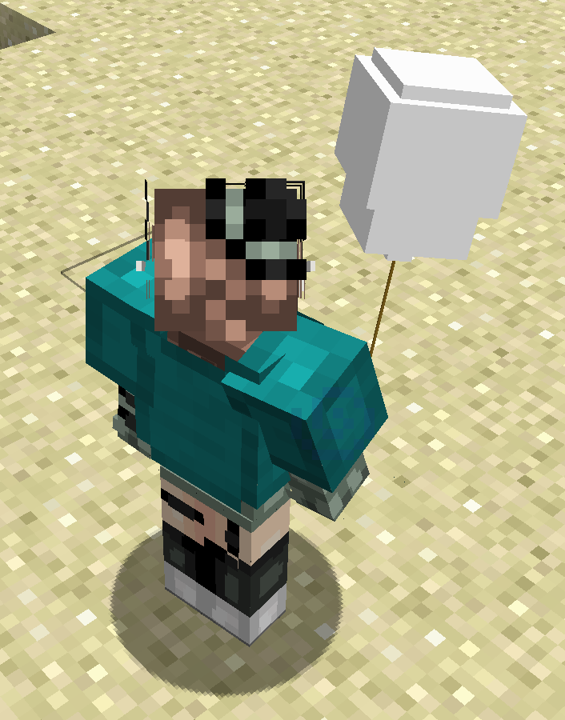

### Recipes

The recipe is generally the same for each balloon. The dye in the middle can be any of the above listed dyes.

All recipes must be crafted in the [Product crafter](chemistry-lab#product-crafter)

| Ingredients                                                                                                    | Crafting recipe                                                  | Recipe Command                                 |
| -------------------------------------------------------------------------------------------------------------- | ---------------------------------------------------------------- | ---------------------------------------------- |
| [6 Latex](chemistry-lab-compounds#latex) + Any Dye + Helium + [String](https://minecraft.gamepedia.com/String) | 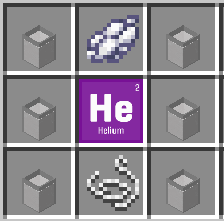 | `/tchemistry formula [Balloon colour]_Balloon` |

## Bleach

Bleach is used to remove the colour from objects. They work just like [Education Edition Bleach](https://minecraft.gamepedia.com/Bleach), however they can also make Leather Armour completely white and turn concrete powder white.

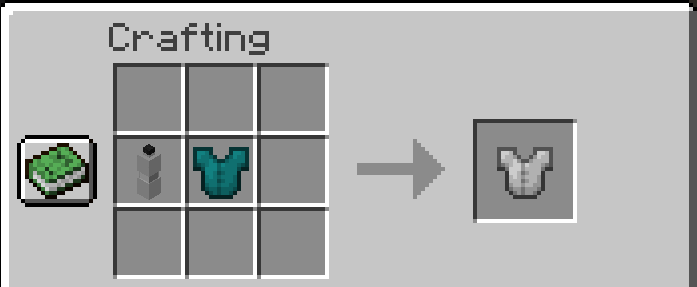

### Recipe

Recipe must be crafted in a [Lab table](chemistry-lab#lab-table)

Recipe is the same as it is in Education Edition

Recipe command: `/tchemistry formula Bleach`

| Result                                               | Materials Needed                                                                                                |
| ---------------------------------------------------- | --------------------------------------------------------------------------------------------------------------- |
| 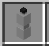 | 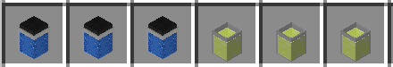                                                   |
| Bleach                                               | [3 Water](chemistry-lab-compounds#water) + [3 Sodium Hypochlorite](chemistry-lab-compounds#sodium-hypochlorite) |

## Glow Sticks

Glow sticks are cosmetic items that don't really do much on their own. They don't provide light, however holding one and right clicking into the air will give it an enchanting effect. Unlike [Balloons](#balloons), there are only 14 colours.

The following colours are available: White, Orange, Magenta, Light Blue, Yellow, Lime, Pink, Light Gray, Cyan, Purple, Blue, Brown, Green, and Red.

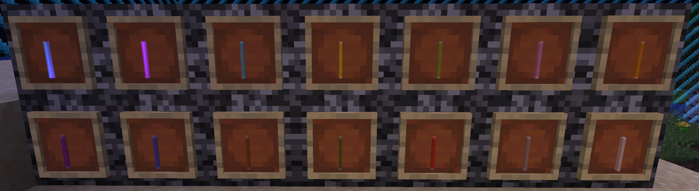
_All 14 colours of glow sticks. The first 2 on the top row are activated._

### Recipes

The recipe is generally the same for each glow stick. The dye in the middle can be any of the above listed dyes (which is all dyes except Gray and Black).

All recipes must be crafted in the [Product crafter](chemistry-lab#product-crafter)

| Ingredients                                                                                                                                                                | Crafting recipe                                                           | Recipe Command                            |
| -------------------------------------------------------------------------------------------------------------------------------------------------------------------------- | ------------------------------------------------------------------------- | ----------------------------------------- |
| [6 Polyethylene](chemistry-lab-compounds#polyethylene) + Dye + [Luminol](chemistry-lab-compounds#luminol) + [Hydrogen Peroxide](chemistry-lab-compounds#hydrogen-peroxide) | 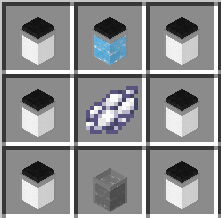 | `/tchemistry formula [colour]_Glow_Stick` |

## Heat Block

The Heat Block acts as a source of heat, melting nearby ice in a 5x5 area.

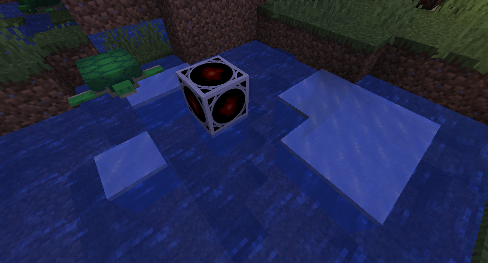

### Recipe

This recipe must be crafted in the [Lab table](chemistry-lab#lab-table)

Recipe command: `/tchemistry formula Heat_Block`

| Result                                                       | Materials Needed                                                                                                                            |
| ------------------------------------------------------------ | ------------------------------------------------------------------------------------------------------------------------------------------- |
| 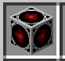 |                                                                        |
| Heat Block                                                   | Iron + [Water](chemistry-lab-compounds#water) + [Charcoal](https://minecraft.gamepedia.com/Charcoal) + [Salt](chemistry-lab-compounds#salt) |

## Ice Bomb

Ice Bombs are simply ice in a ball! Throwing an ice bomb into a body of water will make a 3x3 of [ice](https://minecraft.gamepedia.com/Ice)

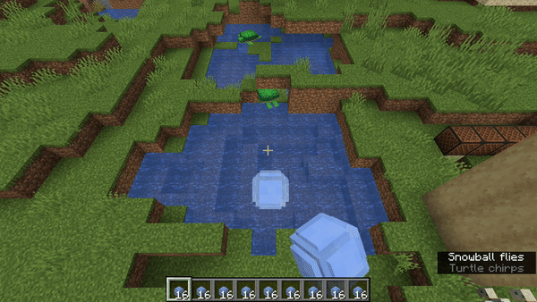

### Recipe

This recipe must be crafted in the [Lab table](chemistry-lab#lab-table)

Recipe command: `/tchemistry forumla Ice_Bomb`

| Result                                                   | Materials Needed                                                  |
| -------------------------------------------------------- | ----------------------------------------------------------------- |
| 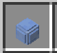 | 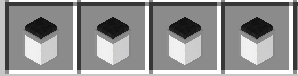 |
| Ice Bomb                                                 | [4 Sodium Acetate](chemistry-lab-compounds#sodium-acetate)        |

## Lamps

Lamps are simple light source blocks.

-   You can craft 4 different colours of Lamps: blue, red, purple, and green lamps.
-   Each lamp produces a light level of 15, the highest light level possible.
-   If the block is updated (e.g. a block is placed next to it) it loses its light until it is placed again.
-   The Lamp can be toggled with a Redstone-enabled [Sonic Screwdriver](sonic-screwdriver)

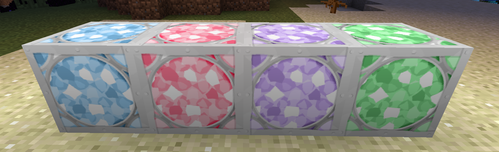
_(left to right) Blue Lamp, Red Lamp, Purple Lamp, Green Lamp_

### Recipes

All recipes must be crafted in the [Product crafter](chemistry-lab#product-crafter)

| Name        | Ingredients                                                                                                                       | Crafting recipe                                                         | Recipe Command                    |
| ----------- | --------------------------------------------------------------------------------------------------------------------------------- | ----------------------------------------------------------------------- | --------------------------------- |
| Blue Lamp   | [Cerium Chloride](chemistry-lab-compounds#cerium-chloride) + [Redstone Lamp](https://minecraft.gamepedia.com/Redstone_Lamp)       | 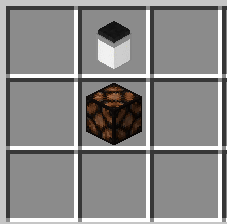     | `/tchemistry formula Blue_Lamp`   |
| Red Lamp    | [Mercuric Chloride](chemistry-lab-compounds#mercuric-chloride) + [Redstone Lamp](https://minecraft.gamepedia.com/Redstone_Lamp)   |        | `/tchemistry formula Red_Lamp`    |
| Purple Lamp | [Potassium Chloride](chemistry-lab-compounds#potassium-chloride) + [Redstone Lamp](https://minecraft.gamepedia.com/Redstone_Lamp) |  | `/tchemistry formula Purple_Lamp` |
| Green Lamp  | [Tungsten Chloride](chemistry-lab-compounds#tungsten-chloride) + [Redstone Lamp](https://minecraft.gamepedia.com/Redstone_Lamp)   | 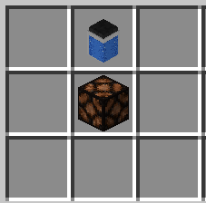   | `/tchemistry formula Green_Lamp`  |

## Sparklers

Sparklers work similar to how they do in real life. Right clicking one on air makes it sparkle for 30 seconds! Once it's done, it will consume 1 sparkler. If you are not holding the Sparkler when the time is up, it will only take it once you hold it again.

Sparklers only come in 5 colours: Orange, Blue, Green, Purple, and Red.

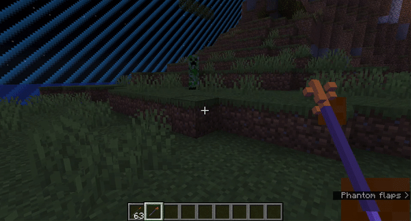
_Orange Sparkler in action_

### Recipes

All recipes must be crafted in the [Product crafter](chemistry-lab#product-crafter)

| Name            | Ingredients                                                                          | Crafting recipe                                                                 | Recipe Command                        |
| --------------- | ------------------------------------------------------------------------------------ | ------------------------------------------------------------------------------- | ------------------------------------- |
| Orange Sparkler | [Calcium Chloride](chemistry-lab-compounds#calcium-chloride) + Magnesium + Stick     | 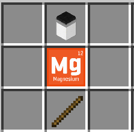 | `/tchemistry formula Orange_Sparkler` |
| Blue Sparkler   | [Cerium Chloride](chemistry-lab-compounds#cerium-chloride) + Magnesium + Stick       |        | `/tchemistry formula Blue_Sparkler`   |
| Green Sparkler  | [Tungsten Chloride](chemistry-lab-compounds#tungsten-chloride) + Magnesium + Stick | 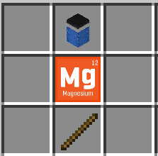 | `/tchemistry formula Green_Sparkler`  |
| Purple Sparkler | [Potassium Chloride](chemistry-lab-compounds#potassium-chloride) + Magnesium + Stick   |    | `/tchemistry formula Purple_Sparkler` |
| Red Sparkler    | [Mercuric Chloride](chemistry-lab-compounds#mercuric-chloride) + Magnesium + Stick   |    | `/tchemistry formula Red_Sparkler`    |

## Super Fertiliser

Super fertiliser is a "super" version of the typical bone meal. It instantly fully-grows crops, restoring old bone meal mechanics.

### Recipe

This recipe must be crafted in the [Lab table](chemistry-lab#lab-table)

Recipe command: `/tchemistry formula Super_Fertiliser`

| Result                                                                   | Materials Needed                                                                  |
| ------------------------------------------------------------------------ | --------------------------------------------------------------------------------- |
| 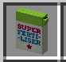 | 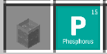 |
| Super Fertiliser                                                         | [Ammonia](chemistry-lab-compounds#ammonia) + Phosphorus                           |
