# TARDIS Chemistry Lab

The TARDIS comes with a Chemistry lab room!

*This page shows how to use the chemistry lab equipment, to see a list of items you can craft with the equipment, check out [Chemistry Lab Products](chemistry-lab-products) or their [compounds](chemistry-lab-compounds), or the [elements themselves](elements).*

## Table of Contents
* [Resource Pack](#resource-pack)
* [Permissions](#permissions)
* [Element Constructor](#element-constructor)
* [Chemical Compounding](#chemical-compounding)
* [Material Reducer](#material-reducer)
* [The Lab Table & Product Crafting](#the-lab-table--product-crafter)
* [Atomic Elements Block](#atomic-elements-block-creativecheats)

## Resource Pack

***The room is best viewed with the [resource pack](https://github.com/eccentricdevotion/TARDIS-Resource-Pack).***

All images use the TARDIS-Resource-Pack, and your experience will be much better with it!

How does it work?

## Permissions

**TARDIS Chemistry Lab equipment is not given to users by default or with `tardis.use`, they must be given via the table below**

| Permission Node             | Description                                                            |
| --------------------------- | ---------------------------------------------------------------------- |
| `tardis.chemistry.command`  | Allow a player to open Chemistry GUIs by command.                      |
| `tardis.chemistry.creative` | Allow a player to craft and open the Chemistry creative GUIs.          |
| `tardis.construct.build`    | Allow a player to craft and open the 'Element constructor' GUI.        |
| `tardis.compound.create`    | Allow a player to craft and open the 'Chemical compounds' GUI.         |
| `tardis.reducer.use`        | Allow a player to craft and open the 'Material reducer' GUI.           |
| `tardis.products.craft`     | Allow a player to craft and open the 'Product crafting' GUI.           |
| `tardis.lab.combine`        | Allow a player to craft and open the 'Lab table' GUI.                  |
| `tardis.formula.show`       | Allow a player to view a compound or product formula.                  |
| `tardis.chemistry.brew`     | Allow a player to brew potions and cures using a cauldron.             |
| `tardis.chemistry.cure`     | Allow a player to cure poison, weakness, blindness and nausea effects. |
| `tardis.chemistry.glue`     | Allow a player to turn pistons into sticky pistons with glue.          |

## Element Constructor

In order to create elements, you need to use the Element constructor to create elements.

[Click here to view a list of all the elements!](elements)

In-game description: Add or subtract protons, neutrons and electrons to construct an atomic element.

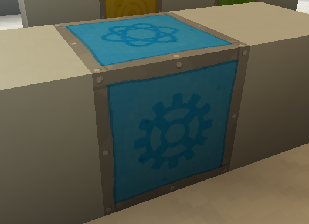

Right clicking this block or running `/tardischemistry gui construct` will open up a GUI to create Elements for you to mess around with.

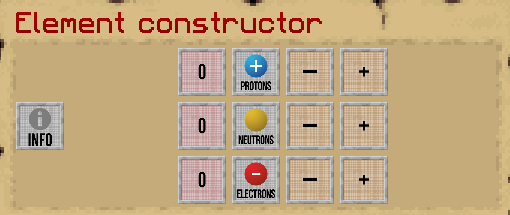

From here, you can use the plus or minus items to decrease or increase the amount of protons, neutrons, and electrons in your element. For example, 1 Proton and 1 Electron => 1 Hydrogen atom.

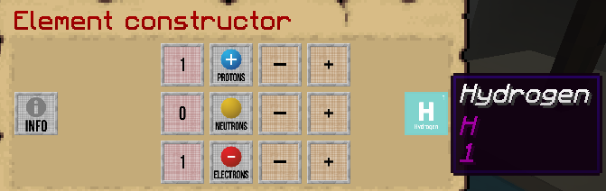

Click the newly created atom to add it to your inventory. Every click adds one to your inventory.

## Chemical Compounding

(You can also access this GUI with `/tardischemistry gui compound` with proper permissions)

[Click to view all the compounds!](chemistry-lab-compounds)

In-game description: Combine elements to create chemical compounds. To see a compound formula use the `/tardischemistry forumla` command. Place items in the bottom row from left to right.

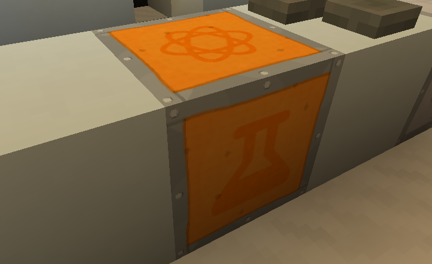

Once you have elements, you can compound them into different items. For example, if you run `/tardischemistry forumla Water`, you can figure out how to craft water! (Note, the formula is case-sensitive!)

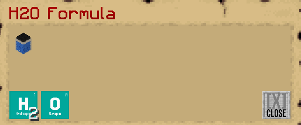

As you can see, we need 2 Hydrogen and 1 Oxygen atom. If we put this into the Chemical compounder, then click this check...

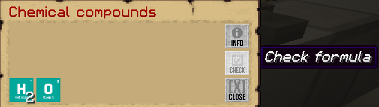

We get water! Click the item to select it and bring it to your inventory.

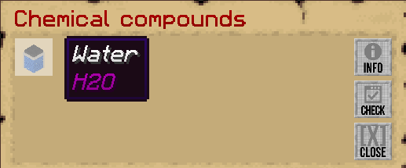

## Material Reducer

With the material reducer, you can reduce a substance to its component elements.

[Click to see vanilla item/block material reductions!](material-reductions) (does not include compound reductions)

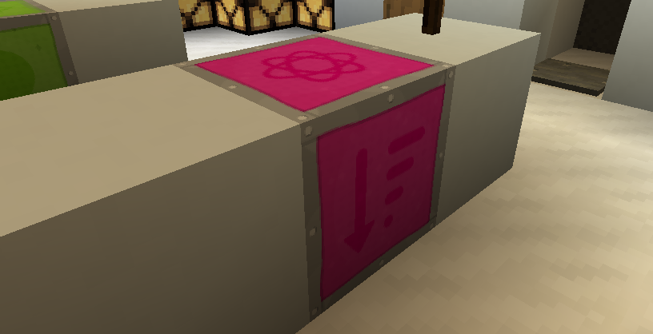

Remember our Chemical compounder? With this machine, we can reduce it back to its atoms used to created it. You can access this by right clicking the block above or by running `/tardischemistry gui reduce`

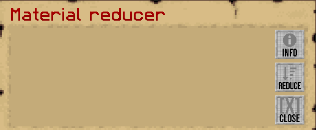

Place an item in the first slot, then click the "Reduce" button. Let's put in our water from before.

**It does not have to just be items crafted from before, almost any item can go in there, sand, dirt, etc**

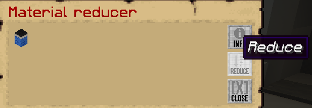

Clicking reduce gets us our Hydrogen and Oxygen back!

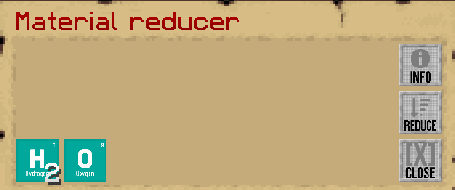

## The Lab Table & Product Crafter

These blocks do the same thing, however they craft different items with elements and compounds and the process to craft them differs slightly.

[Click to view all possible products made from these machines!](chemistry-lab-products)

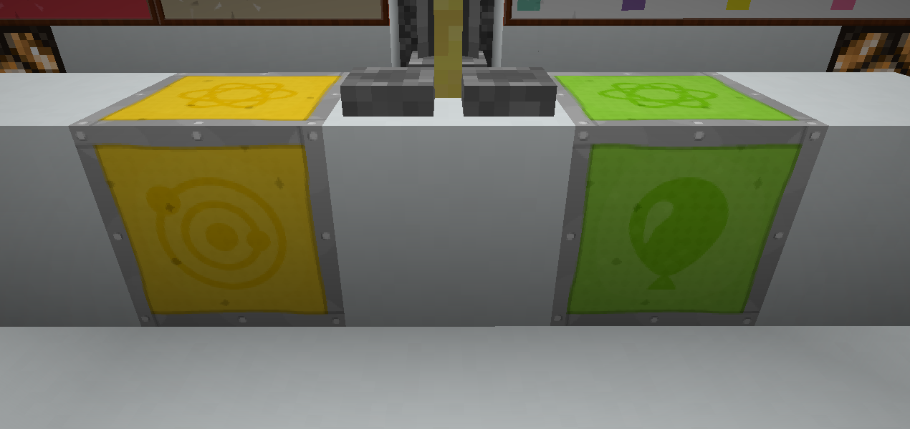

Lab Table (left) and Product Crafter (right).

### Lab Table

In-game description: Combine elements and compounds to create bleach, ice bombs, heat blocks, and fertiliser.

As the description implies, you can craft those 4 items, just like you would with the [chemical compounder](#chemical-compounding). Place items in the bottom row from left to right, then click Check product.

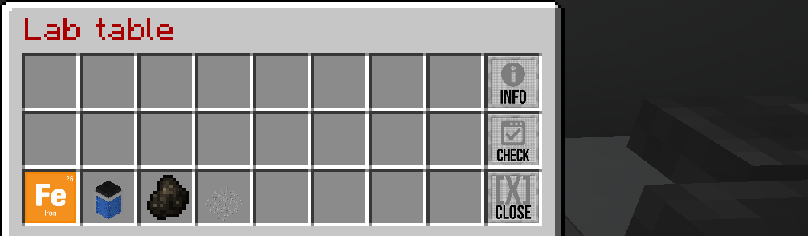

Clicking check product gets our product!

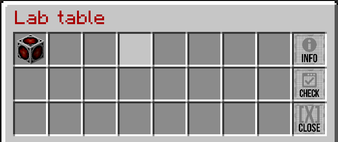

### Product Crafter

In-game description: Combine elements and compounds to create sparklers, balloons, lamps, and glow sticks.

Much like the Lab table, you can craft the above 4 items. However, instead these items must be arranged like a 3x3 crafting grid, instead of putting them in the bottom row.

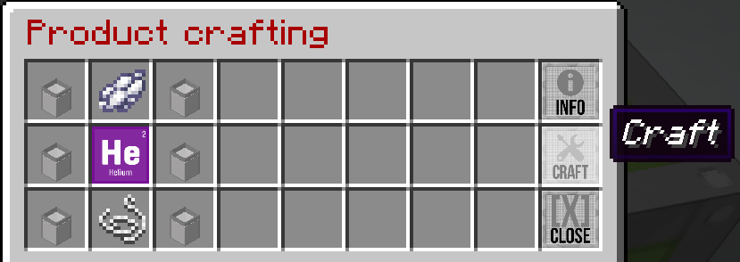

Then, click "Craft" to complete the process.

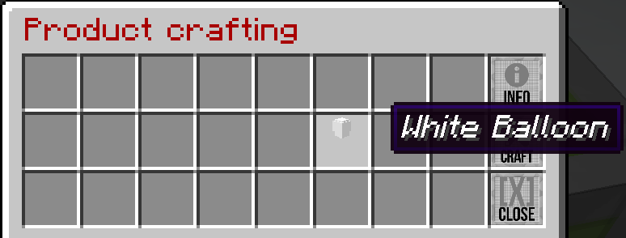

## Atomic Elements Block (Creative/Cheats)

You can get all elements and products from the Atomic Elements panel.

(You can also access this GUI with `/tardischemistry gui creative elements` with proper permissions)

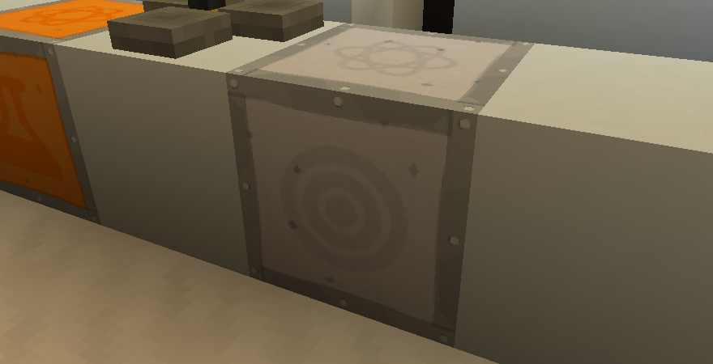

The Atomic Elements GUI is where you can obtain elements, compounds, as well as products.

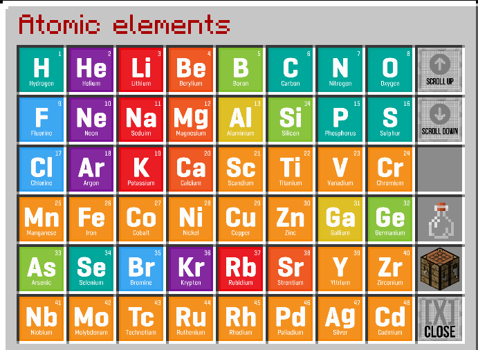
