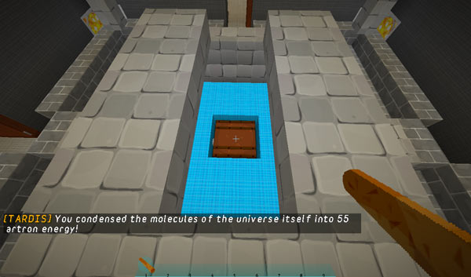

# Condenser chest

One of the ways to recharge the Artron Energy Capacitor is to convert raw materials into energy. You can do this with the TARDIS’s condenser chest.

The condenser chest is automatically added to newly created TARDISes, but there are two other ways to add the chest:

1. Place a chest, and use the `/tardis update condenser` command
2. Grow an **Eye of Harmony** room. The Eye of Harmony contains a chest which is automatically set as the condenser.

### Using the condenser

To convert materials to Artron Energy, place them in the Condenser chest and then close it. Any valid materials will be converted, and you will receive a message stating how much energy was generated.

A list of condensable items and their relative values can be found on the [Condensables](condensables.html) page.

### Server condenser

As of TARDIS v3.0-beta-1, you can now add a public server condenser. This allows players to top up their Artron Energy without having to be inside the TARDIS. This is useful if a player has used the last of their energy to hide the TARDIS.

To add a server condenser, place a chest, target it, then run the command:

    /tardisadmin condenser

The server condenser works the same way as the interior TARDIS condenser.
