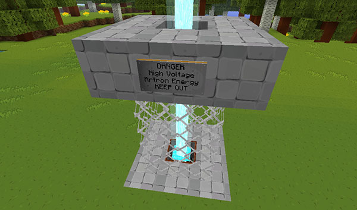

# Configuration

The configuration files (config.yml, artron.yml, rooms.yml, recipes.yml) are generated automatically, you can find them in _plugins/TARDIS/_

All configuration options can be set via in game commands or in the console, see the [Admin Commands](admin-commands.html) page.

Choose a configuration page from below:

1. [Storage](configuration-storage.html)
2. [TARDIS creation](configuration-creation.html)
3. [Police Box and presets](configuration-preset.html)
4. [TARDIS travel](configuration-travel.html)
5. [TARDIS preferences](configuration-prefs.html)
6. [TARDIS restrictions](configuration-allow.html)
7. [Room growth](configuration-growth.html)
8. [Rooms](configuration-rooms.html)
9. [Energy](configuration-energy.html)
10. [Planets](configuration-planets.html)
11. [Chameleon Arch](chameleon-arch.html#config)
12. [Circuits](circuit-use.html#config)
13. [Siege mode](siege-mode.html#config)
14. [Junk TARDIS](junk-tardis.html#config)
15. [Desktop Theme](desktop-theme.html#config)
16. [Archives](archive.html#config)

