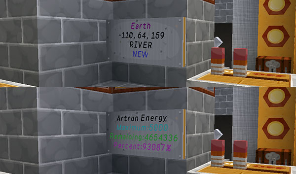
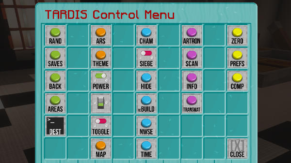

# The TARDIS Control Menu

From TARDIS version 3.6 and higher, the TARDIS Control Menu is the main way to access the TARDIS’s functions. Previously the TARDIS had multiple signs scattered throughout the console to access its various GUIs. The TARDIS Control Menu brings them all together in one place.

The TARDIS Control Menu sign displays information about the TARDIS’s location and Artron Energy levels.

If you have an existing TARDIS without the Control Menu, you can add it by placing a sign where you want the Control Menu to be, and running the command:

    /tardis update control

Click on the sign and its position will be added to the TARDIS database.

## Control Menu use

To use the TARDIS Control Menu, right-click on the Control Menu sign.

The Control Menu opens, giving you a range of buttons grouped by type / colour. Hover over each button to see what it does. The button functions are explained below:

| Button | Icon | Action |
| --- | --- | --- |
| TARDIS Travel functions |
| --- |
| Random Location |  | Sets a random destination based on the position of the console _world, x, z_ and _multiplier_ repeaters. |
| Saved Locations |  | Opens the TARDIS Saves GUI. |
| Fast Return |  | Sets the destination to the last location the TARDIS travelled to. |
| TARDIS Areas |  | Opens the TARDIS Areas GUI. |
| Destination Terminal |  | Opens the TARDIS Areas GUI. |
| TARDIS Interior functions |
| --- |
| Architectural Reconfiguration System |  | Opens the Architectural Reconfiguration GUI. |
| Desktop Theme |  | Opens the Desktop Theme GUI. |
| Power |  | Toggles the TARDIS power on and off. |
| Light Switch |  | Toggles the TARDIS lamps on and off. |
| Toggle blocks behind door |  | Removes or places the wool behind the TARDIS door. |
| TARDIS Map |  | Opens the TARDIS Map GUI. |
| TARDIS Exterior functions |
| --- |
| Chameleon Circuit |  | Opens the Chameleon Circuit GUI. |
| Siege Mode |  | Toggles Siege Mode on and off. |
| Hide |  | Hides the TARDIS exterior. |
| Rebuild |  | Rebuilds the TARDIS exterior. |
| Direction |  | Changes the direction the TARDIS exterior faces. |
| Temporal Locator |  | Opens the Temporal Locator GUI. |
| TARDIS Information functions |
| --- |
| Artron Energy Levels |  | Displays the current TARDIS Artron Energy levels. |
| Scanner |  | Performs a scan of the TARDIS current (or next if set) destination. |
| TARDIS Information System |  | Opens the TARDIS Information System chat interface. |
| Miscellaneous functions |
| --- |
| Zero Room transmat |  | Transmats the player into the Zero Room. |
| Player Preferences |  | Opens the Player Prefs Menu GUI. |
| Close |  | Close the TARDIS Control Menu GUI. |

