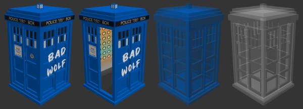

# Custom item model presets

As of version 5.0.0 you can now add custom item model presets for the TARDIS exterior.

Custom model presets are defined in _plugins/TARDIS/custom\_models.yml_:

```yaml
# a list of the custom models you want to use
models:
  # model name
  Type 40:
    # the item that is placed in the item frame
    item: CLAY_BALL
  Bad Wolf:
    item: WOLF_SPAWN_EGG
    
```

# Custom model data values

The plugin uses standardised values for each state of the TARDIS visuals - open/closed door + 2 stages of materialisation (coloured/clear). You must use these values when setting up your resource pack entries! See the examples below (these are also included in the [TARDIS-Resource-Pack](https://github.com/eccentricdevotion/TARDIS-Resource-Pack), and as comments in _custom\_models.yml_).

| State                | Custom model data |
| -------------------- | ----------------- |
| door closed          | `1001`            |
| door open            | `1002`            |
| transparent coloured | `1003`            |
| transparent clear    | `1004`            |



# Example model overrides

This would go in _assets/minecraft/models/item/**clay\_ball.json**_:

```json
{
  "parent": "minecraft:item/generated",
  "textures": {
    "layer0": "minecraft:item/clay_ball"
  },
  "overrides": [
    {"predicate": {"custom_model_data": 1001}, "model": "tardis:block/police_box/type_40_closed"},
    {"predicate": {"custom_model_data": 1002}, "model": "tardis:block/police_box/type_40_open"},
    {"predicate": {"custom_model_data": 1003}, "model": "tardis:block/police_box/type_40_stained"},
    {"predicate": {"custom_model_data": 1004}, "model": "tardis:block/police_box/type_40_glass"}
  ]
}
```

This would go in _assets/minecraft/models/item/**wolf\_spawn\_egg.json**_:

```json
{
  "parent": "minecraft:item/template_spawn_egg",
  "overrides": [
    {"predicate": {"custom_model_data": 1001}, "model": "tardis:block/police_box/bad_wolf_closed"},
    {"predicate": {"custom_model_data": 1002}, "model": "tardis:block/police_box/bad_wolf_open"},
    {"predicate": {"custom_model_data": 1003}, "model": "tardis:block/police_box/bad_wolf_stained"},
    {"predicate": {"custom_model_data": 1004}, "model": "tardis:block/police_box/bad_wolf_glass"}
  ]
}
```