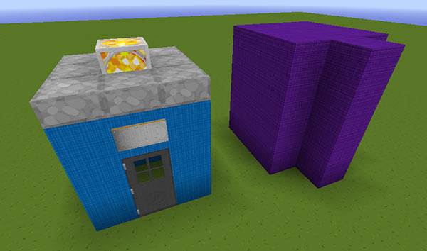

[Jump to video](#video)

# The Custom Chameleon preset

The TARDIS Chameleon Circuit GUI has one preset slot set up so that server admins can add a custom preset.

Custom presets need to be a certain size and shape:

- Maximum 4 blocks tall
- Maximum 3 blocks wide
- Maximum 3 blocks deep
- A single 4 block column at the front

You can build the custom preset with almost any block (directional blocks can sometimes be an issue), it can contain empty spaces (AIR), and there should be a door in it somewhere (iron, wood and trap doors will all work). **IMPORTANT:** When you build it, start by facing EAST so you are looking at the FRONT of the design.

Once you have constructed your new design, you need to create a preset file for the TARDIS plugin to use. The easiest way to do this is to use the `/tardisadmin make_preset [name] [asymmetric]` command.

To use the command:

- Face the front of the preset (you should be facing EAST)
- If the bottom left corner block is empty (AIR), place a sponge block there instead
- Run the `/tardisadmin make_preset [name] [asymmetric]` command
- Give the preset a name, and if the preset is an irregular shape (for example like the DUCK preset) put `true` for [asymmetric]. If it is boxy like the Police Box preset, put `false` for [asymmetric]
- Click the bottom left corner block

The plugin creates a text file in the _plugins/TARDIS_ folder called `custom_preset_[name].txt`

#### Final steps

If your custom preset contained a sign, you can change the text that is displayed on the second and third lines (the first line is reserved for the player’ name).

- Open the text file that was created and find the section starting with `##sign text`
- Change the lines that don't start with a `#` to what you want the sign to say
- Save the file, and then rename it to _custom\_preset.txt_ (you may have to remove/rename the old custom preset file first)
- Start up the server and select the custom preset in the Chameleon GUI
- Test the preset by rebuilding the TARDIS in each direction

### Video
<iframe src="https://player.vimeo.com/video/88423516" width="600" height="366" frameborder="0" webkitallowfullscreen mozallowfullscreen allowfullscreen></iframe>

Video here
