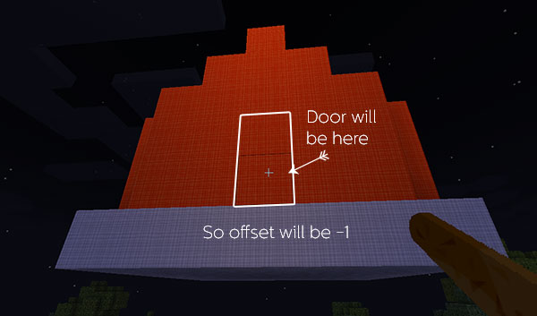

[Jump to video](#video)

# Custom rooms

TARDIS has the ability to add your own custom rooms using [TARDIS schematic](schematics.html) files and the `/tardisroom` command.

<!--<p>You can download community contributed schematics from <a href="http://tardis.thatsnotacreeper.com/">http://tardis.thatsnotacreeper.com/</a></p>-->

Custom schematics created with the `/tardisschematic` command are automatically saved in the _plugins/TARDIS/user\_schematics_ folder, if you have got a schematic from somewhere else you will need to manually put it in the correct folder on the server — it should be called **[something]**.tschm.

To add the room, run the following commands:

    /tardisroom add [something]
    /tardisroom [something] [cost]
    /tardisroom [something] [offset]
    /tardisroom [something] [seed material]
    /tardisroom [something] true

`[something]` is the name of the room/schematic file and _MUST_ be lowercase.

`[cost]` is the Artron Energy cost to grow the room, and must be a **POSITIVE** number.

`[offset]` is how far below the door position the schematic extends, and must be a **NEGATIVE** number e.g. `-1` (if your floors don’t line up then you got this wrong) See image below. Most of the time (allowing for the default redstone door circuits) this will be `-4`.



`[seed material]` is the [Bukkit Material enum](https://hub.spigotmc.org/stash/projects/SPIGOT/repos/bukkit/browse/src/main/java/org/bukkit/Material.java) of the room seed block, and must be _a block not used by any other rooms_ e.g. SAND

The last command enables the room.

### /tardisroom required

Lists the blocks needed to grow a room. This is helpful if `rooms_require_blocks` is `true` in the TARDIS config.

    /tardisroom required [room name]

## Tips

- A room template with the correct door circuits is supplied with the plugin. You can load and paste it into a world with the `/tardisschematic` command and then modify it as needed.

```    
    /tardisschematic load template
    /tardisschematic paste
```

- Any room can be enabled/disabled with `/tardisroom [name] [true|false]`, and all other settings can be changed using the same command `/tardisroom [name] [value]`
- Rooms schematics must be 16 blocks in width and 16 blocks in length
- Don’t put doors in the walls they will be added automatically (always in the centre of the wall)
- If you want to be able to have the rooms use the player wall and floor preferences, then you need to use orange wool for the walls and light grey wool for the floors
- Not all items will work — things that will NOT are: paintings, item frames, plants in flower pots (the pots are OK)
- Rooms are grown from the bottom to top so keep that in mind when designing the room — you can’t place levers upside down for example as there will be no block for them to stick to and they will just fall into the void

### Video

**Note:** This video is very outdated! The plugin no longer uses WorldEdit schematics and rooms should be grown with ARS. The video shows also the custom room schematic being put into the _schematics_ folder, but it should now be put into the _user\_schematics_ folder.

<iframe src="https://player.vimeo.com/video/64474578" width="600" height="365" frameborder="0" webkitallowfullscreen mozallowfullscreen allowfullscreen></iframe>
