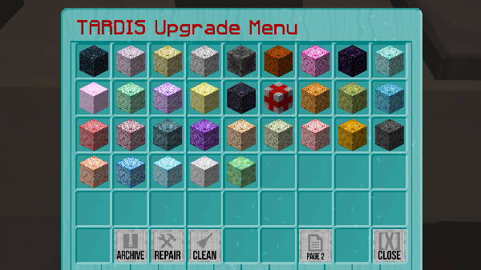
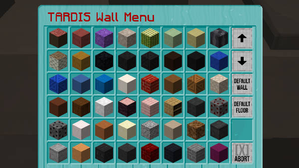

[Jump to video](#video)

# Desktop Theme

You can upgrade/downgrade/crossgrade your TARDIS to another type or simply change the wall and floor blocks with the
TARDIS Desktop Theme.

Changing the desktop theme requires a player to have the `tardis.upgrade` permission, and consumes a set amount of
Artron Energy (the amount of energy is set in _artron.yml_).

If you are just changing the walls and floor of your current TARDIS the Artron cost is less (you can set the reduction
with the `just_wall_floor: [percent]` option in _artron.yml_.

The speed at which the change happens is linked to the `growth.room_speed` config option.

### Opening the desktop theme GUI

You can open the desktop theme GUI from the [TARDIS Control Menu](control-menu.html), with a command, or by **right-shift-clicking the ARS sign**.

To open the desktop theme GUI using a command type one of the following:

    /tardis desktop
    /tardis theme
    /tardis upgrade

### How it works

1. Run the command, or right-shift-click the ARS sign to open the GUI.
2. When the GUI opens — select the TARDIS you want to change to — this can be the same type as you currently have if you
   just want to change the walls and floor. If you don’t have permission for the TARDIS type or don’t have enough Artron
   Energy you won’t be able to select that TARDIS type. The server's custom consoles appear on page two.
3. If there are rooms in the way when trying to upgrade to a bigger TARDIS, you will need to manually jettison them
   first (you must be using ARS, manually growing rooms is not supported).
4. Once a TARDIS type has been selected, the next GUI opens allowing you to select a wall block, click one... or choose _Default Wall_ to use orange wool.
5. Another GUI opens allowing you to select a floor block, click one... or choose _Default Floor_ to use light gray wool.
6. The TARDIS starts reconfiguring — you should be able to stay inside the TARDIS (if needed you will be teleported to a
   safe location).
7. Watch in amazement as the TARDIS changes before your eyes.

### Archiving, repairing and cleaning

THe TARDIS Upgrade GUI also contains three other buttons to aid keeping your console in tip-top shape.

| Button     | Icon                                                                                                                            | Action                                                                                                                                                                                                                                                          |
|------------|---------------------------------------------------------------------------------------------------------------------------------|-----------------------------------------------------------------------------------------------------------------------------------------------------------------------------------------------------------------------------------------------------------------|
| Archive    |  | Use this to save a copy of a modified console - see the [Archiving consoles](archive.html) page for more details.                                                                                                                                               |
| Repair     |   | Use this to repair a damaged console. It resets the console back to the original console schematic. Players must condense all missing blocks - unless the `/tardisadmin repair [player] [amount]` command has been run, assigning the player a 'free' repair(s) |
| Clean      |    | Use this to remove any blocks in the console that are not in the original schematic (missing blocks will not be restored) - good if someone has griefed your interior by filling it with cobwebs.                                                               |

### Config options

| Option                                                        | Type                                                                            | Default Value |
|---------------------------------------------------------------|---------------------------------------------------------------------------------|---------------|
| &nbsp;&nbsp;&nbsp;&nbsp;`desktop.check_blocks_before_upgrade` | boolean                                                                         | `false`       |
| &nbsp;                                                        | Sets whether to compare the amount of block changes before allowing an upgrade. |
| &nbsp;&nbsp;&nbsp;&nbsp;`desktop.block_change_percent`        | integer                                                                         | `25`          |
| &nbsp;                                                        | Sets the maximum percentage of block change compared to the original schematic. |

### Video

<iframe width="600" height="366" src="https://www.youtube.com/embed/g-tHLnpR8oY?rel=0" frameborder="0" allowfullscreen></iframe><iframe src="https://player.vimeo.com/video/104995044" width="600" height="366" frameborder="0" webkitallowfullscreen mozallowfullscreen allowfullscreen></iframe>
