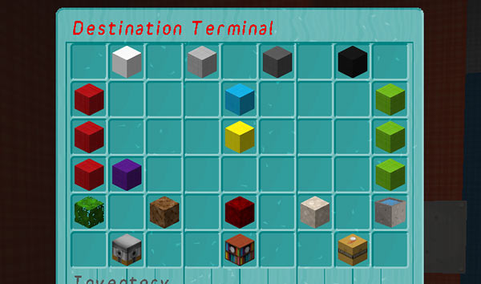
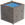

[Jump to video](#video)

# Destination Terminal

The Destination Terminal is an alternative way to set a time travel location. The Destination Terminal is automatically added to new TARDISes. You can destroy and place it at a new location by using the `/tardis update terminal` command.

To use the Destination Terminal, right-click it to open the inventory based GUI. You will see a screen like the one below. The basic functions of the GUI are the same as when using the repeaters on the TARDIS console — you can set the `x` and `z` coordinates, a distance multiplier, and a world type. The Destination Terminal also lets you select the TARDIS submarine mode for travelling under water.

### Key to the blocks

First row: **Step levels** — these control how much the x, z and multiplier values change.

-  Step 10
-  Step 25
-  Step 50
-  Step 100

Second row: **x coordinate**.

-  Make x move towards negative
-  x coordinate value
-  Make x move towards positive

Third row: **z coordinate**.

-  Make z move towards negative
-  z coordinate value
-  Make z move towards positive

Fourth row: **distance multiplier**.

-  Make multiplier less
-  Multiplier value
-  Make multiplier bigger

Fifth row: **world/environment type**.

-  Use current world
-  Random overworld
-  A Nether world
-  An End world
-  Submarine mode

Bottom row: **check/set destination**.

-  Check destination
-  Set destination
-  Cancel

### Video

Slightly outdated, but you’ll get the idea…

<iframe src="https://player.vimeo.com/video/68899459" width="600" height="366" frameborder="0" webkitallowfullscreen mozallowfullscreen allowfullscreen></iframe>
