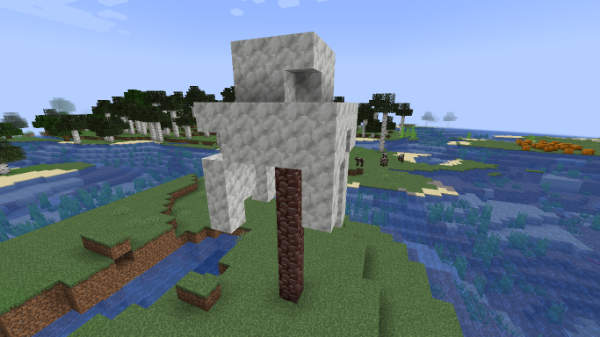

# TARDIS dev commands

Commands used by eccentric_nz to help with coding and documenting the TARDIS plugin.

### `/tardisdev`

* Alias: `/tdev`
* Permission: `tardis.admin`

| Argument       | Description                                                                                                                                                                                              | Usage                              |
|----------------|----------------------------------------------------------------------------------------------------------------------------------------------------------------------------------------------------------|------------------------------------|
| `add_regions`  | Adds missing WorldGuard regions for Bedrock players.                                                                                                                                                     | `/tdev add_regions`                |
| `advancements` | Checks whether a TARDIS advancement is valid.                                                                                                                                                            | `/tdev advancements [advancement]` |
| `biome`        | Get the biome the player is looking at.                                                                                                                                                                  | `/tdev biome`                      |
| `list`         | Lists various options to aid documentation - possible listings are: `preset_perms`, `perms`, `recipes`, `blueprints`, `commands`.                                                                        | `/tdev list [which] [html/all]`    |
| `stats`        | Display ARS room counts.                                                                                                                                                                                 | `/tdev stats`                      |
| `tree`  | Grows a Huge Fungus Tree on the block the player is targeting. If no further arguments are specified, random blocks are used to grow the tree. You can also specify a block for the stem, hat and decor. | `/tdev tree [stem] [hat] [decor]`  |
| `plurals`      | Displays a list of block and item names in plural form.                                                                                                                                                  | `/tdev plurals`                    |
| `chunky`       | Pre-generates chunks using the [Chunky plugin](https://www.spigotmc.org/resources/chunky.81534/)                                                                                                         | `/tdev chunky [world]`             |
| `displayitem`   | Various commands to test Item Display custom blocks and lights - sub-commands are: `add`, `remove`, `place`, `break`, `convert`, `chunk` | `/tdev displayitem place [display block]` see separate table below.

#### `/tdev displayitem`

| Argument | Description | Usage |
| -------- | ----------- | ----- |
| `add`    | Adds a TARDIS Shop module item (hologram) above the targeted block. | `/tdev displayitem add` |
| `remove`    | Removes an Item Display from above the targeted block. | `/tdev displayitem remove` |
| `place`    | Places an Item Display custom block on top of the block the player is targeting. | `/tdev displayitem place [custom block]` |
| `break`    | Breaks the Item Display custom block the player is targeting and drops the related item. | `/tdev displayitem break` |
| `convert`    | Converts old custom mushroom blocks to Item Display custom blocks in TARDIS interiors and ARS rooms. | `/tdev displayitem convert` |
| `chunk`    | Deletes all Item Display and Interaction entieies in the chunk the player currently resides in. | `/tdev displayitem chunk` |
