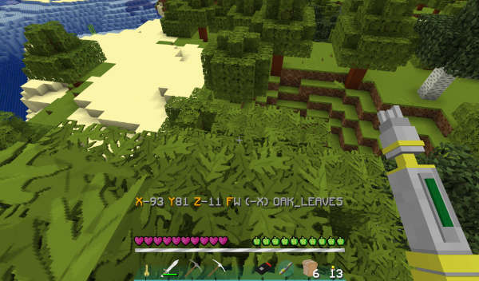

# TARDIS Display

TARDIS can provide a heads up display (HUD) for players that shows various information:

- the biome the player is in
- the player's current coordinates
- the direction the player is facing
- the type of block the player is targeting
- a combination of the above



## Permissions

`tardis.display` lets players use the TARDIS HUD.

## Use

Activate the HUD with the command:

```
/tardisdisplay [ALL|BIOME|COORDS|DIRECTION|TARGET_BLOCK]
```

## Configuration

There is one config option which uses colour codes and placeholders to show information for the `ALL` option:

```
# HUD display
display:
   all: '&6X&7%X% &6Y&7%Y% &6Z&7%Z% &6F&7%FACING% (%FACING_XZ%) %TARGET_BLOCK%'
```

The placeholders that can be used are:

| Placeholder      | Description                                             |
|------------------|---------------------------------------------------------|
| `%X%`            | the `x` coordinate of the player’s location             |
| `%Y%`            | the `y` coordinate of the player’s location             |
| `%Z%`            | the `z` coordinate of the player’s location             |
| `%FACING%`       | the direction the player is facing (`N`, `W`, `S`, `E`) |
| `%FACING_XZ%`    | the direction the player is facing (+/- `x`, +/- `z`)   |
| `%TARGET_BLOCK%` | the type of block the player is targeting               |
| `%BIOME% `       | the biome the player is in                              |

The other HUD display options use the following (not configurable):

```
BIOME: "&6B&7%BIOME%"
COORDS: "&6X&7%X% &6Y&7%Y% &6Z&7%Z%"
DIRECTION: "&6F&7%FACING% (%FACING_XZ%)"
TARGET_BLOCK: "&6T&7%TARGET_BLOCK%"
```