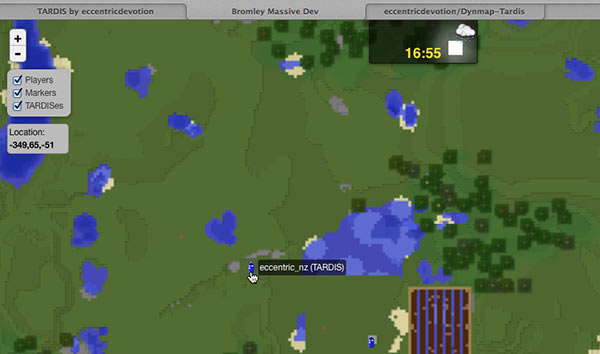

# Dynmap-TARDIS

If you have Dynmap installed on your Bukkit server, you can use the Dynmap-TARDIS add-on to display the real-time locations of all TARDISes.

You can download the Dynmap-TARDIS plugin from here: [http://dev.bukkit.org/bukkit-plugins/dynmap-tardis/](http://dev.bukkit.org/bukkit-plugins/dynmap-tardis/)

### Requirements

- TARDIS version 2.8-beta-1 build #654 or higher
- Dynmap (Dynmap-TARDIS is compiled against Dynmap 1.9.2)

### Installation

1. Install Dynmap as per the instructions found on the [Dynmap](http://dev.bukkit.org/bukkit-plugins/dynmap/) page. Run the server once to generate the default Dynmap files and folders.
2. Drop the _Dynmap-TARDIS.jar_ file in the server plugins folder.
3. Put the [tardis.png](https://github.com/eccentricdevotion/Dynmap-Tardis/blob/master/tardis.png?raw=true%0A) icon file ( ) into the _plugins/dynmap/web/tiles/\_markers\_/_ folder.
4. Run the command `/dmarker addicon id:tardis newlabel:tardis file:plugins/dynmap/web/tiles/_markers_/tardis.png`
5. Stop and start the server.
6. Render the map.

