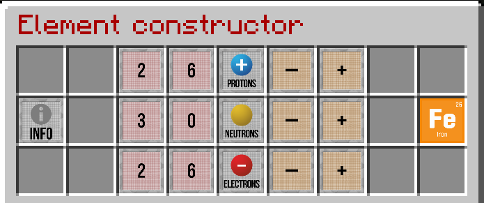

# Atomic Elements

This is a cheat sheet for the Atomic Elements used in the [Element constructor](chemistry-lab#element-constructor)

Please note, the Protons and Electrons are the same number and are based on the Atomic Number.

*Example of Iron in an [Element constructor](chemistry-lab#element-constructor)*

| Name          | Symbol | Atomic Number | Neutrons |
| ------------- | ------ | ------------- | -------- |
| Hydrogen      | H      | 1             | 0        |
| Helium        | He     | 2             | 2        |
| Lithium       | Li     | 3             | 4        |
| Beryllium     | Be     | 4             | 5        |
| Boron         | B      | 5             | 6        |
| Carbon        | C      | 6             | 6        |
| Nitrogen      | N      | 7             | 7        |
| Oxygen        | O      | 8             | 8        |
| Fluorine      | F      | 9             | 10       |
| Neon          | Ne     | 10            | 10       |
| Sodium        | Na     | 11            | 12       |
| Magnesium     | Mg     | 12            | 12       |
| Aluminium     | Al     | 13            | 14       |
| Silicon       | Si     | 14            | 14       |
| Phosphorus    | P      | 15            | 16       |
| Sulfur        | S      | 16            | 16       |
| Chlorine      | Cl     | 17            | 18       |
| Argon         | Ar     | 18            | 22       |
| Potassium     | K      | 19            | 20       |
| Calcium       | Ca     | 20            | 20       |
| Scandium      | Sc     | 21            | 24       |
| Titanium      | Ti     | 22            | 26       |
| Vanadium      | V      | 23            | 28       |
| Chromium      | Cr     | 24            | 28       |
| Manganese     | Mn     | 25            | 30       |
| Iron          | Fe     | 26            | 30       |
| Cobalt        | Co     | 27            | 32       |
| Nickel        | Ni     | 28            | 31       |
| Copper        | Cu     | 29            | 35       |
| Zinc          | Zn     | 30            | 30       |
| Gallium       | Ga     | 31            | 39       |
| Germanium     | Ge     | 32            | 41       |
| Arsenic       | As     | 33            | 42       |
| Selenium      | Se     | 34            | 45       |
| Bromine       | Br     | 35            | 45       |
| Krypton       | Kr     | 36            | 48       |
| Rubidium      | Rb     | 37            | 48       |
| Strontium     | Sr     | 38            | 50       |
| Yttrium       | Y      | 39            | 50       |
| Zirconium     | Zr     | 40            | 51       |
| Niobium       | Nb     | 41            | 52       |
| Molybdenum    | Mo     | 42            | 54       |
| Technetium    | Tc     | 43            | 55       |
| Ruthenium     | Ru     | 44            | 57       |
| Rhodium       | Rh     | 45            | 58       |
| Palladium     | Pd     | 46            | 60       |
| Silver        | Ag     | 47            | 61       |
| Cadmium       | Cd     | 48            | 64       |
| Indium        | In     | 49            | 66       |
| Tin           | Sn     | 50            | 69       |
| Antimony      | Sb     | 51            | 71       |
| Tellurium     | Te     | 52            | 76       |
| Iodine        | I      | 53            | 74       |
| Xenon         | Xe     | 54            | 77       |
| Caesium       | Cs     | 55            | 78       |
| Barium        | Ba     | 56            | 81       |
| Lanthanum     | La     | 57            | 82       |
| Cerium        | Ce     | 58            | 82       |
| Praseodymium  | Pr     | 59            | 82       |
| Neodymium     | Nd     | 60            | 84       |
| Promethium    | Pm     | 61            | 84       |
| Samarium      | Sm     | 62            | 88       |
| Europium      | Eu     | 63            | 89       |
| Gadolinium    | Gd     | 64            | 93       |
| Terbium       | Tb     | 65            | 94       |
| Dysprosium    | Dy     | 66            | 97       |
| Holmium       | Ho     | 67            | 98       |
| Erbium        | Er     | 68            | 99       |
| Thulium       | Tm     | 69            | 100      |
| Ytterbium     | Yb     | 70            | 103      |
| Lutetium      | Lu     | 71            | 104      |
| Hafnium       | Hf     | 72            | 106      |
| Tantalum      | Ta     | 73            | 108      |
| Tungsten      | W      | 74            | 110      |
| Rhenium       | Re     | 75            | 111      |
| Osmium        | Os     | 76            | 114      |
| Iridium       | Ir     | 77            | 115      |
| Platinum      | Pt     | 78            | 117      |
| Gold          | Au     | 79            | 118      |
| Mercury       | Hg     | 80            | 121      |
| Thallium      | Tl     | 81            | 123      |
| Lead          | Pb     | 82            | 125      |
| Bismuth       | Bi     | 83            | 126      |
| Polonium      | Po     | 84            | 125      |
| Astatine      | At     | 85            | 125      |
| Radon         | Rn     | 86            | 136      |
| Francium      | Fr     | 87            | 136      |
| Radium        | Ra     | 88            | 138      |
| Actinium      | Ac     | 89            | 138      |
| Thorium       | Th     | 90            | 142      |
| Protactinium  | Pa     | 91            | 148      |
| Uranium       | U      | 92            | 146      |
| Neptunium     | Np     | 93            | 144      |
| Plutonium     | Pu     | 94            | 150      |
| Americium     | Am     | 95            | 148      |
| Curium        | Cm     | 96            | 151      |
| Berkelium     | Bk     | 97            | 150      |
| Californium   | Cf     | 98            | 153      |
| Einsteinium   | Es     | 99            | 153      |
| Fermium       | Fm     | 100           | 157      |
| Mendelevium   | Md     | 101           | 157      |
| Nobelium      | No     | 102           | 157      |
| Lawrencium    | Lr     | 103           | 159      |
| Rutherfordium | Rf     | 104           | 157      |
| Dubnium       | Db     | 105           | 157      |
| Seaborgium    | Sg     | 106           | 157      |
| Bohrium       | Bh     | 107           | 155      |
| Hassium       | Hs     | 108           | 157      |
| Meitnerium    | Mt     | 109           | 157      |
| Darmstadtium  | Ds     | 110           | 151      |
| Roentgenium   | Rg     | 111           | 161      |
| Copernicium   | Cn     | 112           | 165      |
| Nihonium      | Nh     | 113           | 173      |
| Flerovium     | Fl     | 114           | 174      |
| Moscovium     | Mc     | 115           | 174      |
| Livermorium   | Lv     | 116           | 177      |
| Tennessine    | Ts     | 117           | 177      |
| Oganesson     | Og     | 118           | 176      |
| Unknown       | Un     | 999           | 999      |
