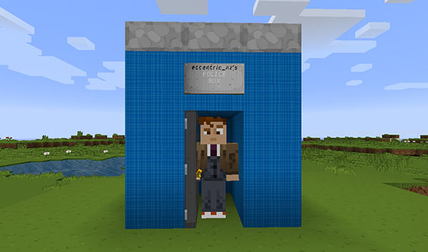

# Entering and exiting the TARDIS

**Note:** From TARDIS v2.9-beta-1 the entry and exit mechanics of the plugin have changed, and you can now walk in and out of the TARDIS if the door is open.

## You must exit the TARDIS correctly!

You should never leave the TARDIS by any other way than walking in and out (or clicking the TARDIS door). The plugin keeps track of who is in the TARDIS, so that TARDIS specific functions will work correctly (e.g. you can only use the `/tardis update` command inside the TARDIS, and you can only destroy the TARDIS if you are outside of it.)

## Walk in and out

**Note:** If the exterior TARDIS preset you have selected has a door and space to walk inside, then you can walk in to be transported to the interior. If it has a trapdoor or there isn't space to walk inside — SHIFT-RIGHT click the door with the TARDIS key to gain entry.

Right-clicking the TARDIS door now opens and closes the door, SHIFT-right-clicking will teleport you in and out (the old behaviour).

The TARDIS _interior_ door can be opened and closed with any item in hand by simply right-clicking the door.

The TARDIS _exterior_ door can be only opened by right-clicking it with the TARDIS key, but can be closed with any item in hand.

Opening the door activates walk in access, but be careful, it also means that monsters can enter the TARDIS as well (see below). It might be a good idea to close the door after you!

If you leave the door open (and the Police Box is visible), any monsters within a 16 block radius can enter the TARDIS (unless a player is also within range). If there are no monsters nearby outside there will be a 25% percent chance that a random monster will spawn inside the TARDIS. A check is made every 2 minutes the door is left open.

## Legacy entry and exit (pre v2.9)

To enter the TARDIS, right-click the Police Box door with your TARDIS key (by default a Gold Nugget).

To exit, right-click the inner TARDIS door with your TARDIS key.

## Locking the door

You can prevent anyone — including companions and yourself — from entering the TARDIS by locking the Police Box door. To do this, **LEFT** -click the door with your TARDIS key.

To unlock, **LEFT** -click the door again.

## Opening the door (pre v2.9)

To open the door, RIGHT-click the door while sneaking (by default hold down the LEFT-SHIFT key). Both the door being clicked and the door on the opposite side should open (sometimes it’s a bit buggy). If you exit the TARDIS when the door is open, instead of being transported outside the Police Box, you will be transported to the outer door location. This can be handy to see what is going on before leaving the safety of the TARDIS.

**Note:** In order for the TARDIS to time travel, the door must be closed.

## Other door uses

The TARDIS door can be handy in other ways:

- [Mob farming](farming.html) — bringing a mob close to the TARDIS door and then entering, will also bring the mob into the TARDIS if you have grown the appropriate room.
- [Storage minecarts](rail-room.html) — if you run rails up to the TARDIS door (and grow a Rail room) you can transport storage minecarts into the TARDIS.

## Interior door Vortex access

TARDIS v2.9 allows you to open the interior so that you can see out into the vortex — this can be useful if you have built a nice view.

To gain access to space, you first need to add a switch to toggle the black wool blocks behind the door on and off. Place a lever somewhere in the console and then use the command `/tardis update toggle_wool` to set it as the wool toggling switch.

Clicking the switch will remove or replace the wool blocks behind the door, so that when you open the door, instead of walking out of the TARDIS, you will gain access to the outside.

### Video
<!--<iframe src="https://player.vimeo.com/video/87380933" width="600" height="366" frameborder="0" webkitallowfullscreen mozallowfullscreen allowfullscreen></iframe>-->

Video here

