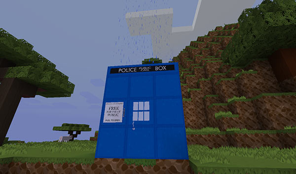
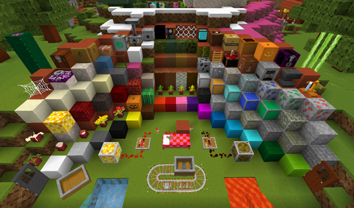

# Troubleshooting/Common Problems

- [I made a stack of blocks but the TARDIS doesn’t materialise!](#create)
- [When I click the TARDIS seed block with a stick, nothing happens!](#stick)
- [The plugin says ‘You cannot grow rooms unless your TARDIS was created in its own world’](#rooms)
- [I made a room and it grew inside the TARDIS!](#grew)
- [I try to grow a room but the plugin says “There seems to be a block in the way! You should be growing out into the void…”](#void)
- [My TARDIS is not generating its own world!](#own-world)
- [How do I import my TARDIS world into my multi-world plugin?](#import)
- [Non-op players can’t break the blocks inside the TARDIS to grow rooms](#spawn)
- [The console says “Could not find TARDIS map files, some recipes may not work!”](#maps)
- [My Handbrake is not re-engaging!](#handbrake)
- [I can’t craft the Stattenheim Circuit / upgrade my Sonic Screwdriver!](#stat)
- [It says circuits are missing from the Advanced Console.](#advanced)
- [It says I need to use the Advanced Console.](#difficulty)
- [My TARDIS isn’t charging at a recharge beacon](#charging)
- [I can’t hear the custom sound effects](#sfx)
- [It says I’m still inside the TARDIS, but I’m not](#inside)
- [It keeps saying I’m restricted to the [] area or something about my exile status!](#perms)
- [I changed some config options but they keep changing back!](#config)
- [I jettisoned a room and it deleted part of the control room!](#jettison)
- [I edited the config file, but when I reload the changes don’t save!](#reload)
- [The perception filter has gone completely invisible!](#filter)
- [Why does it rain on my TARDIS in dry biomes?](#rain)
- [Why does my TARDIS door open when I crouch-click it (and get out of sync with the other door)?](#sync)
- [What is the Texture Pack in the videos?](#txtpac)

#### I made a stack of blocks but the TARDIS doesn’t materialise!

The method for creating a TARDIS was changed in version 2.6, you should craft a TARDIS seed block instead. Check the ‘[Creating a TARDIS](creating-a-tardis.html)’ page for details.

#### When I click the TARDIS seed block with a stick, nothing happens!

You didn’t read and follow the instructions — you need to click the seed block with the **TARDIS Key** — the key is only a stick if you have configured it to be one. Check the ‘[Creating a TARDIS](creating-a-tardis.html)’ page for details.

#### The plugin says ‘You cannot grow rooms unless your TARDIS was created in its own world’

You need to set up the plugin to so that when you create a TARDIS, it is created in its own world, or in a special world called _TARDIS\_TimeVortex_. To do this you need follow the instructions for “My TARDIS is not generating its own world!” below, or go to the [Time Vortex](time-vortex.html) page.

#### I made a room and it grew inside the TARDIS!

Things have changed quite a lot with the update to TARDIS v2.6, especially the way that you grow rooms

- make sure the plugin is up to date
- read **all** the [change logs](change-log.html) for the various 2.6 versions
- stop the server
- delete _plugins/TARDIS/schematics_ and _plugins/TARDIS/rooms.yml_
- start the server
- delete your old TARDIS
- make a new TARDIS
- use [ARS](ars.html) to grow a new room

#### I try to grow a room but the plugin says “There seems to be a block in the way! You should be growing out into the void…”

Read the answer [above](#grew), once you’ve done that (and you still want to grow a room manually) make sure the room you are growing from contains a pressure plate in the correct position for the piston door, then place the seed block in the right place — i.e. NOT in the wall.

#### My TARDIS is not generating its own world!

For best results, follow these steps to set up the plugin to create TARDIS worlds:

1. Remove all current TARDISes by breaking the Police Box sign
2. Stop the server
3. Delete the `plugins/TARDIS` folder
4. Install TARDISChunkGenerator (if you haven’t already)
5. Install [Multiverse-Core](http://dev.bukkit.org/bukkit-plugins/multiverse-core/)
6. Make sure that the TARDIS config option `create_worlds` is set to `true` — (it gets disabled automatically if a multi-world plugin is not found).
7. Start the server
8. Create a TARDIS

[Back to top](#top)

#### How do I import my TARDIS world into my multi-world plugin?

You should only need to do this if you created a TARDIS before installing the multi-world plugin (and only if you’re using an early version 2.0 beta of TARDIS)

If you are using **Multiverse-Core** :

```
    /mv import [world name] normal -g TARDISChunkGenerator -n
    /mv modify set hidden true [world name]
    /mv modify set weather false [world name]
    /mv modify set portalform none [world name]
    /mv modify set pvp false [world name]
```

Only the first command is required, but the TARDIS plugin sets the other world options as well by default.

**Remember** to change `[world name]` to the name of your own TARDIS world!

If you are using **MultiWorld**

You’re a bit stuck, as MultiWorld doesn’t have an easy way of loading a world after it is created.

1. Open up the MultiWorld config file and duplicate the section for the server’s default world.
2. Change the section so it looks like the one below — don’t forget to change the world name to your actual world.

```
TARDIS_WORLD_eccentric_nz:
    seed: -400605742453603641
    worldgen: PLUGIN
    options: TARDISChunkGenerator
    difficulty: 2
    autoload: true
    flags:
      PVP: false
    spawnGroup: defaultGroup
```

[Back to top](#top)

#### Non-op players can’t break the blocks inside the TARDIS to grow rooms

This is probably because of Minecraft’s built-in spawn protection. The server admin will need to set `spawn-protection=0` in _server.properties_ (and set up their normal world spawn with another form of protection instead e.g. WorldGuard).

[Back to top](#top)

#### The console says “Could not find TARDIS map files, some recipes may not work!”

TARDIS requires some special `map.dat` files in order for some TARDIS recipes to work correctly. If you read the rest of the message in the server log, you will see that the required map files have been copied into the _Bukkit/plugins/TARDIS_ folder. It then tells you where to put the copied map files — they go into the `data` folder of the server’s main world folder (by default it is called ‘world’).

You need to move all the TARDIS map files (named `map_1963.dat` to `map_1979.dat`) in to the world data folder located at: _Bukkit/ **world** /data_ — substitute _ **world** _ for whatever the name of the server’s main world is called.


[Back to top](#top)

#### My Handbrake is not re-engaging!

To re-engage the handbrake you must **LEFT** -click the lever.

If you are stuck in the Time Vortex, restart the server and rebuild your TARDIS before trying to travel again.

[Back to top](#top)

#### I can’t craft the Stattenheim Circuit / upgrade my Sonic Screwdriver!

There are a couple of things you can try:

- Make sure that the TARDIS map files are in the correct location.
- Delete any circuits and sonics that were created before the step above.
- Assign more RAM to your server (in the startup script). Adding new recipes requires more memory!
- Watch this video of the [Stattenheim Circuit being crafted](https://vimeo.com/83094452) on a freshly installed server.
- Set the TARDIS difficulty level to `easy` — the Stattenheim Remote doesn’t use the Stattenheim Circuit in easy mode.
- Change the recipe! All TARDIS item recipes are configurable as of TARDIS v2.7. Edit _recipes.yml_.
- Use the `/tardisgive [player] s-circuit 1` command to give yourself the circuit.

[Back to top](#top)

#### It says circuits are missing from the Advanced Console.

You haven’t crafted the appropriate circuit and placed it in the TARDIS Advanced Console (the JUKEBOX).

**Solution 1:** Craft the circuit!

**Solution 2:** Give yourself the circuits! `/tardisgive [your name] kit circuits`

**Solution 3:** Set the TARDIS difficulty level to `easy` — circuits are not required in easy mode.

[Back to top](#top)

#### It says I need to use the Advanced Console.

This is probably because the TARDIS difficulty level is set to `hard`. On hard difficulty, most travel commands are disabled, and you must place the appropriate storage disk into the Advanced Console instead. See the [Advanced Console](advanced-console.html) page for more information.

You can also use the `/tardisadmin difficulty easy` command to switch difficulty levels and re-enable the commands.

[Back to top](#top)

#### My TARDIS isn’t charging at a recharge beacon

You must time travel to the recharge location.

Charging is triggered by players actually travelling to the recharge point, not remotely bringing their TARDIS into position with the `/tardis comehere` command.

[Back to top](#top)

#### I can’t hear the custom sound effects

The custom TARDIS sound effects require you to have the **TARDIS Resource Pack** installed in the Minecraft client, and that you are running Minecraft 1.7.x or higher.

You can download the resource pack from GitHub: [https://github.com/eccentricdevotion/TARDIS-SoundResourcePack](https://github.com/eccentricdevotion/TARDIS-SoundResourcePack) — take note of installation instructions on that page.

[Back to top](#top)

#### It says I’m still inside the TARDIS, but I’m not

This happens if you have exited the TARDIS by some other way than the TARDIS door — this could be because of death, call, teleport, Multiverse teleport, or server crash.

To fix this, type the command:

    /tardis occupy

[Back to top](#top)

#### It keeps saying I’m restricted to the [] area or something about my exile status!

Please read the first part of the [Permissions](permissions.html) page.

[Back to top](#top)

#### I changed some config options but they keep changing back!

If you manually edit the TARDIS config file while the server is running, you will need to use the `/tardisadmin reload` command (DO NOT use `/reload` as the plugin saves the current settings when it is disabled).

The better option is to set the config options in game with the `/tardisadmin [config option] [value]` command — changes take effect immediately, no server restart required. See the [Admin Commands](admin-commands.html) page for more details.

[Back to top](#top)

#### I jettisoned a room and it deleted part of the control room!

The `/tardis jettison` command relies on the direction the player is facing in order to work — always **face into the room you want to jettison** , otherwise you are likely to be removing parts of your TARDIS that you don’t want to.

[Back to top](#top)

#### I edited the config file, but when I reload the changes don’t save!

This is fairly standard behaviour for plugins. The **currently loaded** config options are saved when you restart the server, and the new ones you put in are overwritten.

You have three options:

1. Use the the TARDIS admin commands to change the options i.e. `/tardisadmin [config option] [value]` for example `/tardisadmin key CARROT` — the benefit is that changes take effect immediately, you don’t need to restart the server. Refer to the [admin commands](admin-commands.html) page.
2. Manually edit the file, save it, and use the `/tardisadmin reload` command to load your changes into the server’ memory.
3. **STOP** the server. Edit the config file, save it, then start the server.

**Note:** It is generally not good practice to use the `/reload` command.

[Back to top](#top)

#### The perception filter has gone completely invisible!

When travelling between worlds, the Perception Filter may sometimes go completely invisible — if this happens, just press your “sneak” key (usually LEFT-SHIFT) to make the player skin update.

[Back to top](#top)

#### Why does it rain on my TARDIS in dry biomes?

This is due to a residual temporal flux causing the immediate TARDIS environment to be out of sync with the rest of the multiverse — nothing the TARDIS perception filter can’t handle!

In reality, you have `police_box.set_biome: true` in the config. This sets the biome of the TARDIS location to DEEP\_OCEAN, so that players with [MCPatcher](https://bitbucket.org/prupe/optifine/wiki/Home) modded clients and the [TARDIS\_MCP Resource Pack](https://github.com/eccentricdevotion/TARDIS-MCP) will see a groovy looking TARDIS — the result is that it sometimes rains on the Police Box.



[Back to top](#top)

#### Why does my TARDIS door open when I crouch-click it (and get out of sync with the other door)?

You probably have the LWC plugin installed. LWC has a setting that allows iron doors to be opened by clicking them. You should disable this in LWC’s doors.yml:

    # Enable the opening of Iron Doors when you click on them
        enabled: false

If you move the interior TARDIS door, remember to remove the LWC protection after placing the door in its new position (and before running the `/tardis update door` command.

[Back to top](#top)

#### What is the Texture Pack in the videos?

An unreleased (and unfinished — still most of the mobs to do) pack called Bromley Massive Vector, also by eccentric\_nz. Maybe, one day he will finish it. It’s [128X], and is compatible with Minecraft 1.11.2.



If you _\*\*really\*\*_ need it, the pack is available here: [https://github.com/eccentricdevotion/Bromley-Massive-Vector](https://github.com/eccentricdevotion/Bromley-Massive-Vector) — take note of installation instructions on that page.

[Back to top](#top)
