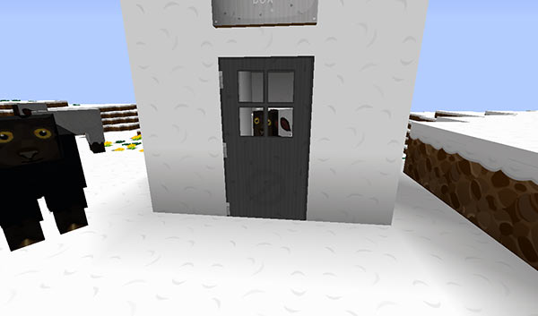
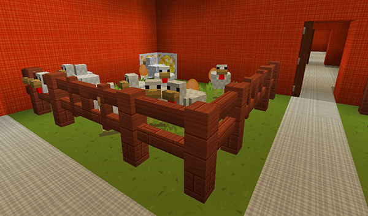
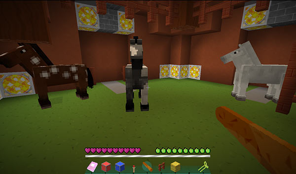

# Mob farming

You can capture farm animals in the Police Box and transport them into the TARDIS.

The mobs you can collect are:

- Chicken
- Cow
- Pig
- Sheep
- Horse
- Llama
- Rabbit
- Villager
- Guardian
- Polar Bear

You will first need to herd the mobs so that they are close to the Police Box (within 2 blocks) — wheat or carrots in hand should make them follow you — sometimes you may be lucky enough to have the Police Box materialise around an animal!

Enter the TARDIS as usual, and the following will happen:

- If you have already grown a ‘farm’ room, then chickens, cows, pigs and sheep will be teleported into the appropriate pen in the farm
- If you have already grown a ‘stable’ room, then horses will be teleported into the stable
- If you have already grown a ‘stall’ room, then llamas will be teleported into the stall
- If you have already grown a ‘hutch’ room, then rabbits will be teleported into the hutch room
- If you have already grown a ‘village’ room, then villagers will be teleported into the village room
- If you have already grown an ‘igloo’ room, then polar bears will be teleported into the igloo room
- If you have already grown a ‘pool’ room and the `allow.guardians` config option is set to `true`, then guardians will be teleported into the pool
- If no appropriate room is available (and if allowed in the TARDIS config), then the spawn eggs for the mobs are placed in the player’s inventory. **Note:** In order to use the spawn eggs, you may need to remove `mob_spawning: deny` from the TARDIS world’s region file if you are using WorldGuard — from TARDIS v2.8 and later growing the appropriate room automatically allows mob spawning in those rooms (but not monsters!)

Non-op players require the permission: `tardis.farm`

## Ejecting farmed mobs and villagers

As of TARDIS version 3.1-beta-1, you can now eject farmed mobs, villagers and companions.

To eject an entity, use the `/tardis eject` command, then click the mob/villager/companion you want to eject. They will be teleported outside the TARDIS, what you do with them then is up to you.

Horses must still be ridden over the wood pressure plate.

**Note:** there are a couple of exceptions to the rule with companion ejection — if the player is an OP or the player has `tardis.admin` permission they will **NOT** be ejected.

