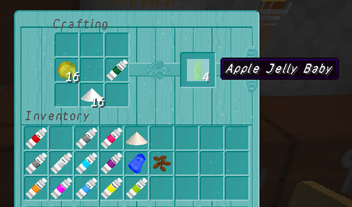
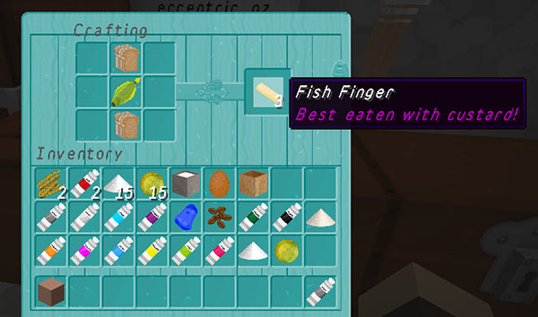
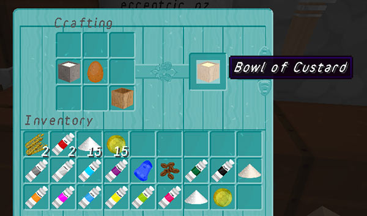
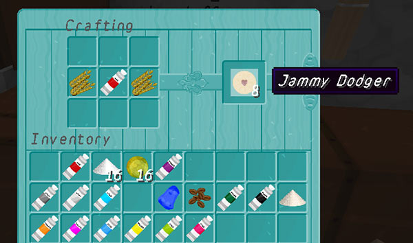
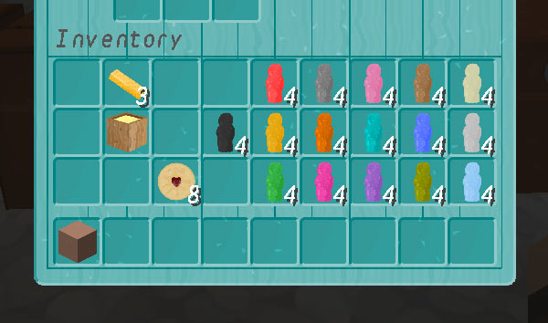

# Whovian food

You can craft Whovian food items in-game so that you can eat like the Doctor.

For best results (and custom textures) you should use the TARDIS-MCP resource pack, and an MCPatcher modded client.

### Jelly babies

The fourth Doctor’s favourite! A shapeless recipe, jelly babies are crafted with 1 slimeball, 1 sugar, and 1 dye of any colour. To see the recipe type:

    /tardisrecipe jelly-baby

Each recipe gives 4 coloured jelly-babies, eating a jelly baby restores one hunger.

### Fish fingers

One half of the eleventh Doctor’s regeneration food. A shaped recipe, fish fingers are crafted with 2 bread, and 1 raw fish. To see the recipe type:

    /tardisrecipe fish-finger

Each recipe gives 3 fish fingers, eating a fish finger restores 2.5 hunger.

### Bowl of custard

The other part of the eleventh Doctor’s regeneration food, together they make fish custard! A shapeless recipe, custard is crafted with 1 bucket of milk, 1 egg, and 1 wooden bowl. To see the recipe type:

    /tardisrecipe custard

Each recipe gives one bowl of custard, eating custard restores 3 hunger.

### Jammy Dodgers

The eleventh Doctor fooled the Daleks into thinking a Jammy Dodger was a self-destruct button for the TARDIS. A shaped recipe, Jammy Dodgers are crafted the same way as cookies, but instead of cocoa beans, 1 red dye is used. To see the recipe type:

    /tardisrecipe jammy-dodger

Each recipe gives 8 Jammy Dodgers, eating a Jammy Dodger restores 1 hunger.

All the food items, including all 16 jelly baby flavours.

