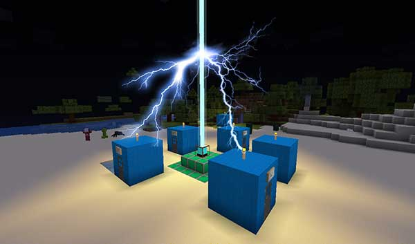

# TARDIS

TARDIS is a Spigot / Paper plugin that allows you to create a TARDIS that lets you time travel (teleport) to random locations. It adds a Whovian twist to the typical /sethome and /home commands.

**As a player, you can:**

- Create a TARDIS that is bigger on the inside.
- Time travel to a random location.
- Time travel to saved destinations.
- Grow rooms in your TARDIS.
- Take companions with you when you time travel.
- Collect Artron Energy to power your TARDIS.

### Get started…

[Index / Site map](site-map.html)

[Go to the **Contents** page](contents.html)

[Check out some **FAQs**](faqs.html)

[Join our Community-Led Discord Server!](https://discord.gg/sfuPVHh)

