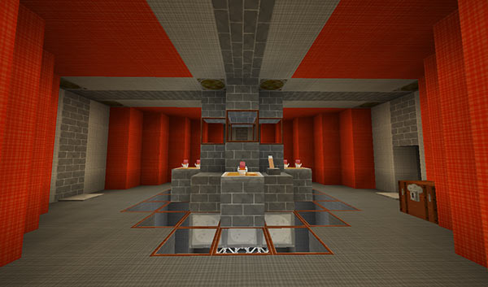
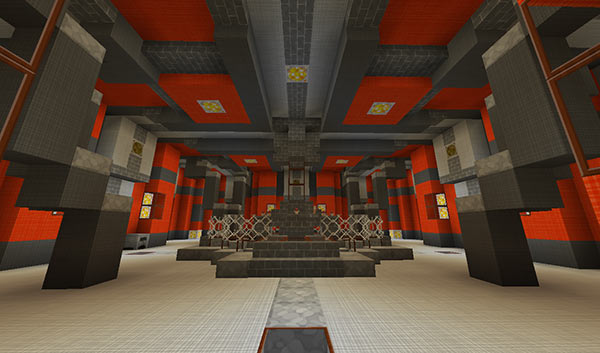
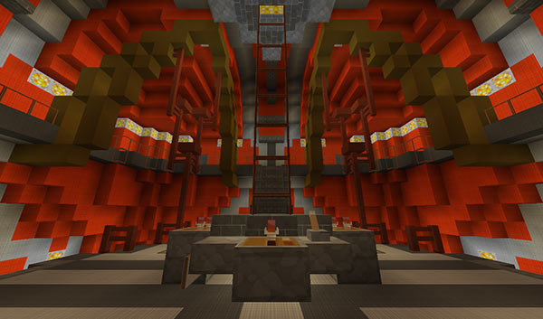
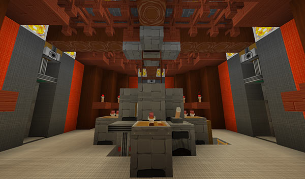
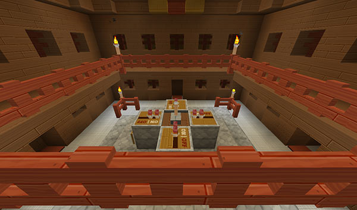
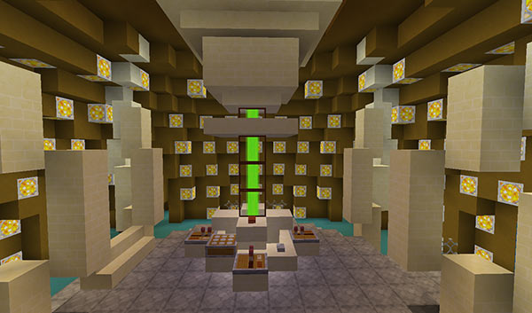

# TARDIS Interiors

Default sized TARDIS - good if you don’t like walking too far to the console :)

Bigger TARDIS - you could swing a cat in here!

Deluxe TARDIS - luxury in a box.

‘Eleventh’ TARDIS - It’s smaller on the outside…

‘Twelfth’ TARDIS - The Twelfth Doctor’s TARDIS

‘Redstone’ TARDIS - Multi-level madness (this one has mushroom walls…)

‘Steampunk’ TARDIS - Small, but steamy

‘ARS’ TARDIS - Lots of quartz

‘Tom’ TARDIS - Tom Baker’s console

‘Plank’ TARDIS - A woody interior

‘Master’ TARDIS - The Master’s TARDIS (thanks to ShadowAssociate)

‘Pyramid’ TARDIS - A sandstone interior (thanks to Airomis)

‘Ender’ TARDIS - An End dimension inspired interior (thanks to ToppanaFIN)

‘Coral’ TARDIS - The Tenth Doctor’s (thanks to vistaero)

[Back](javascript:history.back();)

