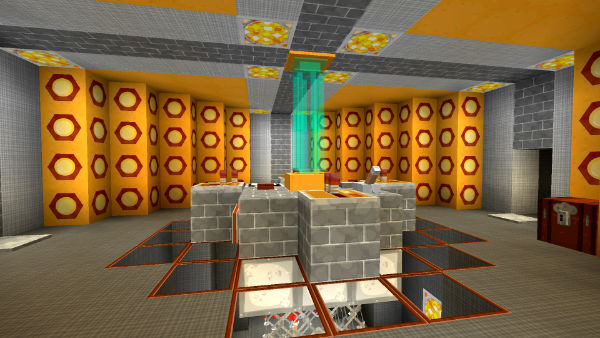
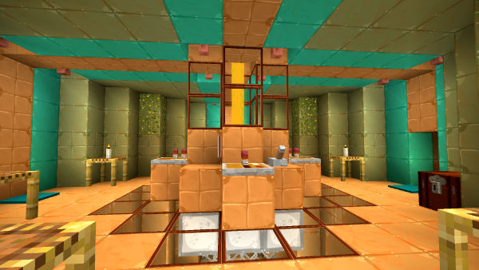

# TARDIS Interiors

These interiors are designed to be used with the TARDIS.
To find their corresponding block required to use them, see [TARDIS types](creating-a-tardis#tardis-types).

## ANCIENT

Ancient City TARDIS - inspired by the deep dark

## ARS

‘ARS’ TARDIS - Lots of quartz

## BUDGET

Default sized TARDIS - good if you don’t like walking too far to the console :)

## BIGGER

Bigger TARDIS - you could swing a cat in here!

## CAVE

Cave TARDIS - you could be in a cave in your TARDIS!

## COPPER

Copper TARDIS - experience copper like you’ve never experienced before!

## CORAL

‘Coral’ TARDIS - The Tenth Doctor’s TARDIS (thanks to vistaero)

## DELTA

Nether Delta TARDIS - experience the nether delta inside your TARDIS!

## DELUXE

Deluxe TARDIS - luxury in a box.

## DIVISION

Division TARDIS - A TARDIS inspired by "[The Division ship outpost](https://tardis.fandom.com/wiki/The_Division)".

## ELEVENTH

‘Eleventh’ TARDIS - It’s smaller on the outside...

A TARDIS inspired by 11th Doctor's TARDIS.

## ENDER

‘Ender’ TARDIS - An End dimension inspired interior (thanks to ToppanaFIN)

## FACTORY

Factory TARDIS - The 1st Doctor’s Factory TARDIS (thanks to vistaero)

## FUGITIVE

Fugutive TARDIS - Ruth (The Fugitive Doctor) Clayton's Console
(based on [Ruth TARDIS designed by DT10](https://www.youtube.com/watch?v=aykwXVemSs8))

## MASTER

‘Master’ TARDIS - The Master’s TARDIS (thanks to ShadowAssociate)

## ORIGINAL

The original console from v1.0 of the TARDIS plugin - For those with nostalgia

## PLANK

‘Plank’ TARDIS - A woody interior

## PYRAMID

‘Pyramid’ TARDIS - A sandstone interior (thanks to Airomis)

## REDSTONE

‘Redstone’ TARDIS - Multi-level madness (this one has mushroom walls...)

## ROTOR

'Rotor' TARDIS - An animated time rotor TARDIS

## STEAMPUNK

‘Steampunk’ TARDIS - Small, but steamy

## TOM

‘Tom’ TARDIS - Tom Baker’s console

## THIRTEENTH

The 13th Doctor's TARDIS

## TWELFTH

‘Twelfth’ TARDIS - The Twelfth Doctor’s TARDIS

## WAR

The War Doctor's TARDIS

## WEATHERED

A weathered copper TARDIS

