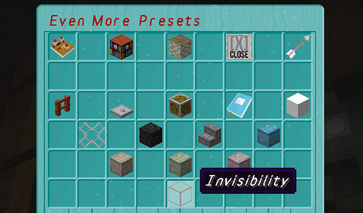
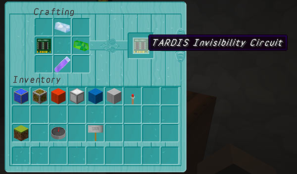

# TARDIS invisibility

When inserted in the Advanced Console, and the INVISIBLE Chameleon preset is chosen, then the TARDIS will land invisibly.

The TARDIS Police Box will be made up of invisible blocks that cannot be walked through. The walk in / out portal will function as normal so that the Time Lord and their companions can still enter and exit the TARDIS while it is invisible.

If `circuits.damage` is set to true in the TARDIS config, then the Invisibilty circuit is damaged with each use.  
**Warning:** Clicking the Invisibility button in the Chameleon presets GUI will damage the circuit, whether you use invisibility or not!

### Recipe

DIAMOND, Perception Filter, Emerald, and Invisibility Potion in shape shown below.

### Configuration

In _config.yml_:

    circuits:
        damage: true
        uses:
            invisibility: 5

If `damage` is set to true, then `uses.invisibilty` sets the number of times the Invisibilty circuit can be used before it vapourises.

    allow:
        invisibility: true

Whether players can make their TARDIS invisible.
