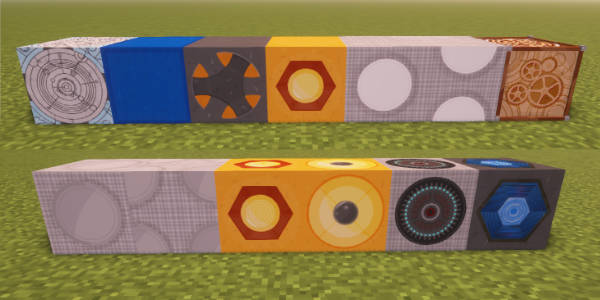
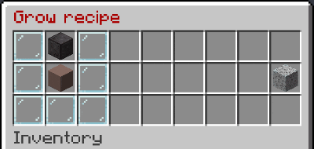
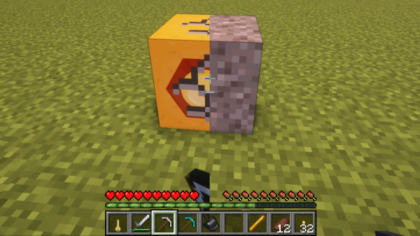

# TARDIS Item Display custom blocks

From TARDIS v5.0.0 the plugin now uses Minecraft's Item Display entities to fake custom TARDIS blocks and lights 
(instead of unused mushroom blocks). The benefit of this is that if the TARDIS Resource Pack is not installed, the 
custom block's appearance will default to a regular Minecraft block instead of a random mushroom block.

## Obtaining

You can craft most of the custom blocks in SURVIVAL gamemode - use the `/tardisrecipe` command to view the recipes in-game.

## Placing / breaking

You can place TARDIS custom blocks like any other block... except when trying to place a block onto one of a 
light block's faces (the Interaction entity gets in the way) - place a block somewhere else and then place a block 
against that to that one have blocks adjacent to a light block.

As these custom blocks are actually entities, interacting and breaking them is different to regular blocks.

### Blocks

To break a custom TARDIS block:

- In SURVIVAL gamemode you need use a pickaxe.
- You need to __LEFT-click__ the block _multiple times_ in SURVIVAL in order to break the block.
- If you have the TARDIS Resource Pack installed you will see the break animation - if not, the block will 
visually change to a gravel block before breaking and dropping the relevant item. 
- In CREATIVE, the block will just break and not drop an item.

### Lights

To break a custom TARDIS light:

- In SURVIVAL gamemode you need use a pickaxe.
- You need to __RIGHT-click__ the block _multiple times_ in SURVIVAL in order to break the block.
- If you have the TARDIS Resource Pack installed you will see the break animation - if not, the block will
  visually change to a gravel block before breaking and dropping the relevant item.
- In CREATIVE, the block will just break and not drop an item.

## Toggling light states

You can use the Sonic Screwdriver (with the Redstone Upgrade) to toggle any TARDIS light block on and off.