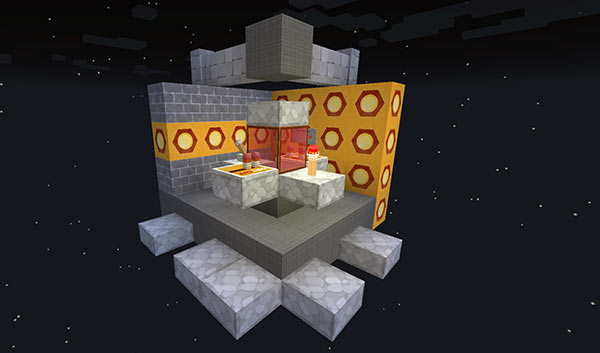

[Jump to video](#video)

# The Junk TARDIS

The Junk TARDIS is a public use TARDIS that any player with the correct permission can use on the server. It only travels in overworlds (no Nether or The End) and doesn’t require the player to have an Artron Energy supply.

### Prerequisite for enabling the Junk TARDIS

For the Junk TARDIS to be enabled on the server, the server must be set to use a default world for storing TARDISes (this is the default option with new installs). In the config, set `creation.default_world: true`. You will also need to enable the Junk TARDIS — `junk.enabled: true`.

### Creating the Junk TARDIS

Any player with the `tardis.admin` permission can create the Junk TARDIS, but only one Junk TARDIS can be active at a time. To create the Junk TARDIS:

1. Clear a 6 x 6 block flat area
2. Target a block in the centre of the flat area
3. Open chat and type the command `/tardisjunk create`

### Removing the Junk TARDIS

Open chat and type the command `/tardisjunk delete`. Requires the `tardis.admin` permission.

### Flying the Junk TARDIS

There are seven controls that let you set a Junk TARDIS destination:

- **sign** — shows the travel destination
- **handbrake** — starts the TARDIS travelling
- **tripwire hook** — selects the world to travel to
- **stone button** — sets the x coordinate
- **wood button** — sets the z coordinate
- **repeater** — determines the amount (1, 10, 100 or 1000) which is added or subtracted from the x and z coordinates when the buttons are clicked
- **comparator** — sets whether the buttons add or subtract

When the Junk TARDIS is travelling, any player who steps off the Junk TARDIS platform will be killed instantly. To visually show that the Junk TARDIS is travelling particle effects and the redstone torch on the console will flash on and off.

If no destination coordinates are entered onto the destination sign and the Junk TARDIS is not at its ‘home’ location, then clicking the handbrake lever will make the Junk TARDIS travel home.

### Other commands

`/tardisjunk return` — returns the Junk TARDIS to its ‘home’ location (bringing along any players who may be onboard)

`/tardisjunk time` — find out how much time remains before the Junk TARDIS automatically returns home.

`/tardisjunk find` — find the current location of the Junk TARDIS

`/tardisjunk [wall|floor] [material]` — change the wall and floor blocks of the Junk TARDIS. Use **before** creating the Junk TARDIS so that the Vortex TARDIS matches

### Config options

    junk.enabled: [true|false]

Whether the Junk TARDIS is available on the server — **NOTE:** The Junk TARDIS will be disabled if `creation.default_world` is `false`

    junk.particles: [true|false]

Whether the Junk TARDIS displays a particle effect when travelling

    junk.return: [time in seconds]

If `[time in seconds]` is greater than `0` and the Junk TARDIS has not been used for longer than the specified period, it will automatically return to its ‘home’ location

### Permissions

`tardis.admin` — to create, delete and return the Junk TARDIS

`tardis.junk` — to fly and find the Junk TARDIS.

### Video
<iframe src="https://player.vimeo.com/video/139185257" width="600" height="366" frameborder="0" webkitallowfullscreen mozallowfullscreen allowfullscreen></iframe>
