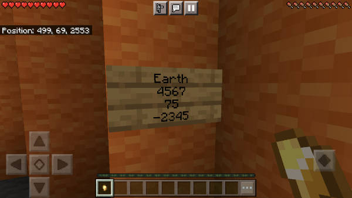

# TARDIS keyboard

You can add a TARDIS keyboard to set destinations.

To use it:

1. Place a sign in the TARDIS control room
2. Use the command `/tardis update keyboard`, then click the sign
3. Right-click the sign to start editing
4. Enter a destination on the first line or coordinates (world,x,y,z) on four lines. The destination can be:
   * a _save_ name
   * an _area_ name
   * a _player_ name
   * a _biome_ name
   * ‘home’
   * ‘cave’
   * ‘village’

   You will need to _change the sign_ to trigger a sign change event
5. Click done and the destination will be set (providing it is a valid destination)
6. Release the handbrake to travel

### Video

<iframe src="https://player.vimeo.com/video/66056277#t=16s" width="600" height="365" frameborder="0" webkitallowfullscreen mozallowfullscreen allowfullscreen></iframe>
