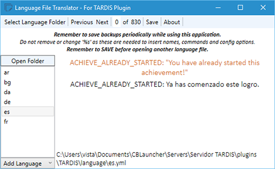

# Localisation

From version 2.9-beta-2, all in-game messages can now be localised to the server’s preferred language

The default language is English, and all the messages are contained in the `plugins/TARDIS/language/en.yml` file.

## Changing the language

Localising TARDIS is a two step process:

1. Translate the en.yml file
2. Set the desired language in the config

### Translations

Language translations require their own file. Make a copy of `en.yml` and translate it. For example; if the language is set to Spanish (code: **es** ), then a file called `es.yml` needs to placed in the `plugins/TARDIS/language/` folder.

Vistaero (a helpful TARDIS plugin user) has written a useful tool for editing language files, you can get it here: [TARDIS Language File Translator](images/docs/tlTranslator.zip).

### Set the language

The config option to change is: `preferences.language: [language code]` — you can set the language with the command: `/tardisadmin language [code]` — use tab completion to see a list of valid language codes.

### Updates

As messages are added for new TARDIS features, the preferred language file will be updated (in English) for you to translate.

### Video
<iframe width="600" height="354" src="https://www.youtube.com/embed/Zx_i66YKIgQ?rel=0" frameborder="0" allowfullscreen></iframe>