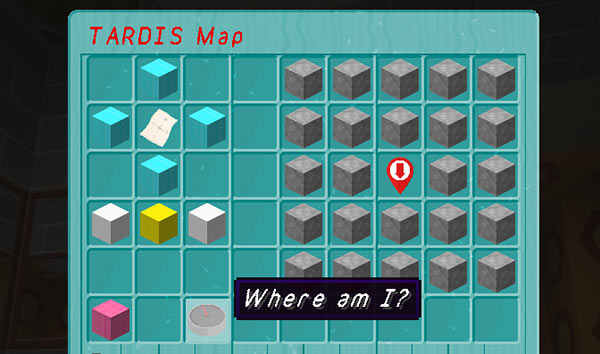

# TARDIS Map

The TARDIS Map lets you find your location in the ARS grid.

To open the map, you first need to open the Player Prefs Menu by right-clicking AIR with the sonic screwdriver. Once open click the map button in the GUI.

### Using the map

The map controls work in a similar way to the ARS GUI.

- You need to load the map first by clicking the “Load map” button
- The map can be scrolled using the four cyan wool direction blocks
- You can change levels with the white wool blocks
- You can find your current location in the grid by clicking the _“Where am I?”_ compass button
- The pink wool button closes the map

