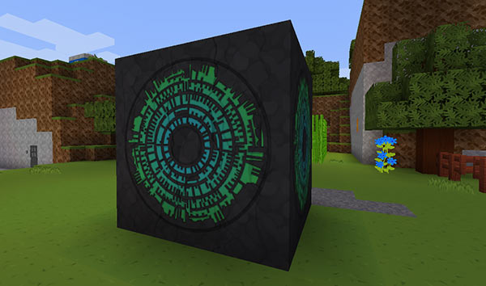
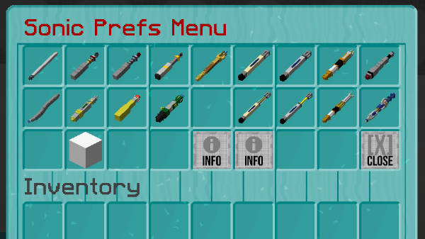
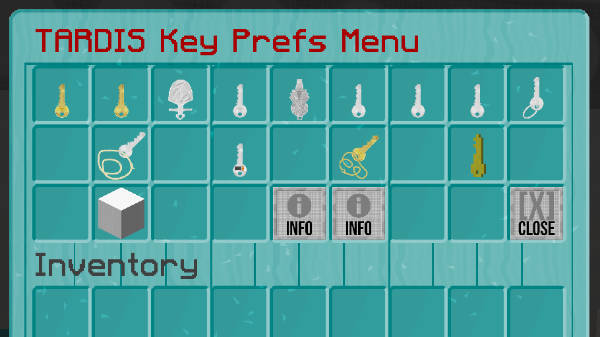

# MCPatcher texture support

From version 2.9-beta-1, TARDIS now supports custom block and item textures for all TARDIS items by utilising the Connected Textures Mod (CTM) and Custom Item Textures (CIT) that are part of [MCPatcher](http://www.minecraftforum.net/topic/1496369-).

To see the custom textures, you **MUST** install MCPatcher and the [TARDIS-MCP](https://github.com/eccentricdevotion/TARDIS-MCP) resource pack!

## How it works

CTM has a feature where you can set different textures for blocks depending on which biome they are found. To make the TARDIS Police Box use custom textures the 3 x 3 block area where the TARDIS lands is set to a DEEP\_OCEAN biome. When the TARDIS leaves the location, the biome is reset back to what is was originally.

Currently, only the Police Box and Pandorica use custom block textures.

For interior textures, the TARDIS console and rooms are set to the SKY biome. There are custom wall, advanced console, disk storage container and door textures.

If you would prefer that TARDIS does not change the biome in your worlds, you can turn off the feature in the config — use the admin command to toggle the settings — for Police Boxes use: `/tardisadmin set_biome [true|false]`, and for TARDIS worlds use: `/tardisadmin sky_biome [true|false]`.

CIT allows TARDIS to have custom item textures by detecting the display name and/or lore of the item. For example, this lets sonic screwdrivers have a custom texture without changing _all_ BLAZE\_RODs to a sonic texture.

### Notes

An ‘umbrella’ is added to the police box when `set_biome` is `true` and the TARDIS lands in a dry biome. The umbrella is a 3 x 3 x 1 area of glass blocks set at y=255.

Only new interiors and rooms are set to SKY biome, to change existing consoles and rooms, you will need to use the WorldEdit `//setbiome Sky` command

The interior TARDIS door may need its hinge location changed, use the `/tardis update hinge` command while targeting the top-half of the door.

For existing Police Boxes, things may look a little odd until you rebuild the TARDIS or travel…

A new `/tardisprefs ctm [on|off]` command can be used in conjunction with the custom textures — if `on` the plugin replaces the left front wool block in the Police box with a quartz pillar textured on ends with the TARDIS door sign. You may prefer to set this `off` so that players without MCPatcher installed will see the regular blue wool block.

### Sonic screwdriver and TARDIS keys

CIT also lets us have multiple textures for some TARDIS items. Want your sonic screwdriver to look like the eighth Doctor’s one? Want your TARDIS key to be like the first Doctor’s brass Yale key? No problem… TARDIS now has a Sonic Prefs Menu and a TARDIS Key Prefs Menu.

To access the menus:

- Sonic menu — `/tardisprefs sonic`
- Key menu — `/tardisprefs key_menu`

To change the texture for the item, put it in the bottom-left-most slot and then click the texture of your choice.

## Keeping the resource packs up-to-date

The TARDIS resource packs are shared in GitHub repositories. If you install a GitHub client, you can easily keep your resource packs current by syncing with any changes that are pushed to the repository.

Here’s a quick run down on doing that:

1. Download and install the GitHub client for your operating system: 
  - [GitHub for Mac](https://mac.github.com/)
  - [GitHub for Windows](https://windows.github.com/)
2. Start GitHub client and create a free GitHub account (if you don’t have one)
3. In your web browser, naviagte to the TARDIS resource pack repositories 
  - [TARDIS-MCP](https://github.com/eccentricdevotion/TARDIS-MCP)
  - [TARDIS-Sounds](https://github.com/eccentricdevotion/TARDIS-SoundResourcePack)
4. Click the **Clone in Desktop** button
5. Save the repository clone in the _minecraft/resourcepacks_ folder
6. Repeat steps 4 and 5 for each resource pack
7. To update the resource pack, use the desktop client to ‘Pull’ in any changes. 
  - `Command-Shift-P` on a Mac
  - `Control-Shift-P` on Windows
