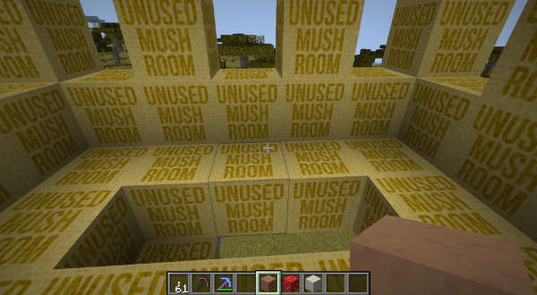
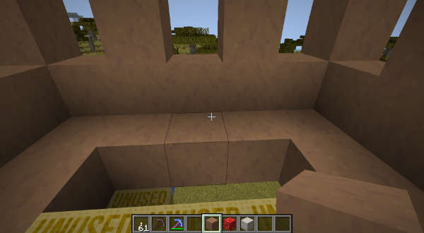

#  Miscellaneous commands

Some utility commands available in the TARDIS plugin.

### `/tardiscall`

Request a player to bring their TARDIS to your targeted location.

* Alias: `/tcall`
* Permission: `tardis.use`
* Usage: `/tardiscall [player]`

### `/tardisinfo`

Internal command used by the TARDIS Information System.

* Alias: none
* Permission: `tardis.help`
* Usage: `/tardisinfo [letter]`

### `/tardisgamemode`

Set a player's gamemode.

* Aliases: tgm, tgms, tgmc, tgma, tgmsp
* Permission: `tardis.admin`
* Usage: `/tardisgamemode [GameMode] <player>` - if no player is specified, then the gamemode is changed for the player running the command.

### `/tardismushroom`

Fix broken mushroom block textures.

* Alias: `tmushroom`
* Permission: `tardis.mushroom`
* Usage: `/tardismushroom [red|brown|stem] [radius]`

Before command:

After command:

### `/tardistime`

Change the time in the world the player is in (or where their TARDIS is if they are inside it).

* Alias: `ttime`
* Permission: `tardis.admin`
* Usage: `/tardistime [day|morning|noon|night|midnight|?AM|?PM|ticks]`

### `/tardisweather`

Change the weather in the world the player is in (or where their TARDIS is if they are inside it).

* Alias: `tweather`
* Permissions: `tardis.weather.clear`, `tardis.weather.rain`, `tardis.weather.thunder`
* Usage: `/tardisweather [clear|rain|thunder]`

