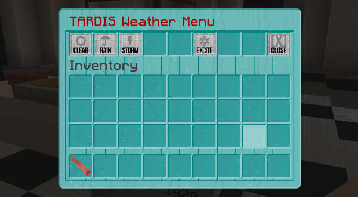

#  Miscellaneous commands

Some utility commands available in the TARDIS plugin.

_____

## `/tardiscall`

Request a player to bring their TARDIS to your targeted location.

> If you're wandering around in your TARDIS, and a friend wants you to come and 
check something out, rather than them saying in chat "Hey come check this out"
and then you using `/ttravel [player] ?` to request to travel to them (and them 
possibly having to move to a safe landing spot and accepting) - they can just run
the command `tardiscall [player]` and you'll get a message saying "{Player} wants
you to travel to them, do you accept?" which you accept to set the destination.

* Alias: `/tcall`
* Permission: `tardis.use`
* Usage: `/tardiscall [player]`

_____

## `/tardisinfo`

Internal command used by the TARDIS Information System.

* Alias: none
* Permission: `tardis.help`
* Usage: `/tardisinfo [letter]`

_____

## `/tardisgamemode`

Set a player's gamemode.

* Aliases: tgm, tgms, tgmc, tgma, tgmsp
* Permission: `tardis.admin`
* Usage: `/tardisgamemode [GameMode] <player>` - if no player is specified, then the gamemode is changed for the player running the command.

_____

## `/tardismushroom`

Fix broken mushroom block textures.

* Alias: `tmushroom`
* Permission: `tardis.mushroom`
* Usage: `/tardismushroom [red|brown|stem] [radius]`

Before command:

After command:

_____

## `/tardistime`

Change the time in the world the player is in (or where their TARDIS is if they are inside it).

* Alias: `ttime`
* Permission: `tardis.admin`
* Usage: `/tardistime [day|morning|noon|night|midnight|?AM|?PM|ticks]`

_____

## `/tardisweather`

Change the weather in the world the player is in (or where their TARDIS is if they are inside it).

* Alias: `tweather`
* Permissions: `tardis.weather.clear`, `tardis.weather.rain`, `tardis.weather.thunder`
* Usage: `/tardisweather [clear|rain|thunder]`

You can also add a weather button to your TARDIS console to open a weather GUI. Palce an appropriate block and then run the `/tardis update weather` command.

When you open the weather GUI, you can click a button to change the weather, or initiate atmospheric excitation (make it snow around your TARDIS).

<iframe src="https://player.vimeo.com/video/222985511" width="600" height="365" frameborder="0" webkitallowfullscreen mozallowfullscreen allowfullscreen></iframe>
