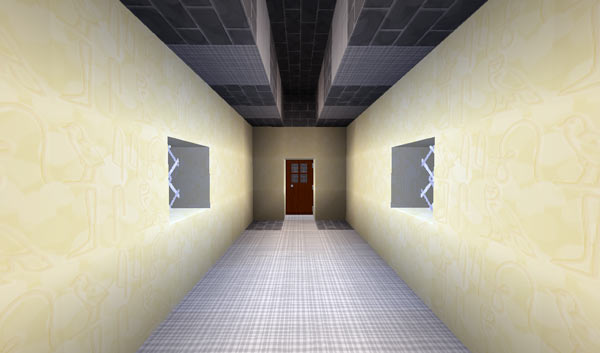

# Modifying the TARDIS interior

**Note:** see also: [TARDIS Desktop Theme](desktop-theme.html)

While you can’t modify the Police Box — as it gets recreated every time you travel to a new destination, it is possible to alter the interior of the TARDIS (aside from growing [rooms](rooms.html)). However there are some blocks that the plugin expects to be in a certain position. These are:

- On the TARDIS console
  - The repeaters
  - The handbrake
  - The random location button
  - The Artron Energy button
- The Iron Door
- The Chameleon Circuit sign
- The Save Sign
- The Energy Condenser chest
- The environment Scanner
- The TARDIS Information System
- The Architectural Reconfiguration System sign
- The Temporal Locator
- The direction item frame
- The ‘keyboard’
- The ‘black wool behind the door’ toggle switch

You can move these to wherever you want, but you must run the command:

    /tardis update [the block to update]

So that the TARDIS plugin will know of the new locations and your TARDIS will function correctly. Visit the [Commands](tardis-commands.html) page for more detailed info on the command.

Anything else can be destroyed and changed.

**Note 1:** The TARDIS expects the blocks for the controls to be a certain type. The table below shows which blocks you can use for each:

| TARDIS control | Valid blocks |
| --- | --- |
| `world-repeater` | Redstone Repeater |
| `x-repeater` | Redstone Repeater |
| `y-repeater` (multiplier) | Redstone Repeater |
| `z-repeater` | Redstone Repeater |
| `handbrake` | Lever |
| `button` | Stone Button, Wood Button, Lever |
| `artron` | Stone Button, Wood Button, Lever |
| `chameleon` | Wall Sign, Sign Post |
| `save-sign` | Wall Sign, Sign Post |
| `ars` (Architectural Reconfiguration System) | Wall Sign, Sign Post |
| `info` (TARDIS Info System) | Wall Sign, Sign Post |
| `temporal` (Temporal Locator) | Wall Sign, Sign Post |
| `door` | Iron Door |
| `condenser` | Single Chest |
| `scanner` | Stone Button, Wood Button, Lever |
| `direction` | Item Frame |
| `keyboard` | Wall Sign, Sign Post |
| `toggle_wool` (wool behind door switch) | Stone Button, Wood Button, Lever |

**Note 2:** If `create_worlds` is false in the TARDIS configuration file and you are using a TARDIS version prior to v2.7-beta-1, the plugin only reserves and protects the initial chunks used to create the TARDIS in, which means that another player could potentially create a TARDIS that overlaps yours if you make it bigger.

See also: [Binding destinations to blocks](bind-commands.html)

## Changing room wall and floor blocks

Although you set the TARDIS interior wall and floor blocks when you make a TARDIS seed block, you are not limited to the choice you made at that time.

You can change the blocks that room walls and floors are grown with in two ways:

- Set the wall/floor block when crafting the TARDIS Seed Block — this sets the wall/floor block to the block you use in the seed
- Set the wall block using the `/tardisprefs wall [material]` command. A list of valid materials can be found on the [Wall materials](walls.html) page
- Set the floor block using the `/tardisprefs floor [material]` command. A list of valid materials can be found on the [Wall materials](walls.html) page

