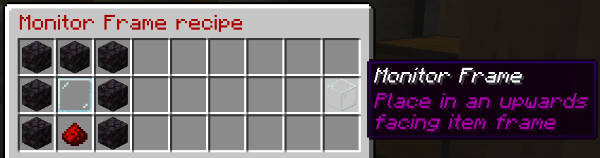

# TARDIS Monitor

The TARDIS Monitor lets you view the world outside your TARDIS exterior.

To refresh the view click the keyboard and levers.

### Adding the monitor to your TARDIS

The monitor requires two item frames to be placed adjacent to each other.

- Craft a TARDIS Monitor - `/tardisrecipe monitor`

  

- Place an item frame against a wall or other block and put the monitor in the frame

  

- Craft a Monitor Frame - `/tardisrecipe monitor-frame`

  

- Place an item frame facing _up_ in front of the TARDIS Monitor item frame and put the monitor frame in
- Rotate the frame if necessary
- Run the `/tardis update monitor` command and then click the monitor
- Run the `/tardis update monitor-frame` command and then click the monitor frame

