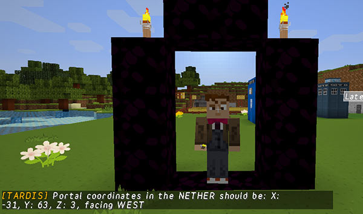

# The Nether Portal command

This command lets you get the coordinates for accurately linking Nether Portals.

    /tardisnetherportal

There are some shorter aliases to the command: `/tnp`, `/tnether`, `/o2n`, `/n2o`

To use the command to link portals:

1. Use the command `/tnp` while standing in a nether portal frame
2. Write down or remember the coordinates you are given
3. Light portal and enter the nether
4. Go to the coordinates that were displayed by the TARDIS command `/tnp`
5. Build another portal at those coordinates and light it
6. Go back to the portal that you stepped out of in the nether, and destroy the portal

Your nether portal is now permanently linked to the portal you created in the overworld and you won’t have to worry about which random portal you will step out of.

Now you can start creating a hub system in the nether to travel to the over world coordinates — it is much faster travelling through the Nether as each block in the Nether you travel is 8 blocks in the overworld. It’s a shortcut, sort of like a wormhole in space!

