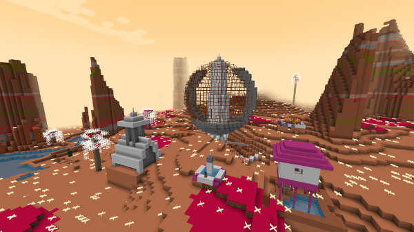
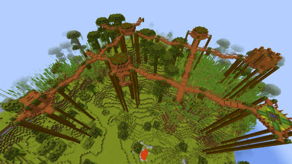

# Planets

The TARDIS plugin has 3 built-in planets from the Whoniverse.
The planets are created by installing custom datapacks on the server. To enable the planets on the server use the command `/tardisworld load [gallifrey|siluria|skaro]` - this will install the appropriate custom dimension datapack on the server, and the world will be generated on the next server restart. The worlds will be named according to vanilla Minecraft conventions using the default world name as specified in `server.properties` e.g. _world_tardis_gallifrey_, _world_tardis_siluria_, and _world_tardis_skaro_

The planets are listed and described below!

## Note

To get the best experience on these planets, it's recommended to download the accompanying plugin and resource pack. Otherwise, mobs will look like vanilla mobs!

- [TARDISWeepingAngels](http://tardisjenkins.duckdns.org:8080/job/TARDISWeepingAngels/lastSuccessfulBuild/)
- [TARDISWeepingAngels-ResourcePack](https://github.com/eccentricdevotion/TARDISWeepingAngels-Resource-Pack)

## Planet Skaro


- This world is limited to the customised Desert, Desert Lakes and Desert Hills biomes.
- If configured, all water is acid and will harm / kill the player (wearing armour reduces the effect). Use a boat!
- Dalek structures will generate automatically as you explore the world — there are currently two building types, a big main building and a smaller corridor type one.
- Daleks will spawn in the big main buildings. There is a 10% chance that a Dalek will spawn flying in the air, but this can be disabled in the config described below.
- A random loot chest is located in the main Dalek building — wear plenty of armour if you want to raid these!
- You can fill Acid Buckets and Rust Buckets by using an empty bucket on water and lava. Acid Buckets can be used to make Acid Batteries, which in turn can be used to make [Rift Manipulators](rift-manipulator.html). Rust Buckets are used in the crafting recipe for the [Rust Plague](http://tardis.wikia.com/wiki/Rust_plague) Sword - this deals more damage to Daleks (Update the TARDIS-MCP resource pack to see the textures).

## Planet Gallifrey



- This world is limited to customised Badlands, Badlands Plateau and Eroded Badlands biomes.
- Time Lord structures will generate automatically as you explore the world — there is currently one building type.
- Time Lords will spawn in these structures.
- A random loot chest is also located in the structures.

## Planet Siluria



- This world is limited to the Bamboo Jungle and Bamboo Jungle Hills biomes.
- Structures will generate automatically as you explore the jungles.
- Silurians will spawn in these structures.
- A random loot chest is also located in the structures.

## Enabling Planets

All planets must be enabled using the `/tardisworld load` command. There are some world specific options in the [planets.yml configuration file](configuration-planets). Below is a sample code, and it is commented to describe each line.

For acid potion effects, see the [Bukkit PotionType Enum](https://hub.spigotmc.org/javadocs/bukkit/org/bukkit/potion/PotionType.html).

```yaml
# other config #
# Planet name
world_tardis_skaro:
  # Whether this world should be created and managed by TARDIS.
  # This must be enabled to load the world and requires a restart.
  enabled: false

  #### The following are exclusive to Skaro. ###
  # Whether all the water in the world is acid (and harms the player).
  acid: true
  # the amount of damage a player takes when in acid water each second.
  acid_damage: 5
  # Optional list of potion effects to give the player when they are in acid water.
  acid_potions:
  - WEAKNESS
  - POISON
  # Whether rust is enabled (not actually used yet).
  rust: true
  # Whether or not to enable flying daleks
  flying_daleks: true

  ## other terrain options, see planets configuration ##

  # Exclusive to custom planets.
  # Should non-doctor who (vanilla) mobs spawn?
  spawn_other_mobs: true
# other config #
```
**tl;dr:**

1. Use the command `/tardisworld load [gallifrey|siluria|skaro]`
2. (Re)start the server
